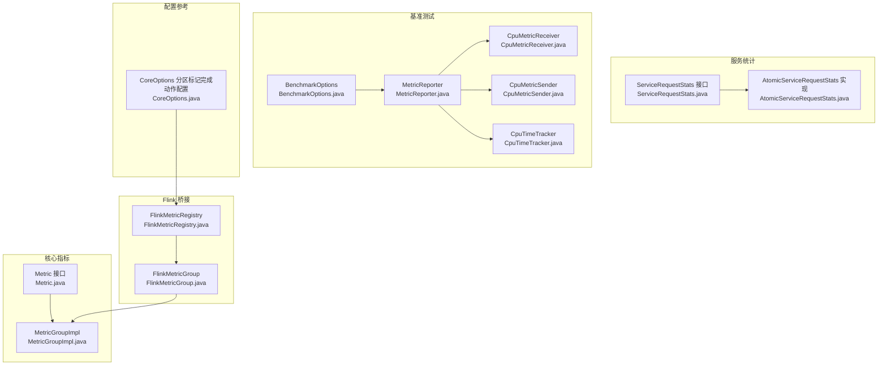
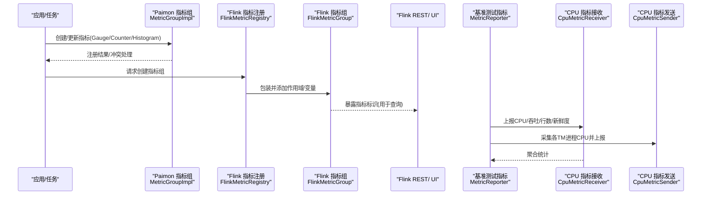
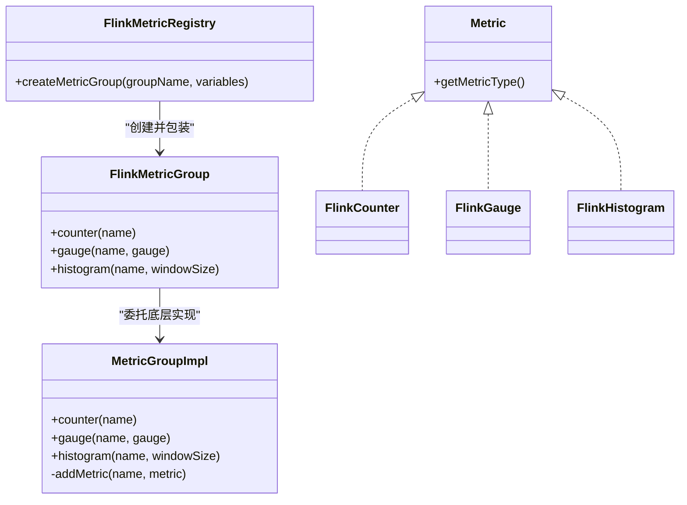
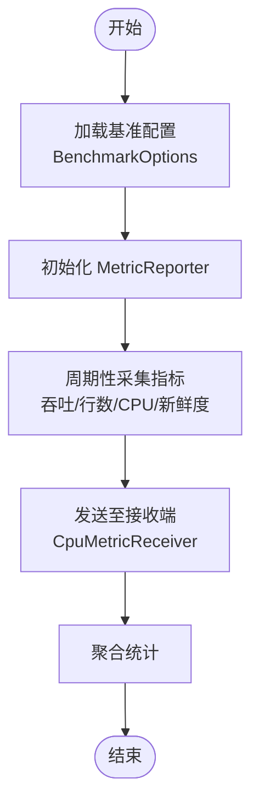
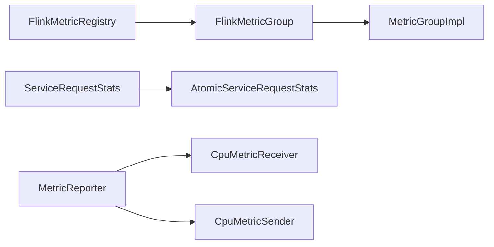

# 监控告警

<cite>
**本文引用的文件**
- [metrics.md](file://docs/content/maintenance/metrics.md)
- [Metric.java](file://paimon-core/src/main/java/org/apache/paimon/metrics/Metric.java)
- [MetricGroupImpl.java](file://paimon-core/src/main/java/org/apache/paimon/metrics/MetricGroupImpl.java)
- [FlinkMetricRegistry.java](file://paimon-flink/paimon-flink-common/src/main/java/org/apache/paimon/flink/metrics/FlinkMetricRegistry.java)
- [FlinkMetricGroup.java](file://paimon-flink/paimon-flink-common/src/main/java/org/apache/paimon/flink/metrics/FlinkMetricGroup.java)
- [TestingMetricUtils.java](file://paimon-flink/paimon-flink-common/src/test/java/org/apache/paimon/flink/utils/TestingMetricUtils.java)
- [ServiceRequestStats.java](file://paimon-service/paimon-service-client/src/main/java/org/apache/paimon/service/network/stats/ServiceRequestStats.java)
- [AtomicServiceRequestStats.java](file://paimon-service/paimon-service-client/src/main/java/org/apache/paimon/service/network/stats/AtomicServiceRequestStats.java)
- [BenchmarkOptions.java](file://paimon-benchmark/paimon-cluster-benchmark/src/main/java/org/apache/paimon/benchmark/BenchmarkOptions.java)
- [MetricReporter.java](file://paimon-benchmark/paimon-cluster-benchmark/src/main/java/org/apache/paimon/benchmark/metric/MetricReporter.java)
- [CpuMetricReceiver.java](file://paimon-benchmark/paimon-cluster-benchmark/src/main/java/org/apache/paimon/benchmark/metric/cpu/CpuMetricReceiver.java)
- [CpuMetricSender.java](file://paimon-benchmark/paimon-cluster-benchmark/src/main/java/org/apache/paimon/benchmark/metric/cpu/CpuMetricSender.java)
- [CpuTimeTracker.java](file://paimon-benchmark/paimon-cluster-benchmark/src/main/java/org/apache/paimon/benchmark/metric/cpu/CpuTimeTracker.java)
- [CoreOptions.java](file://paimon-api/src/main/java/org/apache/paimon/CoreOptions.java)
</cite>

## 目录
1. [简介](#简介)
2. [项目结构](#项目结构)
3. [核心组件](#核心组件)
4. [架构总览](#架构总览)
5. [详细组件分析](#详细组件分析)
6. [依赖关系分析](#依赖关系分析)
7. [性能考量](#性能考量)
8. [故障排查指南](#故障排查指南)
9. [结论](#结论)
10. [附录](#附录)

## 简介
本文件面向运维与开发工程师，系统化梳理 Apache Paimon 的监控与告警体系，覆盖指标分类与含义、采集配置（含 Flink 桥接）、告警规则设计与管理、仪表板可视化、趋势分析与优化、以及故障排查与最佳实践。文档以仓库内现有实现与文档为依据，结合可扩展点给出落地建议。

## 项目结构
围绕监控告警的关键模块与文件如下：
- 指标定义与分组：paimon-core 中的 Metric 接口与 MetricGroupImpl 实现
- Flink 桥接：paimon-flink-common 中的 FlinkMetricRegistry 与 FlinkMetricGroup
- 运行时统计接口：paimon-service 中的服务请求统计接口与原子实现
- 基准测试与指标上报：paimon-benchmark 中的基准指标聚合与 CPU 指标收发
- 配置项参考：paimon-api 中的分区标记完成动作相关配置项

**图表来源**
- [Metric.java:29-33](file://paimon-core/src/main/java/org/apache/paimon/metrics/Metric.java#L29-L33)
- [MetricGroupImpl.java:36-98](file://paimon-core/src/main/java/org/apache/paimon/metrics/MetricGroupImpl.java#L36-L98)
- [FlinkMetricRegistry.java:27-39](file://paimon-flink/paimon-flink-common/src/main/java/org/apache/paimon/flink/metrics/FlinkMetricRegistry.java#L27-L39)
- [FlinkMetricGroup.java:35-78](file://paimon-flink/paimon-flink-common/src/main/java/org/apache/paimon/flink/metrics/FlinkMetricGroup.java#L35-L78)
- [ServiceRequestStats.java:22-42](file://paimon-service/paimon-service-client/src/main/java/org/apache/paimon/service/network/stats/ServiceRequestStats.java#L22-L42)
- [AtomicServiceRequestStats.java:24-33](file://paimon-service/paimon-service-client/src/main/java/org/apache/paimon/service/network/stats/AtomicServiceRequestStats.java#L24-L33)
- [BenchmarkOptions.java:36-71](file://paimon-benchmark/paimon-cluster-benchmark/src/main/java/org/apache/paimon/benchmark/BenchmarkOptions.java#L36-L71)
- [MetricReporter.java:161-200](file://paimon-benchmark/paimon-cluster-benchmark/src/main/java/org/apache/paimon/benchmark/metric/MetricReporter.java#L161-L200)
- [CpuMetricReceiver.java:62-107](file://paimon-benchmark/paimon-cluster-benchmark/src/main/java/org/apache/paimon/benchmark/metric/cpu/CpuMetricReceiver.java#L62-L107)
- [CpuMetricSender.java:164-188](file://paimon-benchmark/paimon-cluster-benchmark/src/main/java/org/apache/paimon/benchmark/metric/cpu/CpuMetricSender.java#L164-L188)
- [CpuTimeTracker.java:79-112](file://paimon-benchmark/paimon-cluster-benchmark/src/main/java/org/apache/paimon/benchmark/metric/cpu/CpuTimeTracker.java#L79-L112)
- [CoreOptions.java:1607-1635](file://paimon-api/src/main/java/org/apache/paimon/CoreOptions.java#L1607-L1635)

**章节来源**
- [metrics.md:27-465](file://docs/content/maintenance/metrics.md#L27-L465)
- [Metric.java:29-33](file://paimon-core/src/main/java/org/apache/paimon/metrics/Metric.java#L29-L33)
- [MetricGroupImpl.java:36-98](file://paimon-core/src/main/java/org/apache/paimon/metrics/MetricGroupImpl.java#L36-L98)
- [FlinkMetricRegistry.java:27-39](file://paimon-flink/paimon-flink-common/src/main/java/org/apache/paimon/flink/metrics/FlinkMetricRegistry.java#L27-L39)
- [FlinkMetricGroup.java:35-78](file://paimon-flink/paimon-flink-common/src/main/java/org/apache/paimon/flink/metrics/FlinkMetricGroup.java#L35-L78)
- [ServiceRequestStats.java:22-42](file://paimon-service/paimon-service-client/src/main/java/org/apache/paimon/service/network/stats/ServiceRequestStats.java#L22-L42)
- [AtomicServiceRequestStats.java:24-33](file://paimon-service/paimon-service-client/src/main/java/org/apache/paimon/service/network/stats/AtomicServiceRequestStats.java#L24-L33)
- [BenchmarkOptions.java:36-71](file://paimon-benchmark/paimon-cluster-benchmark/src/main/java/org/apache/paimon/benchmark/BenchmarkOptions.java#L36-L71)
- [MetricReporter.java:161-200](file://paimon-benchmark/paimon-cluster-benchmark/src/main/java/org/apache/paimon/benchmark/metric/MetricReporter.java#L161-L200)
- [CpuMetricReceiver.java:62-107](file://paimon-benchmark/paimon-cluster-benchmark/src/main/java/org/apache/paimon/benchmark/metric/cpu/CpuMetricReceiver.java#L62-L107)
- [CpuMetricSender.java:164-188](file://paimon-benchmark/paimon-cluster-benchmark/src/main/java/org/apache/paimon/benchmark/metric/cpu/CpuMetricSender.java#L164-L188)
- [CpuTimeTracker.java:79-112](file://paimon-benchmark/paimon-cluster-benchmark/src/main/java/org/apache/paimon/benchmark/metric/cpu/CpuTimeTracker.java#L79-L112)
- [CoreOptions.java:1607-1635](file://paimon-api/src/main/java/org/apache/paimon/CoreOptions.java#L1607-L1635)

## 核心组件
- 指标类型与注册
  - 指标接口：定义指标类型能力，支持自定义类型扩展（通过实现类）。
  - 指标分组：提供计数器、直方图、仪表盘（Gauge）的创建与注册，内部维护名称去重与冲突处理。
- Flink 桥接
  - 将 Paimon 指标体系桥接到 Flink 的 MetricGroup，按作用域与变量组织指标标识，便于在 Flink UI/REST 中查询。
- 服务统计
  - 定义服务端/客户端请求统计接口，提供连接数、请求数、成功/失败计数与耗时统计。
- 基准测试指标
  - 提供 CPU 使用率、吞吐、累计行数、数据新鲜度等指标的采集、聚合与上报流程，支撑性能评估与趋势分析。

**章节来源**
- [Metric.java:29-33](file://paimon-core/src/main/java/org/apache/paimon/metrics/Metric.java#L29-L33)
- [MetricGroupImpl.java:36-98](file://paimon-core/src/main/java/org/apache/paimon/metrics/MetricGroupImpl.java#L36-L98)
- [FlinkMetricRegistry.java:27-39](file://paimon-flink/paimon-flink-common/src/main/java/org/apache/paimon/flink/metrics/FlinkMetricRegistry.java#L27-L39)
- [FlinkMetricGroup.java:35-78](file://paimon-flink/paimon-flink-common/src/main/java/org/apache/paimon/flink/metrics/FlinkMetricGroup.java#L35-L78)
- [ServiceRequestStats.java:22-42](file://paimon-service/paimon-service-client/src/main/java/org/apache/paimon/service/network/stats/ServiceRequestStats.java#L22-L42)
- [AtomicServiceRequestStats.java:24-33](file://paimon-service/paimon-service-client/src/main/java/org/apache/paimon/service/network/stats/AtomicServiceRequestStats.java#L24-L33)
- [MetricReporter.java:161-200](file://paimon-benchmark/paimon-cluster-benchmark/src/main/java/org/apache/paimon/benchmark/metric/MetricReporter.java#L161-L200)

## 架构总览
下图展示从指标采集到可视化与告警的端到端路径，涵盖 Paimon 内部指标、Flink 桥接、基准测试指标上报与服务统计。

**图表来源**
- [MetricGroupImpl.java:36-98](file://paimon-core/src/main/java/org/apache/paimon/metrics/MetricGroupImpl.java#L36-L98)
- [FlinkMetricRegistry.java:27-39](file://paimon-flink/paimon-flink-common/src/main/java/org/apache/paimon/flink/metrics/FlinkMetricRegistry.java#L27-L39)
- [FlinkMetricGroup.java:35-78](file://paimon-flink/paimon-flink-common/src/main/java/org/apache/paimon/flink/metrics/FlinkMetricGroup.java#L35-L78)
- [MetricReporter.java:161-200](file://paimon-benchmark/paimon-cluster-benchmark/src/main/java/org/apache/paimon/benchmark/metric/MetricReporter.java#L161-L200)
- [CpuMetricReceiver.java:62-107](file://paimon-benchmark/paimon-cluster-benchmark/src/main/java/org/apache/paimon/benchmark/metric/cpu/CpuMetricReceiver.java#L62-L107)
- [CpuMetricSender.java:164-188](file://paimon-benchmark/paimon-cluster-benchmark/src/main/java/org/apache/paimon/benchmark/metric/cpu/CpuMetricSender.java#L164-L188)

## 详细组件分析

### 指标系统与分类
- 指标类型
  - Gauge：瞬时数值，如 lastCommitDuration、maxLevel0FileCount。
  - Counter：累计计数，如 compactionCompletedCount。
  - Histogram：统计分布（均值、分位、极值），如 scanDuration、commitDuration。
- 指标粒度
  - 表级粒度，按扫描、提交、写入、压缩、写缓冲等维度划分。
- Flink 桥接
  - 通过 FlinkMetricRegistry/FlinkMetricGroup 将 Paimon 指标映射到 Flink 作用域，形成稳定指标标识，便于在 Flink UI 或外部监控系统抓取。

**图表来源**
- [Metric.java:29-33](file://paimon-core/src/main/java/org/apache/paimon/metrics/Metric.java#L29-L33)
- [MetricGroupImpl.java:36-98](file://paimon-core/src/main/java/org/apache/paimon/metrics/MetricGroupImpl.java#L36-L98)
- [FlinkMetricRegistry.java:27-39](file://paimon-flink/paimon-flink-common/src/main/java/org/apache/paimon/flink/metrics/FlinkMetricRegistry.java#L27-L39)
- [FlinkMetricGroup.java:35-78](file://paimon-flink/paimon-flink-common/src/main/java/org/apache/paimon/flink/metrics/FlinkMetricGroup.java#L35-L78)

**章节来源**
- [metrics.md:40-465](file://docs/content/maintenance/metrics.md#L40-L465)
- [Metric.java:29-33](file://paimon-core/src/main/java/org/apache/paimon/metrics/Metric.java#L29-L33)
- [MetricGroupImpl.java:36-98](file://paimon-core/src/main/java/org/apache/paimon/metrics/MetricGroupImpl.java#L36-L98)
- [FlinkMetricRegistry.java:27-39](file://paimon-flink/paimon-flink-common/src/main/java/org/apache/paimon/flink/metrics/FlinkMetricRegistry.java#L27-L39)
- [FlinkMetricGroup.java:35-78](file://paimon-flink/paimon-flink-common/src/main/java/org/apache/paimon/flink/metrics/FlinkMetricGroup.java#L35-L78)

### 指标采集与配置
- Flink 桥接配置要点
  - 通过 FlinkMetricRegistry 创建指标组，FlinkMetricGroup 自动拼接作用域与变量，形成稳定指标标识。
  - 参考文档中对不同指标（扫描、提交、写入、写缓冲、压缩、源/汇标准指标）的作用域与 infix 规则，确保外部系统能正确抓取。
- 基准测试指标采集
  - 通过 BenchmarkOptions 配置指标上报地址、端口与采样间隔。
  - MetricReporter 聚合吞吐、累计行数、CPU、数据新鲜度等指标；CpuMetricReceiver/CpuMetricSender 负责 CPU 指标采集与上报。

**图表来源**
- [BenchmarkOptions.java:36-71](file://paimon-benchmark/paimon-cluster-benchmark/src/main/java/org/apache/paimon/benchmark/BenchmarkOptions.java#L36-L71)
- [MetricReporter.java:161-200](file://paimon-benchmark/paimon-cluster-benchmark/src/main/java/org/apache/paimon/benchmark/metric/MetricReporter.java#L161-L200)
- [CpuMetricReceiver.java:62-107](file://paimon-benchmark/paimon-cluster-benchmark/src/main/java/org/apache/paimon/benchmark/metric/cpu/CpuMetricReceiver.java#L62-L107)
- [CpuMetricSender.java:164-188](file://paimon-benchmark/paimon-cluster-benchmark/src/main/java/org/apache/paimon/benchmark/metric/cpu/CpuMetricSender.java#L164-L188)

**章节来源**
- [metrics.md:320-465](file://docs/content/maintenance/metrics.md#L320-L465)
- [BenchmarkOptions.java:36-71](file://paimon-benchmark/paimon-cluster-benchmark/src/main/java/org/apache/paimon/benchmark/BenchmarkOptions.java#L36-L71)
- [MetricReporter.java:161-200](file://paimon-benchmark/paimon-cluster-benchmark/src/main/java/org/apache/paimon/benchmark/metric/MetricReporter.java#L161-L200)
- [CpuMetricReceiver.java:62-107](file://paimon-benchmark/paimon-cluster-benchmark/src/main/java/org/apache/paimon/benchmark/metric/cpu/CpuMetricReceiver.java#L62-L107)
- [CpuMetricSender.java:164-188](file://paimon-benchmark/paimon-cluster-benchmark/src/main/java/org/apache/paimon/benchmark/metric/cpu/CpuMetricSender.java#L164-L188)

### 告警规则设计与管理
- 指标分类与阈值建议
  - 性能指标：lastCommitDuration、lastScanDuration、avgCompactionTime、avgLevel0FileCount。
  - 资源指标：maxSortBufferUtilisationPercent、usedWriteBufferSizeByte/totalWriteBufferSizeByte、numWriters。
  - 业务指标：numRecordsOut、numRecordsOutPerSecond、lastPartitionsWritten、lastBucketsWritten。
- 告警级别与通知
  - 建议按“警告/严重”两级或“低/中/高/严重”四级划分；结合趋势与基线设定动态阈值。
  - 通知渠道：邮件、IM、值班系统；对关键指标启用静默窗口与抑制策略。
- 规则管理
  - 使用外部监控系统（如 Prometheus + Alertmanager、Grafana Alerting、Zabbix 等）基于指标标识进行规则配置与告警收敛。

[本节为通用实践建议，不直接分析具体文件，故无“章节来源”]

### 仪表板与可视化
- Flink 指标可视化
  - 在 Flink Web UI 中查看桥接后的指标标识，或通过 Flink REST API 抓取。
- 外部可视化
  - 将指标导出至 Prometheus/Grafana，构建多面板仪表板，覆盖吞吐、延迟、资源使用、业务增长等主题。

[本节为通用实践建议，不直接分析具体文件，故无“章节来源”]

### 监控数据分析与趋势预测
- 指标聚合与对比
  - 使用 MetricReporter 聚合吞吐、行数、CPU、数据新鲜度，形成性能摘要。
- 趋势分析
  - 基于 Histogram 统计（均值、分位）与时间序列对比，识别异常波动与容量压力。
- 预测与容量规划
  - 结合历史趋势与业务增长模型，预估存储与计算资源需求。

**章节来源**
- [MetricReporter.java:161-200](file://paimon-benchmark/paimon-cluster-benchmark/src/main/java/org/apache/paimon/benchmark/metric/MetricReporter.java#L161-L200)
- [CpuTimeTracker.java:79-112](file://paimon-benchmark/paimon-cluster-benchmark/src/main/java/org/apache/paimon/benchmark/metric/cpu/CpuTimeTracker.java#L79-L112)

### 监控系统性能优化与扩展
- 指标开销控制
  - 合理设置 Histogram 窗口大小与采样频率；避免高频 Gauge 更新造成抖动。
- 扩展点
  - 通过自定义 Metric 实现扩展指标类型；在 Flink 桥接层增加标签维度以提升聚合灵活性。
- 集成扩展
  - 支持将指标导出到多种监控系统（Prometheus、InfluxDB、OpenTelemetry 等），统一接入平台。

[本节为通用实践建议，不直接分析具体文件，故无“章节来源”]

### 故障排查与问题定位
- 指标不可见/为空
  - 检查 Flink 桥接作用域与 infix 是否匹配；确认 MetricGroup 生命周期与注册顺序。
- 指标冲突
  - 查看 MetricGroupImpl 的冲突处理逻辑，避免同名指标重复注册。
- 服务统计异常
  - 核查 ServiceRequestStats 的上报调用是否正确，关注成功/失败计数与耗时统计。
- 基准测试指标异常
  - 检查 CpuMetricSender/CpuMetricReceiver 的网络连通性与端口配置；确认采样间隔合理。

**章节来源**
- [TestingMetricUtils.java:35-65](file://paimon-flink/paimon-flink-common/src/test/java/org/apache/paimon/flink/utils/TestingMetricUtils.java#L35-L65)
- [MetricGroupImpl.java:72-98](file://paimon-core/src/main/java/org/apache/paimon/metrics/MetricGroupImpl.java#L72-L98)
- [ServiceRequestStats.java:22-42](file://paimon-service/paimon-service-client/src/main/java/org/apache/paimon/service/network/stats/ServiceRequestStats.java#L22-L42)
- [AtomicServiceRequestStats.java:24-33](file://paimon-service/paimon-service-client/src/main/java/org/apache/paimon/service/network/stats/AtomicServiceRequestStats.java#L24-L33)
- [CpuMetricReceiver.java:62-107](file://paimon-benchmark/paimon-cluster-benchmark/src/main/java/org/apache/paimon/benchmark/metric/cpu/CpuMetricReceiver.java#L62-L107)
- [CpuMetricSender.java:164-188](file://paimon-benchmark/paimon-cluster-benchmark/src/main/java/org/apache/paimon/benchmark/metric/cpu/CpuMetricSender.java#L164-L188)

## 依赖关系分析
- 指标系统依赖
  - FlinkMetricRegistry 依赖 Flink 的 MetricGroup；FlinkMetricGroup 包装底层 MetricGroupImpl。
- 服务统计依赖
  - ServiceRequestStats 由 AtomicServiceRequestStats 提供线程安全实现。
- 基准测试依赖
  - MetricReporter 依赖 CpuMetricReceiver/CpuMetricSender 与 Flink REST 客户端，聚合运行时指标。

**图表来源**
- [FlinkMetricRegistry.java:27-39](file://paimon-flink/paimon-flink-common/src/main/java/org/apache/paimon/flink/metrics/FlinkMetricRegistry.java#L27-L39)
- [FlinkMetricGroup.java:35-78](file://paimon-flink/paimon-flink-common/src/main/java/org/apache/paimon/flink/metrics/FlinkMetricGroup.java#L35-L78)
- [MetricGroupImpl.java:36-98](file://paimon-core/src/main/java/org/apache/paimon/metrics/MetricGroupImpl.java#L36-L98)
- [ServiceRequestStats.java:22-42](file://paimon-service/paimon-service-client/src/main/java/org/apache/paimon/service/network/stats/ServiceRequestStats.java#L22-L42)
- [AtomicServiceRequestStats.java:24-33](file://paimon-service/paimon-service-client/src/main/java/org/apache/paimon/service/network/stats/AtomicServiceRequestStats.java#L24-L33)
- [MetricReporter.java:161-200](file://paimon-benchmark/paimon-cluster-benchmark/src/main/java/org/apache/paimon/benchmark/metric/MetricReporter.java#L161-L200)
- [CpuMetricReceiver.java:62-107](file://paimon-benchmark/paimon-cluster-benchmark/src/main/java/org/apache/paimon/benchmark/metric/cpu/CpuMetricReceiver.java#L62-L107)
- [CpuMetricSender.java:164-188](file://paimon-benchmark/paimon-cluster-benchmark/src/main/java/org/apache/paimon/benchmark/metric/cpu/CpuMetricSender.java#L164-L188)

**章节来源**
- [FlinkMetricRegistry.java:27-39](file://paimon-flink/paimon-flink-common/src/main/java/org/apache/paimon/flink/metrics/FlinkMetricRegistry.java#L27-L39)
- [FlinkMetricGroup.java:35-78](file://paimon-flink/paimon-flink-common/src/main/java/org/apache/paimon/flink/metrics/FlinkMetricGroup.java#L35-L78)
- [MetricGroupImpl.java:36-98](file://paimon-core/src/main/java/org/apache/paimon/metrics/MetricGroupImpl.java#L36-L98)
- [ServiceRequestStats.java:22-42](file://paimon-service/paimon-service-client/src/main/java/org/apache/paimon/service/network/stats/ServiceRequestStats.java#L22-L42)
- [AtomicServiceRequestStats.java:24-33](file://paimon-service/paimon-service-client/src/main/java/org/apache/paimon/service/network/stats/AtomicServiceRequestStats.java#L24-L33)
- [MetricReporter.java:161-200](file://paimon-benchmark/paimon-cluster-benchmark/src/main/java/org/apache/paimon/benchmark/metric/MetricReporter.java#L161-L200)
- [CpuMetricReceiver.java:62-107](file://paimon-benchmark/paimon-cluster-benchmark/src/main/java/org/apache/paimon/benchmark/metric/cpu/CpuMetricReceiver.java#L62-L107)
- [CpuMetricSender.java:164-188](file://paimon-benchmark/paimon-cluster-benchmark/src/main/java/org/apache/paimon/benchmark/metric/cpu/CpuMetricSender.java#L164-L188)

## 性能考量
- 指标开销
  - 高频 Gauge 与 Histogram 会带来额外 CPU 与内存开销，应结合业务场景选择合适的采样频率与窗口大小。
- 并发与一致性
  - 服务统计采用原子计数器保证并发安全；在高并发场景下建议减少细粒度过指标的更新频率。
- 网络与存储
  - 基准测试中的 CPU 指标上报需考虑网络抖动与端口占用，合理设置超时与重试策略。

[本节为通用指导，不直接分析具体文件，故无“章节来源”]

## 故障排查指南
- 指标缺失或为空
  - 使用 TestingMetricUtils 获取 Gauge/Counter/Histogram，检查底层 metrics 映射与代理包装。
- 指标冲突
  - 关注 MetricGroupImpl 的冲突处理逻辑，避免重复注册导致覆盖。
- 服务统计异常
  - 核查 reportActiveConnection/reportInactiveConnection/reportRequest/reportSuccessfulRequest/reportFailedRequest 的调用链路。
- 基准测试异常
  - 检查 CpuMetricReceiver/CpuMetricSender 的启动参数与端口配置，确认 CPU 采样进程列表解析正确。

**章节来源**
- [TestingMetricUtils.java:35-65](file://paimon-flink/paimon-flink-common/src/test/java/org/apache/paimon/flink/utils/TestingMetricUtils.java#L35-L65)
- [MetricGroupImpl.java:72-98](file://paimon-core/src/main/java/org/apache/paimon/metrics/MetricGroupImpl.java#L72-L98)
- [ServiceRequestStats.java:22-42](file://paimon-service/paimon-service-client/src/main/java/org/apache/paimon/service/network/stats/ServiceRequestStats.java#L22-L42)
- [AtomicServiceRequestStats.java:24-33](file://paimon-service/paimon-service-client/src/main/java/org/apache/paimon/service/network/stats/AtomicServiceRequestStats.java#L24-L33)
- [CpuMetricReceiver.java:62-107](file://paimon-benchmark/paimon-cluster-benchmark/src/main/java/org/apache/paimon/benchmark/metric/cpu/CpuMetricReceiver.java#L62-L107)
- [CpuMetricSender.java:164-188](file://paimon-benchmark/paimon-cluster-benchmark/src/main/java/org/apache/paimon/benchmark/metric/cpu/CpuMetricSender.java#L164-L188)

## 结论
Paimon 的监控体系以表级指标为核心，通过 Flink 桥接实现与外部监控系统的无缝对接；基准测试提供了完善的指标采集与聚合能力。结合合理的告警规则、可视化仪表板与持续的趋势分析，可有效保障系统稳定性与性能。建议在生产环境中按需裁剪指标粒度、优化上报频率，并建立完善的故障排查与应急响应机制。

## 附录
- 指标清单与含义参考：见维护文档中的指标列表与描述。
- Flink 桥接作用域与 infix：参考文档中对扫描、提交、写入、写缓冲、压缩、源/汇标准指标的作用域说明。
- 分区标记完成动作配置：参考 CoreOptions 中关于分区标记完成动作的 HTTP 报告配置项，可用于与外部系统联动。

**章节来源**
- [metrics.md:40-465](file://docs/content/maintenance/metrics.md#L40-L465)
- [CoreOptions.java:1607-1635](file://paimon-api/src/main/java/org/apache/paimon/CoreOptions.java#L1607-L1635)