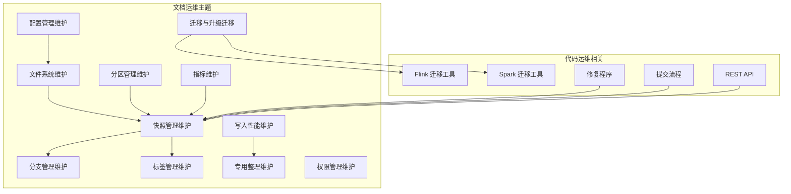
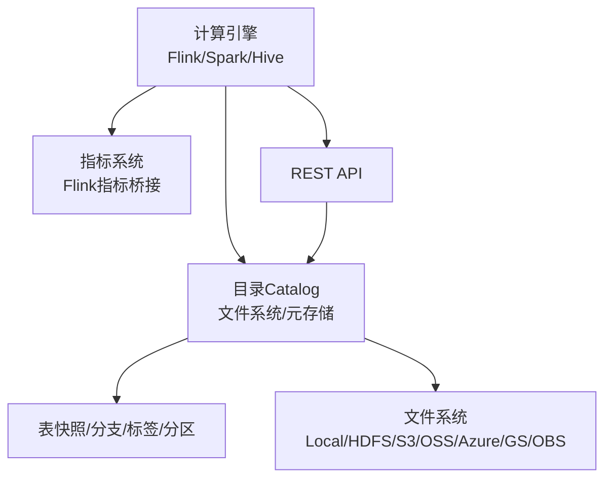
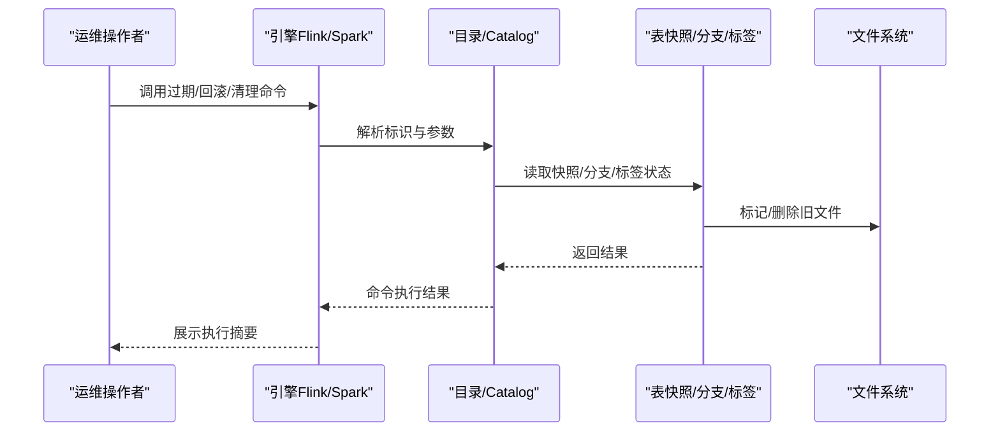
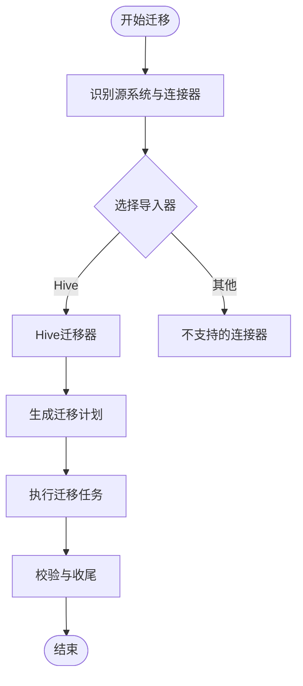
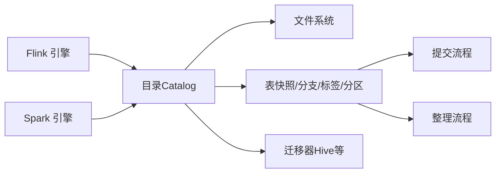
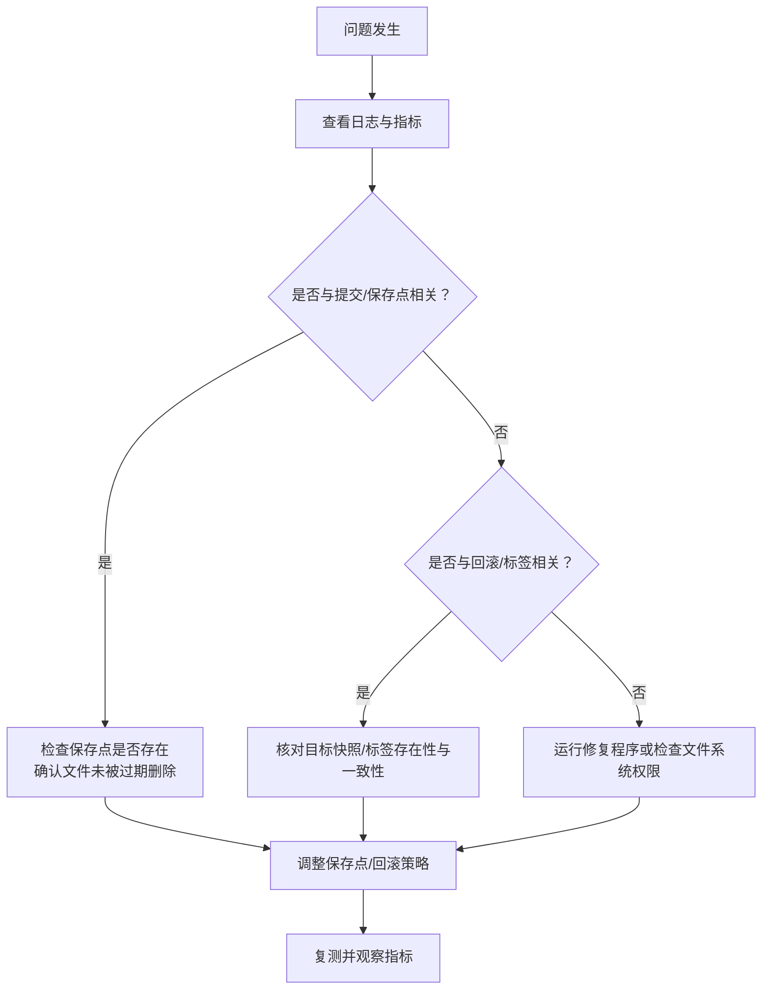

# 运维管理

<cite>
**本文引用的文件**
- [配置管理（维护）](file://docs/content/maintenance/configurations.md)
- [文件系统（维护）](file://docs/content/maintenance/filesystems.md)
- [快照管理（维护）](file://docs/content/maintenance/manage-snapshots.md)
- [分支管理（维护）](file://docs/content/maintenance/manage-branches.md)
- [标签管理（维护）](file://docs/content/maintenance/manage-tags.md)
- [分区管理（维护）](file://docs/content/maintenance/manage-partitions.md)
- [写入性能（维护）](file://docs/content/maintenance/write-performance.md)
- [专用整理（维护）](file://docs/content/maintenance/dedicated-compaction.md)
- [权限管理（维护）](file://docs/content/maintenance/manage-privileges.md)
- [指标（维护）](file://docs/content/maintenance/metrics.md)
- [迁移与升级（迁移）](file://docs/content/migration/_index.md)
- [从Hive迁移（迁移）](file://docs/content/migration/migration-from-hive.md)
- [克隆到Paimon（迁移）](file://docs/content/migration/clone-to-paimon.md)
- [Upsert到分区表（迁移）](file://docs/content/migration/upsert-to-partitioned.md)
- [REST API（概念）](file://docs/content/concepts/rest/rest-api.md)
- [TableMigrationUtils（Flink）](file://paimon-flink/paimon-flink-common/src/main/java/org/apache/paimon/flink/utils/TableMigrationUtils.java)
- [TableMigrationUtils（Spark）](file://paimon-spark/paimon-spark-common/src/main/java/org/apache/paimon/spark/utils/TableMigrationUtils.java)
- [MigrateDatabaseProcedure（Flink 1.18）](file://paimon-flink/paimon-flink-1.18/src/main/java/org/apache/paimon/flink/procedure/MigrateDatabaseProcedure.java)
- [RepairProcedure（Flink）](file://paimon-flink/paimon-flink-common/src/main/java/org/apache/paimon/flink/procedure/RepairProcedure.java)
- [TableCommitImpl（核心）](file://paimon-core/src/main/java/org/apache/paimon/table/sink/TableCommitImpl.java)
- [RESTApiJsonTest（核心）](file://paimon-core/src/test/java/org/apache/paimon/rest/RESTApiJsonTest.java)
- [log4j2.properties（CI工具）](file://tools/ci/paimon-ci-tools/src/main/resources/log4j2.properties)
</cite>

## 目录
1. [简介](#简介)
2. [项目结构](#项目结构)
3. [核心组件](#核心组件)
4. [架构总览](#架构总览)
5. [详细组件分析](#详细组件分析)
6. [依赖关系分析](#依赖关系分析)
7. [性能考量](#性能考量)
8. [故障排查指南](#故障排查指南)
9. [结论](#结论)
10. [附录](#附录)

## 简介
本文件面向Apache Paimon的运维工程师与平台团队，提供一套系统化的运维管理指南，覆盖配置管理、快照与分支/标签治理、分区维护、文件系统与存储、写入与整理性能优化、指标采集与监控、故障诊断、升级与迁移策略以及备份与恢复方案。文档以仓库内的官方文档与关键实现代码为依据，结合最佳实践给出可落地的操作步骤与可视化图示。

## 项目结构
- 文档侧：运维相关内容主要分布在docs/content/maintenance与docs/content/migration目录下，涵盖配置、文件系统、快照/分支/标签、分区、写入性能、专用整理、权限、指标等主题。
- 代码侧：与运维强相关的实现集中在核心模块与引擎适配模块中，如Flink/Spark适配层的迁移工具、修复程序、提交流程、REST API等。

**章节来源**
- [配置管理（维护）:1-92](file://docs/content/maintenance/configurations.md#L1-L92)
- [文件系统（维护）:1-595](file://docs/content/maintenance/filesystems.md#L1-L595)
- [快照管理（维护）:1-402](file://docs/content/maintenance/manage-snapshots.md#L1-L402)
- [分支管理（维护）:1-291](file://docs/content/maintenance/manage-branches.md#L1-L291)
- [标签管理（维护）:1-299](file://docs/content/maintenance/manage-tags.md#L1-L299)
- [分区管理（维护）:1-171](file://docs/content/maintenance/manage-partitions.md#L1-L171)
- [写入性能（维护）:1-164](file://docs/content/maintenance/write-performance.md#L1-L164)
- [专用整理（维护）:1-441](file://docs/content/maintenance/dedicated-compaction.md#L1-L441)
- [权限管理（维护）:1-247](file://docs/content/maintenance/manage-privileges.md#L1-L247)
- [指标（维护）:1-465](file://docs/content/maintenance/metrics.md#L1-L465)
- [迁移与升级（迁移）:1-200](file://docs/content/migration/_index.md#L1-L200)
- [从Hive迁移（迁移）:1-200](file://docs/content/migration/migration-from-hive.md#L1-L200)
- [克隆到Paimon（迁移）:1-200](file://docs/content/migration/clone-to-paimon.md#L1-L200)
- [Upsert到分区表（迁移）:1-200](file://docs/content/migration/upsert-to-partitioned.md#L1-L200)

## 核心组件
- 配置体系：涵盖核心选项、目录选项、引擎（Flink/Spark/Hive）相关选项、RocksDB调优等，统一在配置文档中生成与汇总。
- 文件系统：支持本地、HDFS、S3、OSS、Azure、GS、OBS等，提供插件化JAR与Hadoop Uber包，以及Kerberos、HCFS、HA/ViewFS等高级配置。
- 快照与分支/标签：提供自动过期、手动过期、回滚到快照/标签、孤儿文件清理；分支支持快速前推与回退分支读取。
- 分区管理：按时间或更新时间策略过期分区，支持标记分区完成（成功文件、done分区、事件标记、HTTP上报、自定义策略）。
- 写入与整理：写入性能调优、异步整理、专用整理作业、数据库级整理、排序整理、历史分区整理。
- 指标与监控：内置扫描、提交、写缓冲、整理等指标，并与Flink指标体系对接；提供标准源/汇指标。
- 权限与安全：基于目录的IBAC模型，支持用户、权限、对象层级与认证。
- 迁移与升级：提供从Hive、克隆到Paimon、Upsert到分区表等迁移路径，以及数据库迁移过程。

**章节来源**
- [配置管理（维护）:29-92](file://docs/content/maintenance/configurations.md#L29-L92)
- [文件系统（维护）:36-595](file://docs/content/maintenance/filesystems.md#L36-L595)
- [快照管理（维护）:31-402](file://docs/content/maintenance/manage-snapshots.md#L31-L402)
- [分支管理（维护）:35-291](file://docs/content/maintenance/manage-branches.md#L35-L291)
- [标签管理（维护）:36-299](file://docs/content/maintenance/manage-tags.md#L36-L299)
- [分区管理（维护）:31-171](file://docs/content/maintenance/manage-partitions.md#L31-L171)
- [写入性能（维护）:27-164](file://docs/content/maintenance/write-performance.md#L27-L164)
- [专用整理（维护）:46-441](file://docs/content/maintenance/dedicated-compaction.md#L46-L441)
- [指标（维护）:27-465](file://docs/content/maintenance/metrics.md#L27-L465)
- [权限管理（维护）:27-247](file://docs/content/maintenance/manage-privileges.md#L27-L247)

## 架构总览
下图展示运维相关的关键交互：引擎（Flink/Spark）通过目录访问Paimon表，执行写入、整理、过期、回滚、迁移等操作；同时通过指标系统与REST API进行可观测性与远程控制。

**图表来源**
- [文件系统（维护）:29-595](file://docs/content/maintenance/filesystems.md#L29-L595)
- [指标（维护）:320-465](file://docs/content/maintenance/metrics.md#L320-L465)
- [REST API（概念）:1-29](file://docs/content/concepts/rest/rest-api.md#L1-L29)

## 详细组件分析

### 配置管理最佳实践
- 核心配置：统一在“CoreOptions”下管理，建议分环境（开发/测试/生产）差异化配置，避免在SQL中硬编码敏感参数。
- 引擎配置：针对Flink/Spark/Hive分别设置目录与连接参数，确保与文件系统插件一致。
- RocksDB调优：根据写入模式与数据特征调整压缩、字典、排序缓冲等参数，降低写放大与内存压力。
- 安全与认证：对S3/OSS/Azure/GS/OBS等对象存储配置凭据；HDFS/Kerberos需正确加载core-site与hdfs-site。

**章节来源**
- [配置管理（维护）:29-92](file://docs/content/maintenance/configurations.md#L29-L92)
- [文件系统（维护）:141-188](file://docs/content/maintenance/filesystems.md#L141-L188)

### 快照管理运维
- 自动过期策略：通过保留时长、最小/最大保留数量、执行模式（同步/异步）、单次过期上限控制空间回收节奏。
- 手动过期：支持按older_than、retain_max/min、max_deletes等参数精确清理。
- 回滚到快照/标签：提供多引擎SQL与动作JAR方式，注意回滚会删除后续快照/标签及对应数据。
- 孤儿文件清理：定期清理未被快照引用的文件，避免磁盘膨胀。

**图表来源**
- [快照管理（维护）:231-402](file://docs/content/maintenance/manage-snapshots.md#L231-L402)
- [分支管理（维护）:174-207](file://docs/content/maintenance/manage-branches.md#L174-L207)
- [标签管理（维护）:229-299](file://docs/content/maintenance/manage-tags.md#L229-L299)

**章节来源**
- [快照管理（维护）:31-402](file://docs/content/maintenance/manage-snapshots.md#L31-L402)
- [分支管理（维护）:174-291](file://docs/content/maintenance/manage-branches.md#L174-L291)
- [标签管理（维护）:229-299](file://docs/content/maintenance/manage-tags.md#L229-L299)

### 分区管理日常维护
- 过期策略：支持values-time与update-time两种策略，配合时间格式化器与检查间隔，自动清理历史分区。
- 标记完成：支持多种标记动作（成功文件、done分区、事件、HTTP上报、自定义），可按处理时间或水位线触发。
- 批量标记：批式/有界流结束后统一标记分区完成，便于下游消费。

**章节来源**
- [分区管理（维护）:31-171](file://docs/content/maintenance/manage-partitions.md#L31-L171)

### 文件系统与存储配置
- 插件化JAR：按引擎下载对应文件系统插件，或使用Paimon提供的Uber包。
- HDFS：推荐通过环境变量或目录配置加载Hadoop配置；支持Kerberos、HA、ViewFS。
- 对象存储：S3/OSS/Azure/GS/OBS均提供独立插件与配置项，支持路径风格访问与性能调优。
- HCFS：所有实现org.apache.hadoop.fs.FileSystem接口的文件系统均可直接使用。

**章节来源**
- [文件系统（维护）:36-595](file://docs/content/maintenance/filesystems.md#L36-L595)

### 写入性能与专用整理
- 写入性能：提高检查点间隔、并发检查点数、写缓冲大小与可溢出、桶数重缩放、异步整理等。
- 专用整理：写入阶段跳过整理，由独立整理作业集中执行，避免冲突与重启。
- 数据库级整理：支持组合模式动态扩缩容，连续发现间隔可调。
- 排序整理与历史分区整理：针对查询热点列进行Z-Order等排序，批量整理长时间无新增的分区。

**章节来源**
- [写入性能（维护）:27-164](file://docs/content/maintenance/write-performance.md#L27-L164)
- [专用整理（维护）:46-441](file://docs/content/maintenance/dedicated-compaction.md#L46-L441)

### 指标采集与监控
- 指标类型：Gauge/Counter/Histogram，覆盖扫描、提交、写缓冲、整理等维度。
- Flink集成：指标组生命周期由Flink管理，提供标准源/汇指标（记录/字节速率等）。
- 监控建议：结合Flink Web UI/REST与外部监控系统（如Prometheus/Grafana）建立阈值告警。

**章节来源**
- [指标（维护）:27-465](file://docs/content/maintenance/metrics.md#L27-L465)
- [REST API（概念）:1-29](file://docs/content/concepts/rest/rest-api.md#L1-L29)

### 权限与安全
- IBAC模型：基于用户授予对象权限，支持SELECT/INSERT/ALTER_TABLE/DROP_TABLE/CREATE_TABLE/DROP_DATABASE/CREATE_DATABASE/ADMIN等。
- 启用与认证：仅文件系统/Hive元存储支持；需重新创建目录并以root用户认证后创建其他用户与授权。
- 注意事项：临时表与文件系统直连不受目录权限限制，需要更强保护时应采用具备访问控制的文件系统。

**章节来源**
- [权限管理（维护）:27-247](file://docs/content/maintenance/manage-privileges.md#L27-L247)

### 迁移与升级策略
- 迁移路径：从Hive迁移、克隆到Paimon、Upsert到分区表等，提供引擎侧迁移工具与数据库迁移过程。
- 数据库迁移：通过Flink迁移过程调用引擎工具类选择具体导入器，按连接器类型分发。
- 升级策略：遵循版本发布说明与兼容性要求，优先在测试环境验证迁移与升级流程。

**图表来源**
- [TableMigrationUtils（Flink）:33-61](file://paimon-flink/paimon-flink-common/src/main/java/org/apache/paimon/flink/utils/TableMigrationUtils.java#L33-L61)
- [TableMigrationUtils（Spark）:33-61](file://paimon-spark/paimon-spark-common/src/main/java/org/apache/paimon/spark/utils/TableMigrationUtils.java#L33-L61)
- [MigrateDatabaseProcedure（Flink 1.18）:41-63](file://paimon-flink/paimon-flink-1.18/src/main/java/org/apache/paimon/flink/procedure/MigrateDatabaseProcedure.java#L41-L63)

**章节来源**
- [迁移与升级（迁移）:1-200](file://docs/content/migration/_index.md#L1-L200)
- [从Hive迁移（迁移）:1-200](file://docs/content/migration/migration-from-hive.md#L1-L200)
- [克隆到Paimon（迁移）:1-200](file://docs/content/migration/clone-to-paimon.md#L1-L200)
- [Upsert到分区表（迁移）:1-200](file://docs/content/migration/upsert-to-partitioned.md#L1-L200)
- [TableMigrationUtils（Flink）:33-61](file://paimon-flink/paimon-flink-common/src/main/java/org/apache/paimon/flink/utils/TableMigrationUtils.java#L33-L61)
- [TableMigrationUtils（Spark）:33-61](file://paimon-spark/paimon-spark-common/src/main/java/org/apache/paimon/spark/utils/TableMigrationUtils.java#L33-L61)
- [MigrateDatabaseProcedure（Flink 1.18）:41-63](file://paimon-flink/paimon-flink-1.18/src/main/java/org/apache/paimon/flink/procedure/MigrateDatabaseProcedure.java#L41-L63)

### 备份与恢复实施方案
- 快照/标签备份：通过创建标签保留历史快照，作为离线备份的元数据锚点。
- 孤儿文件清理：定期清理未被快照引用的数据文件，释放空间并减少备份体积。
- 回滚恢复：当出现误写或数据异常时，回滚到最近稳定标签/快照。
- 迁移备份：在执行跨系统迁移前，先导出目标系统的结构与数据快照，确保可回退。

**章节来源**
- [快照管理（维护）:355-402](file://docs/content/maintenance/manage-snapshots.md#L355-L402)
- [标签管理（维护）:93-167](file://docs/content/maintenance/manage-tags.md#L93-L167)

### 运维自动化与监控告警
- 自动化脚本：封装常用运维操作（过期、回滚、孤儿文件清理、数据库整理）为可调度任务。
- 指标告警：基于Flink指标与自定义指标建立阈值告警，覆盖写入延迟、整理队列积压、文件大小异常等。
- 日志与审计：统一日志级别与输出格式，结合CI工具的日志配置模板，便于集中采集与检索。

**章节来源**
- [指标（维护）:320-465](file://docs/content/maintenance/metrics.md#L320-L465)
- [log4j2.properties（CI工具）:1-25](file://tools/ci/paimon-ci-tools/src/main/resources/log4j2.properties#L1-L25)

## 依赖关系分析
- 引擎到目录：Flink/Spark通过Catalog访问表，Catalog再访问文件系统。
- 提交与整理：写入阶段的提交流程负责快照生成与文件标记，整理阶段负责文件合并与过期清理。
- 迁移工具：根据连接器类型选择具体迁移器，Hive迁移器依赖HiveCatalog。

**图表来源**
- [文件系统（维护）:29-595](file://docs/content/maintenance/filesystems.md#L29-L595)
- [TableCommitImpl（核心）:344-363](file://paimon-core/src/main/java/org/apache/paimon/table/sink/TableCommitImpl.java#L344-L363)
- [TableMigrationUtils（Flink）:33-61](file://paimon-flink/paimon-flink-common/src/main/java/org/apache/paimon/flink/utils/TableMigrationUtils.java#L33-L61)

**章节来源**
- [文件系统（维护）:29-595](file://docs/content/maintenance/filesystems.md#L29-L595)
- [TableCommitImpl（核心）:344-363](file://paimon-core/src/main/java/org/apache/paimon/table/sink/TableCommitImpl.java#L344-L363)
- [TableMigrationUtils（Flink）:33-61](file://paimon-flink/paimon-flink-common/src/main/java/org/apache/paimon/flink/utils/TableMigrationUtils.java#L33-L61)

## 性能考量
- 写入吞吐：延长检查点间隔、提升并发检查点数、增大写缓冲、启用写缓冲溢出、合理设置桶数与并行度。
- 整理开销：在高写入场景启用异步整理或专用整理作业，避免写入阶段同步整理导致超时。
- 存储成本：根据查询特征选择列存/行存与压缩等级，平衡IO与存储成本。
- 内存占用：合理配置排序缓冲、字典编码与读批大小，避免OOM。

**章节来源**
- [写入性能（维护）:27-164](file://docs/content/maintenance/write-performance.md#L27-L164)
- [专用整理（维护）:152-156](file://docs/content/maintenance/dedicated-compaction.md#L152-L156)

## 故障排查指南
- 提交失败与文件缺失：若从过旧保存点恢复导致部分文件已被删除，提交流程会报错提示无法恢复，需从更近的保存点或稳定快照恢复。
- 回滚校验：回滚请求解析与校验严格，需确保目标快照/标签存在且满足前置条件。
- 修复程序：支持对数据库或表进行修复，按传入标识区分。
- 日志与级别：统一使用DEBUG级别以便问题定位，结合CI工具日志模板标准化输出。

**图表来源**
- [TableCommitImpl（核心）:344-363](file://paimon-core/src/main/java/org/apache/paimon/table/sink/TableCommitImpl.java#L344-L363)
- [RESTApiJsonTest（核心）:244-266](file://paimon-core/src/test/java/org/apache/paimon/rest/RESTApiJsonTest.java#L244-L266)
- [RepairProcedure（Flink）:69-89](file://paimon-flink/paimon-flink-common/src/main/java/org/apache/paimon/flink/procedure/RepairProcedure.java#L69-L89)
- [log4j2.properties（CI工具）:19-25](file://tools/ci/paimon-ci-tools/src/main/resources/log4j2.properties#L19-L25)

**章节来源**
- [TableCommitImpl（核心）:344-363](file://paimon-core/src/main/java/org/apache/paimon/table/sink/TableCommitImpl.java#L344-L363)
- [RESTApiJsonTest（核心）:244-266](file://paimon-core/src/test/java/org/apache/paimon/rest/RESTApiJsonTest.java#L244-L266)
- [RepairProcedure（Flink）:69-89](file://paimon-flink/paimon-flink-common/src/main/java/org/apache/paimon/flink/procedure/RepairProcedure.java#L69-L89)
- [log4j2.properties（CI工具）:19-25](file://tools/ci/paimon-ci-tools/src/main/resources/log4j2.properties#L19-L25)

## 结论
通过规范的配置管理、严格的快照/分支/标签治理、合理的分区与整理策略、完善的指标与监控体系，以及严谨的迁移与回滚流程，可以显著提升Paimon在生产环境中的稳定性与可运维性。建议将上述最佳实践纳入SOP，并结合自动化脚本与告警机制，形成闭环运维体系。

## 附录
- 参考REST API文档以了解目录与表的REST能力，便于远程运维与集成。
- 在执行任何破坏性操作（回滚、删除分支/标签、过期）前，务必先备份稳定快照/标签。

**章节来源**
- [REST API（概念）:1-29](file://docs/content/concepts/rest/rest-api.md#L1-L29)