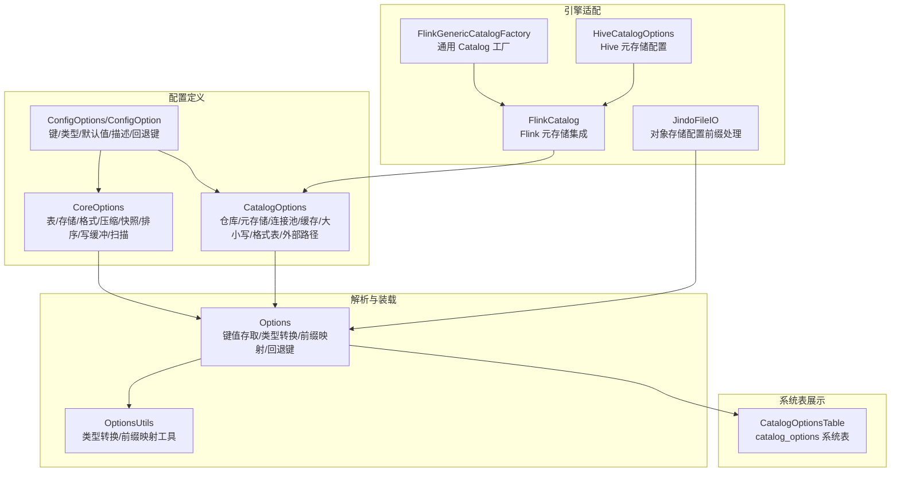
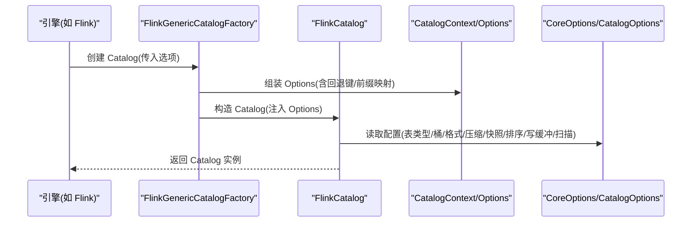
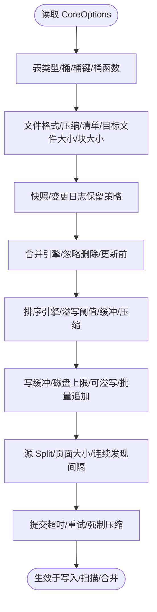
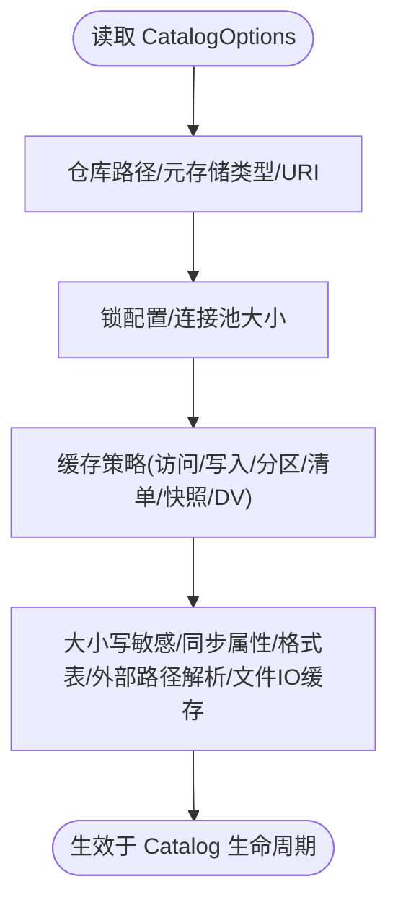
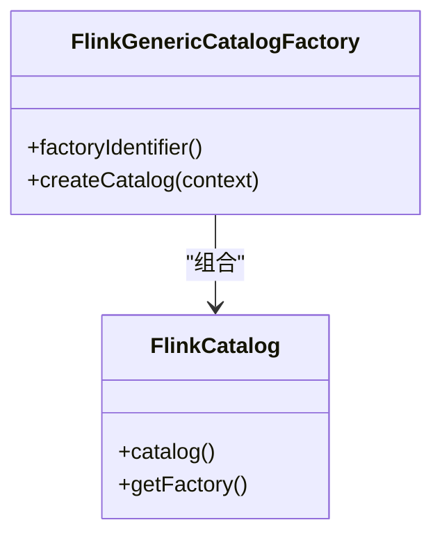
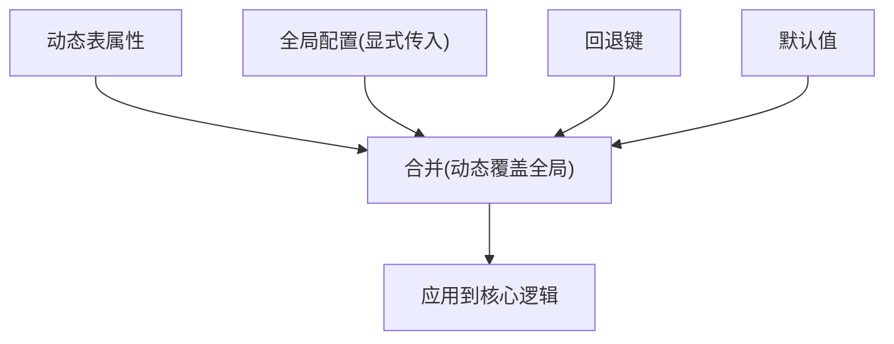
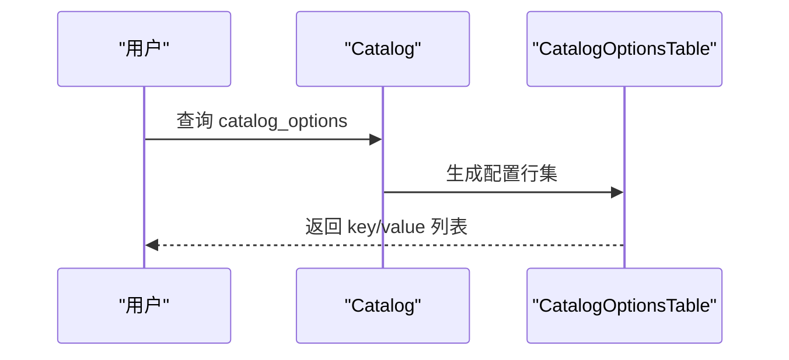
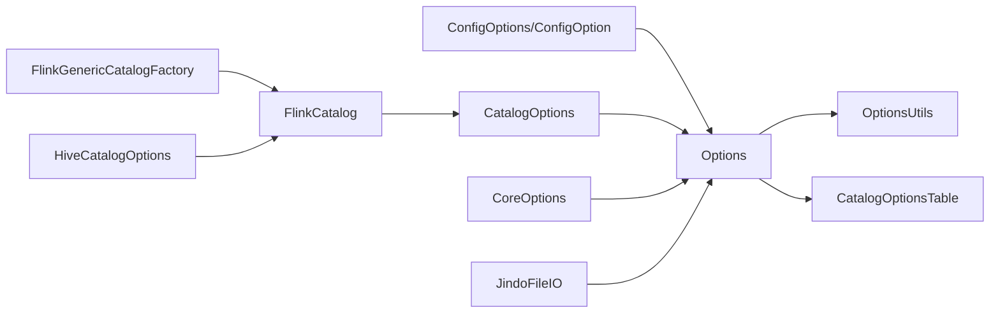

# 配置管理

<cite>
**本文引用的文件**
- [CoreOptions.java](file://paimon-api/src/main/java/org/apache/paimon/CoreOptions.java)
- [CatalogOptions.java](file://paimon-api/src/main/java/org/apache/paimon/options/CatalogOptions.java)
- [ConfigOptions.java](file://paimon-api/src/main/java/org/apache/paimon/options/ConfigOptions.java)
- [Options.java](file://paimon-api/src/main/java/org/apache/paimon/options/Options.java)
- [ConfigOption.java](file://paimon-api/src/main/java/org/apache/paimon/options/ConfigOption.java)
- [OptionsUtils.java](file://paimon-api/src/main/java/org/apache/paimon/options/OptionsUtils.java)
- [CatalogOptionsTable.java](file://paimon-core/src/main/java/org/apache/paimon/table/system/CatalogOptionsTable.java)
- [FlinkCatalog.java](file://paimon-flink/paimon-flink-common/src/main/java/org/apache/paimon/flink/FlinkCatalog.java)
- [FlinkGenericCatalogFactory.java](file://paimon-flink/paimon-flink-common/src/main/java/org/apache/paimon/flink/FlinkGenericCatalogFactory.java)
- [HiveCatalogOptions.java](file://paimon-hive/paimon-hive-catalog/src/main/java/org/apache/paimon/hive/HiveCatalogOptions.java)
- [JindoFileIO.java](file://paimon-filesystems/paimon-jindo/src/main/java/org/apache/paimon/jindo/JindoFileIO.java)
- [BenchmarkGlobalConfiguration.java](file://paimon-benchmark/paimon-cluster-benchmark/src/main/java/org/apache/paimon/benchmark/utils/BenchmarkGlobalConfiguration.java)
- [BenchmarkOptions.java](file://paimon-benchmark/paimon-cluster-benchmark/src/main/java/org/apache/paimon/benchmark/BenchmarkOptions.java)
- [config_options.py](file://paimon-python/pypaimon/common/options/config_options.py)
- [config.py](file://paimon-python/pypaimon/common/options/config.py)
- [SchemaValidation.java](file://paimon-core/src/main/java/org/apache/paimon/schema/SchemaValidation.java)
</cite>

## 目录
1. [简介](#简介)
2. [项目结构](#项目结构)
3. [核心组件](#核心组件)
4. [架构总览](#架构总览)
5. [详细组件分析](#详细组件分析)
6. [依赖分析](#依赖分析)
7. [性能考虑](#性能考虑)
8. [故障排查指南](#故障排查指南)
9. [结论](#结论)
10. [附录](#附录)

## 简介
本文件系统性梳理 Apache Paimon 的配置管理体系，覆盖以下方面：
- 核心配置项（CoreOptions）：表属性、存储与格式、压缩与清单、快照与变更日志、排序与写缓冲、扫描与分片、合并与排序引擎等。
- 目录配置（CatalogOptions）：仓库路径、元数据存储类型、连接池与缓存策略、大小写敏感、格式表支持、外部路径解析等。
- 引擎特定配置：Flink、Spark、Hive 等引擎的适配与差异点。
- 配置文件组织与优先级：全局配置、动态属性、环境变量与回退键。
- 动态与静态配置：区别、适用场景与最佳实践。
- 验证与故障排查：冲突校验、常见问题定位方法。
- 性能调优建议：基于配置项的优化策略。

## 项目结构
配置体系由“配置定义 + 解析与装载 + 引擎适配 + 系统表展示”构成：
- 配置定义层：以 ConfigOptions/ConfigOption 定义键、类型、默认值、描述与回退键；CoreOptions、CatalogOptions 等集中声明具体配置项。
- 解析与装载层：Options 提供键值存取、类型转换、前缀映射、回退键查找；OptionsUtils 提供类型转换与前缀映射工具。
- 引擎适配层：FlinkCatalog、FlinkGenericCatalogFactory、HiveCatalogOptions 等负责在不同引擎中加载与应用配置。
- 展示层：CatalogOptionsTable 将当前 Catalog 的有效配置以只读系统表形式呈现，便于诊断。

**图表来源**
- [CoreOptions.java](file://paimon-api/src/main/java/org/apache/paimon/CoreOptions.java)
- [CatalogOptions.java](file://paimon-api/src/main/java/org/apache/paimon/options/CatalogOptions.java)
- [ConfigOptions.java](file://paimon-api/src/main/java/org/apache/paimon/options/ConfigOptions.java)
- [ConfigOption.java](file://paimon-api/src/main/java/org/apache/paimon/options/ConfigOption.java)
- [Options.java](file://paimon-api/src/main/java/org/apache/paimon/options/Options.java)
- [OptionsUtils.java](file://paimon-api/src/main/java/org/apache/paimon/options/OptionsUtils.java)
- [FlinkCatalog.java](file://paimon-flink/paimon-flink-common/src/main/java/org/apache/paimon/flink/FlinkCatalog.java)
- [FlinkGenericCatalogFactory.java](file://paimon-flink/paimon-flink-common/src/main/java/org/apache/paimon/flink/FlinkGenericCatalogFactory.java)
- [HiveCatalogOptions.java](file://paimon-hive/paimon-hive-catalog/src/main/java/org/apache/paimon/hive/HiveCatalogOptions.java)
- [JindoFileIO.java](file://paimon-filesystems/paimon-jindo/src/main/java/org/apache/paimon/jindo/JindoFileIO.java)
- [CatalogOptionsTable.java](file://paimon-core/src/main/java/org/apache/paimon/table/system/CatalogOptionsTable.java)

**章节来源**
- [CoreOptions.java](file://paimon-api/src/main/java/org/apache/paimon/CoreOptions.java)
- [CatalogOptions.java](file://paimon-api/src/main/java/org/apache/paimon/options/CatalogOptions.java)
- [ConfigOptions.java](file://paimon-api/src/main/java/org/apache/paimon/options/ConfigOptions.java)
- [Options.java](file://paimon-api/src/main/java/org/apache/paimon/options/Options.java)
- [OptionsUtils.java](file://paimon-api/src/main/java/org/apache/paimon/options/OptionsUtils.java)
- [CatalogOptionsTable.java](file://paimon-core/src/main/java/org/apache/paimon/table/system/CatalogOptionsTable.java)
- [FlinkCatalog.java](file://paimon-flink/paimon-flink-common/src/main/java/org/apache/paimon/flink/FlinkCatalog.java)
- [FlinkGenericCatalogFactory.java](file://paimon-flink/paimon-flink-common/src/main/java/org/apache/paimon/flink/FlinkGenericCatalogFactory.java)
- [HiveCatalogOptions.java](file://paimon-hive/paimon-hive-catalog/src/main/java/org/apache/paimon/hive/HiveCatalogOptions.java)
- [JindoFileIO.java](file://paimon-filesystems/paimon-jindo/src/main/java/org/apache/paimon/jindo/JindoFileIO.java)

## 核心组件
- 配置定义与构建
  - ConfigOptions/ConfigOption：提供键名、类型、默认值、描述与回退键能力，统一配置项声明方式。
  - Options：提供键值存取、类型转换、前缀映射、回退键查找、动态表属性合并等。
  - OptionsUtils：提供类型转换（整型、长整型、布尔、浮点、字符串、枚举、Duration、MemorySize、Map）、前缀映射工具与动态表属性合并。
- 核心配置项（CoreOptions）
  - 表类型、桶策略、桶函数、外部路径与权重、文件格式与压缩、清单与目标文件大小、快照与变更日志保留策略、连续发现间隔、合并引擎与排序引擎、写缓冲与分片、提交超时与重试、排序溢写等。
- 目录配置（CatalogOptions）
  - 仓库路径、元存储类型（filesystem/hive/jdbc）、URI、表类型、锁配置、客户端连接池、缓存策略（访问/写入过期、分区数量、清单小文件阈值与内存、快照缓存、删除向量缓存）、大小写敏感、同步属性、格式表开关、外部路径解析与文件 IO 缓存允许。

**章节来源**
- [ConfigOptions.java](file://paimon-api/src/main/java/org/apache/paimon/options/ConfigOptions.java)
- [ConfigOption.java](file://paimon-api/src/main/java/org/apache/paimon/options/ConfigOption.java)
- [Options.java](file://paimon-api/src/main/java/org/apache/paimon/options/Options.java)
- [OptionsUtils.java](file://paimon-api/src/main/java/org/apache/paimon/options/OptionsUtils.java)
- [CoreOptions.java](file://paimon-api/src/main/java/org/apache/paimon/CoreOptions.java)
- [CatalogOptions.java](file://paimon-api/src/main/java/org/apache/paimon/options/CatalogOptions.java)

## 架构总览
下图展示配置从定义到生效的关键流程：引擎侧通过工厂或 Catalog 类加载 Options，再由 Options 解析类型与回退键，最终驱动核心逻辑（如写入、扫描、合并）。

**图表来源**
- [FlinkGenericCatalogFactory.java](file://paimon-flink/paimon-flink-common/src/main/java/org/apache/paimon/flink/FlinkGenericCatalogFactory.java)
- [FlinkCatalog.java](file://paimon-flink/paimon-flink-common/src/main/java/org/apache/paimon/flink/FlinkCatalog.java)
- [Options.java](file://paimon-api/src/main/java/org/apache/paimon/options/Options.java)
- [CoreOptions.java](file://paimon-api/src/main/java/org/apache/paimon/CoreOptions.java)
- [CatalogOptions.java](file://paimon-api/src/main/java/org/apache/paimon/options/CatalogOptions.java)

## 详细组件分析

### 核心配置项（CoreOptions）概览
- 表与存储
  - 表类型、桶数与桶键、桶函数类型（默认/模运/兼容 Hive）、追加有序桶、外部路径与策略（NONE/SPECIFIC_FS/WEIGHTED）及其权重与特定 FS 前缀。
  - 文件格式（orc/parquet/avro/csv/text/json）、默认压缩与 zstd 级别、清单格式与压缩、目标文件大小、块大小、文件后缀是否包含压缩类型。
- 快照与变更日志
  - 快照最小/最大保留数、时间保留、变更日志最小/最大保留数、时间保留、过期执行模式与限制、过期时是否清理空目录。
- 合并与排序
  - 合并引擎（去重/首行/部分更新/基于字段）、忽略删除/更新前记录、排序引擎（败者树等）、排序溢写阈值与缓冲大小、溢写压缩与级别。
- 写入与扫描
  - 写缓冲大小、最大磁盘溢写、可溢写、批量追加写缓冲、本地排序最大文件句柄、页面大小、源 Split 目标大小与打开文件成本、连续发现间隔。
- 提交与容错
  - 提交强制压缩、超时、最大重试次数、最小/最大重试等待时间。
- 变体列与索引
  - 变体拆解 Schema 开关与推断策略、最大 Schema 宽度/深度、最小字段出现比例、推断缓冲行数；文件索引读取开关与阈值。

**图表来源**
- [CoreOptions.java](file://paimon-api/src/main/java/org/apache/paimon/CoreOptions.java)

**章节来源**
- [CoreOptions.java](file://paimon-api/src/main/java/org/apache/paimon/CoreOptions.java)

### 目录配置（CatalogOptions）概览
- 仓库与元存储
  - 仓库根路径、元存储类型（filesystem/hive/jdbc）、服务端 URI、表类型（托管/外部）。
- 锁与连接池
  - 是否启用锁、锁类型、最大睡眠/获取超时、客户端连接池大小。
- 缓存策略
  - 是否启用缓存、访问/写入过期时间、分区最大数量、小清单文件阈值与内存、最大清单内容内存、每表快照缓存数、删除向量缓存数。
- 行为控制
  - 大小写敏感（回退键 allow-upper-case）、是否同步所有属性至元存储、是否支持格式表（非元存储参与）、是否启用外部路径解析（配合 data-file.external-paths）、文件 IO 是否允许静态缓存。

**图表来源**
- [CatalogOptions.java](file://paimon-api/src/main/java/org/apache/paimon/options/CatalogOptions.java)

**章节来源**
- [CatalogOptions.java](file://paimon-api/src/main/java/org/apache/paimon/options/CatalogOptions.java)

### 引擎特定配置

#### Flink 集成
- FlinkGenericCatalogFactory：创建通用 Catalog，内部设置元存储为 hive，并将 Flink Catalog 与 Paimon Catalog 组合。
- FlinkCatalog：构造时读取 CatalogOptions 并进行默认库创建、禁用默认库建表等行为控制。

**图表来源**
- [FlinkGenericCatalogFactory.java](file://paimon-flink/paimon-flink-common/src/main/java/org/apache/paimon/flink/FlinkGenericCatalogFactory.java)
- [FlinkCatalog.java](file://paimon-flink/paimon-flink-common/src/main/java/org/apache/paimon/flink/FlinkCatalog.java)

**章节来源**
- [FlinkGenericCatalogFactory.java](file://paimon-flink/paimon-flink-common/src/main/java/org/apache/paimon/flink/FlinkGenericCatalogFactory.java)
- [FlinkCatalog.java](file://paimon-flink/paimon-flink-common/src/main/java/org/apache/paimon/flink/FlinkCatalog.java)

#### Hive 元存储
- HiveCatalogOptions：定义 Hive 元存储所需配置，如 hive-conf-dir、hadoop-conf-dir、Metastore 客户端类、位置属性开关、客户端池缓存驱逐间隔等。

**章节来源**
- [HiveCatalogOptions.java](file://paimon-hive/paimon-hive-catalog/src/main/java/org/apache/paimon/hive/HiveCatalogOptions.java)

#### 对象存储（以 Jindo 为例）
- JindoFileIO：在 configure 中读取带前缀的配置项，将大小写敏感键映射为大小写不敏感，从而适配对象存储参数。

**章节来源**
- [JindoFileIO.java](file://paimon-filesystems/paimon-jindo/src/main/java/org/apache/paimon/jindo/JindoFileIO.java)

### 配置文件组织与优先级
- 优先级顺序（从高到低）
  1) 动态表属性（动态覆盖全局属性）
  2) 显式传入的配置（如 CatalogContext/Options）
  3) 回退键（fallback keys）
  4) 默认值
- 前缀映射
  - 支持以“键.子键”形式表达 Map 类型配置，OptionsUtils 负责前缀过滤与转换。
- 环境变量与外部配置
  - BenchmarkGlobalConfiguration 通过环境变量加载基准测试配置目录与 YAML 文件，体现“外部配置目录 + 动态属性”的组合加载方式。

**图表来源**
- [Options.java](file://paimon-api/src/main/java/org/apache/paimon/options/Options.java)
- [OptionsUtils.java](file://paimon-api/src/main/java/org/apache/paimon/options/OptionsUtils.java)
- [BenchmarkGlobalConfiguration.java](file://paimon-benchmark/paimon-cluster-benchmark/src/main/java/org/apache/paimon/benchmark/utils/BenchmarkGlobalConfiguration.java)

**章节来源**
- [Options.java](file://paimon-api/src/main/java/org/apache/paimon/options/Options.java)
- [OptionsUtils.java](file://paimon-api/src/main/java/org/apache/paimon/options/OptionsUtils.java)
- [BenchmarkGlobalConfiguration.java](file://paimon-benchmark/paimon-cluster-benchmark/src/main/java/org/apache/paimon/benchmark/utils/BenchmarkGlobalConfiguration.java)

### 动态配置与静态配置
- 静态配置：在表创建或 Catalog 初始化时确定，通常来自 CatalogOptions/CoreOptions 的键值。
- 动态配置：在 SQL 或引擎侧以“动态表属性”形式传入，优先级高于全局配置，用于临时覆盖。
- 使用场景
  - 静态：仓库路径、元存储类型、缓存策略、快照保留等全局策略。
  - 动态：单次查询的扫描 Split 目标大小、压缩级别、外部路径权重等。

**章节来源**
- [OptionsUtils.java](file://paimon-api/src/main/java/org/apache/paimon/options/OptionsUtils.java)
- [Options.java](file://paimon-api/src/main/java/org/apache/paimon/options/Options.java)

### 配置验证与故障排查
- 冲突校验
  - SchemaValidation 在创建/变更 Schema 时对互斥配置进行断言，避免非法组合。
- 常见问题
  - 快照/变更日志保留策略不当导致空间压力。
  - 桶函数与桶键不匹配引发数据倾斜。
  - 外部路径解析未正确配置导致读写失败。
  - 排序/溢写参数不当导致 OOM 或随机读增多。
- 诊断手段
  - 通过 catalog_options 系统表查看当前 Catalog 生效配置。
  - 检查回退键是否被正确识别。
  - 校验动态表属性是否按预期覆盖全局配置。

**图表来源**
- [CatalogOptionsTable.java](file://paimon-core/src/main/java/org/apache/paimon/table/system/CatalogOptionsTable.java)

**章节来源**
- [SchemaValidation.java](file://paimon-core/src/main/java/org/apache/paimon/schema/SchemaValidation.java)
- [CatalogOptionsTable.java](file://paimon-core/src/main/java/org/apache/paimon/table/system/CatalogOptionsTable.java)

### Python 配置适配
- Python 侧提供与 Java 配置体系一致的 ConfigOptions/ConfigOption 抽象，便于在 Python 环境中声明与使用配置项。
- 示例：S3 相关配置键（accessKeyId/accessKeySecret/securityToken/endpoint/region）以 ConfigOptions 形式暴露。

**章节来源**
- [config_options.py](file://paimon-python/pypaimon/common/options/config_options.py)
- [config.py](file://paimon-python/pypaimon/common/options/config.py)

## 依赖分析
- 配置定义与解析
  - ConfigOptions/ConfigOption 定义键与元信息；Options 提供运行时解析与回退键查找；OptionsUtils 提供类型转换与前缀映射。
- 引擎适配
  - FlinkGenericCatalogFactory/FlinkCatalog 依赖 CatalogOptions；HiveCatalogOptions 依赖 Hive 元存储；JindoFileIO 依赖 Options 前缀映射。
- 系统表
  - CatalogOptionsTable 依赖 Options 的 toMap 输出，形成只读视图。

**图表来源**
- [ConfigOptions.java](file://paimon-api/src/main/java/org/apache/paimon/options/ConfigOptions.java)
- [ConfigOption.java](file://paimon-api/src/main/java/org/apache/paimon/options/ConfigOption.java)
- [Options.java](file://paimon-api/src/main/java/org/apache/paimon/options/Options.java)
- [OptionsUtils.java](file://paimon-api/src/main/java/org/apache/paimon/options/OptionsUtils.java)
- [CatalogOptions.java](file://paimon-api/src/main/java/org/apache/paimon/options/CatalogOptions.java)
- [CoreOptions.java](file://paimon-api/src/main/java/org/apache/paimon/CoreOptions.java)
- [FlinkGenericCatalogFactory.java](file://paimon-flink/paimon-flink-common/src/main/java/org/apache/paimon/flink/FlinkGenericCatalogFactory.java)
- [FlinkCatalog.java](file://paimon-flink/paimon-flink-common/src/main/java/org/apache/paimon/flink/FlinkCatalog.java)
- [HiveCatalogOptions.java](file://paimon-hive/paimon-hive-catalog/src/main/java/org/apache/paimon/hive/HiveCatalogOptions.java)
- [JindoFileIO.java](file://paimon-filesystems/paimon-jindo/src/main/java/org/apache/paimon/jindo/JindoFileIO.java)
- [CatalogOptionsTable.java](file://paimon-core/src/main/java/org/apache/paimon/table/system/CatalogOptionsTable.java)

**章节来源**
- [ConfigOptions.java](file://paimon-api/src/main/java/org/apache/paimon/options/ConfigOptions.java)
- [ConfigOption.java](file://paimon-api/src/main/java/org/apache/paimon/options/ConfigOption.java)
- [Options.java](file://paimon-api/src/main/java/org/apache/paimon/options/Options.java)
- [OptionsUtils.java](file://paimon-api/src/main/java/org/apache/paimon/options/OptionsUtils.java)
- [CatalogOptions.java](file://paimon-api/src/main/java/org/apache/paimon/options/CatalogOptions.java)
- [CoreOptions.java](file://paimon-api/src/main/java/org/apache/paimon/CoreOptions.java)
- [FlinkGenericCatalogFactory.java](file://paimon-flink/paimon-flink-common/src/main/java/org/apache/paimon/flink/FlinkGenericCatalogFactory.java)
- [FlinkCatalog.java](file://paimon-flink/paimon-flink-common/src/main/java/org/apache/paimon/flink/FlinkCatalog.java)
- [HiveCatalogOptions.java](file://paimon-hive/paimon-hive-catalog/src/main/java/org/apache/paimon/hive/HiveCatalogOptions.java)
- [JindoFileIO.java](file://paimon-filesystems/paimon-jindo/src/main/java/org/apache/paimon/jindo/JindoFileIO.java)
- [CatalogOptionsTable.java](file://paimon-core/src/main/java/org/apache/paimon/table/system/CatalogOptionsTable.java)

## 性能考虑
- 存储与格式
  - 选择合适的文件格式（parquet/avro/orc）与压缩算法（zstd/lz4），结合层级化格式/压缩策略（file.format.per.level/file.compression.per.level）提升读写效率。
- 分片与扫描
  - 调整 source.split.target-size 与 open-file-cost，平衡并发与文件句柄开销。
- 写入与溢写
  - 合理设置 write-buffer-size、write-buffer-spill.max-disk-size、sort-spill-threshold 与 sort-spill-buffer-size，避免 OOM 与频繁随机读。
- 快照与清单
  - 控制快照与变更日志保留策略，避免过多小文件与频繁合并；必要时开启全量合并阈值。
- 桶与分布
  - 正确设置 bucket 与 bucket-key，避免热点；根据数据类型选择合适的桶函数（默认/模运/Hive 兼容）。

[本节为通用指导，无需列出具体文件来源]

## 故障排查指南
- 配置冲突
  - 使用 SchemaValidation 断言互斥配置，避免非法组合。
- 配置未生效
  - 通过 catalog_options 系统表核对实际生效值；检查是否存在回退键或动态表属性覆盖。
- 外部路径与对象存储
  - 确认 data-file.external-paths 与 resolving-file-io.enabled 配置；对象存储需确保前缀映射与大小写敏感键处理正确。
- Flink/Spark/Hive 集成
  - Flink：确认 CatalogOptions.METASTORE 与默认库策略；Hive：确认 hive-conf-dir/hadoop-conf-dir 与 Metastore 客户端类；Spark：关注引擎侧参数传递与依赖隔离。

**章节来源**
- [SchemaValidation.java](file://paimon-core/src/main/java/org/apache/paimon/schema/SchemaValidation.java)
- [CatalogOptionsTable.java](file://paimon-core/src/main/java/org/apache/paimon/table/system/CatalogOptionsTable.java)
- [FlinkCatalog.java](file://paimon-flink/paimon-flink-common/src/main/java/org/apache/paimon/flink/FlinkCatalog.java)
- [HiveCatalogOptions.java](file://paimon-hive/paimon-hive-catalog/src/main/java/org/apache/paimon/hive/HiveCatalogOptions.java)
- [JindoFileIO.java](file://paimon-filesystems/paimon-jindo/src/main/java/org/apache/paimon/jindo/JindoFileIO.java)

## 结论
Paimon 的配置体系以 ConfigOptions/ConfigOption 为核心，结合 Options 的类型转换与回退键机制，在不同引擎中实现一致的行为与可观测性。通过 CatalogOptions 与 CoreOptions 的协同，既能满足全局策略管理，又能支持动态表属性的灵活覆盖。配合 catalog_options 系统表与冲突校验，可显著提升配置的可靠性与可维护性。

[本节为总结性内容，无需列出具体文件来源]

## 附录
- 关键配置项速查
  - 表与存储：type、bucket、bucket-key、bucket-function.type、file.format、file.compression、manifest.*、target-file-size、data-file.external-paths.*
  - 快照与变更日志：snapshot.*、changelog.*、snapshot.expire.execution-mode
  - 合并与排序：merge-engine、sort-engine、sort-spill-threshold、spill-compression
  - 写入与扫描：write-buffer-size、source.split.*、continuous.discovery-interval
  - 目录：warehouse、metastore、uri、cache.*、lock.*、format-table.enabled、resolving-file-io.enabled
- 引擎侧要点
  - Flink：METASTORE=hive，禁用默认库建表策略；Spark/Hive：依赖 HiveCatalogOptions 的配置项。

[本节为补充性内容，无需列出具体文件来源]