# 技术架构

<cite>
**本文引用的文件**
- [FileStore.java](file://paimon-core/src/main/java/org/apache/paimon/FileStore.java)
- [AbstractCatalog.java](file://paimon-core/src/main/java/org/apache/paimon/catalog/AbstractCatalog.java)
- [SchemaManager.java](file://paimon-core/src/main/java/org/apache/paimon/schema/SchemaManager.java)
- [FileStoreTable.java](file://paimon-core/src/main/java/org/apache/paimon/table/FileStoreTable.java)
- [AbstractFileStore.java](file://paimon-core/src/main/java/org/apache/paimon/AbstractFileStore.java)
- [KeyValueFileStore.java](file://paimon-core/src/main/java/org/apache/paimon/KeyValueFileStore.java)
- [AppendOnlyFileStore.java](file://paimon-core/src/main/java/org/apache/paimon/AppendOnlyFileStore.java)
- [SimpleLsmKvDb.java](file://paimon-common/src/main/java/org/apache/paimon/lookup/sort/db/SimpleLsmKvDb.java)
- [CopyFilesUtil.java](file://paimon-flink/paimon-flink-common/src/main/java/org/apache/paimon/flink/copy/CopyFilesUtil.java)
- [RollbackToProcedure.java](file://paimon-flink/paimon-flink-common/src/main/java/org/apache/paimon/flink/procedure/RollbackToProcedure.java)
- [RollbackProcedure.java](file://paimon-spark/paimon-spark-common/src/main/java/org/apache/paimon/spark/procedure/RollbackProcedure.java)
- [ManifestReadThreadPool.java](file://paimon-core/src/main/java/org/apache/paimon/utils/ManifestReadThreadPool.java)
- [ThreadPoolUtils.java](file://paimon-api/src/main/java/org/apache/paimon/utils/ThreadPoolUtils.java)
- [PrivilegedFileStore.java](file://paimon-core/src/main/java/org/apache/paimon/privilege/PrivilegedFileStore.java)
- [PrivilegedFileStoreTable.java](file://paimon-core/src/main/java/org/apache/paimon/privilege/PrivilegedFileStoreTable.java)
- [RESTCatalog.java](file://paimon-core/src/main/java/org/apache/paimon/rest/RESTCatalog.java)
- [FileSystemCatalog.java](file://paimon-core/src/main/java/org/apache/paimon/catalog/FileSystemCatalog.java)
- [HiveCatalog.java](file://paimon-hive/paimon-hive-catalog/src/main/java/org/apache/paimon/hive/HiveCatalog.java)
- [JdbcCatalog.java](file://paimon-core/src/main/java/org/apache/paimon/jdbc/JdbcCatalog.java)
- [Catalog.java](file://paimon-core/src/main/java/org/apache/paimon/catalog/Catalog.java)
- [CatalogEnvironment.java](file://paimon-core/src/main/java/org/apache/paimon/catalog/CatalogEnvironment.java)
- [SchemaChange.java](file://paimon-api/src/main/java/org/apache/paimon/schema/SchemaChange.java)
- [FileStoreTableFactory.java](file://paimon-core/src/main/java/org/apache/paimon/table/FileStoreTableFactory.java)
- [DataTableBatchScan.java](file://paimon-core/src/main/java/org/apache/paimon/table/source/DataTableBatchScan.java)
- [SnapshotReader.java](file://paimon-core/src/main/java/org/apache/paimon/table/source/snapshot/SnapshotReader.java)
- [TimeTravelUtil.java](file://paimon-core/src/main/java/org/apache/paimon/table/source/snapshot/TimeTravelUtil.java)
- [FileStoreCommitImpl.java](file://paimon-core/src/main/java/org/apache/paimon/operation/FileStoreCommitImpl.java)
- [FileStoreWrite.java](file://paimon-core/src/main/java/org/apache/paimon/table/sink/FileStoreWrite.java)
- [FileStoreRead.java](file://paimon-core/src/main/java/org/apache/paimon/table/reader/FileStoreRead.java)
- [FileStoreScan.java](file://paimon-core/src/main/java/org/apache/paimon/table/scan/FileStoreScan.java)
- [FileStorePathFactory.java](file://paimon-core/src/main/java/org/apache/paimon/utils/FileStorePathFactory.java)
- [SnapshotManager.java](file://paimon-core/src/main/java/org/apache/paimon/utils/SnapshotManager.java)
- [ManifestFile.java](file://paimon-core/src/main/java/org/apache/paimon/manifest/ManifestFile.java)
- [ManifestList.java](file://paimon-core/src/main/java/org/apache/paimon/manifest/ManifestList.java)
- [StatsFileHandler.java](file://paimon-core/src/main/java/org/apache/paimon/stats/StatsFileHandler.java)
- [IndexFileHandler.java](file://paimon-core/src/main/java/org/apache/paimon/index/IndexFileHandler.java)
- [TagManager.java](file://paimon-core/src/main/java/org/apache/paimon/utils/TagManager.java)
- [BranchManager.java](file://paimon-core/src/main/java/org/apache/paimon/utils/BranchManager.java)
- [ChangelogManager.java](file://paimon-core/src/main/java/org/apache/paimon/utils/ChangelogManager.java)
- [PartitionExpire.java](file://paimon-core/src/main/java/org/apache/paimon/table/partition/PartitionExpire.java)
- [ExpirePartitionsProcedure.java](file://paimon-spark/paimon-spark-common/src/main/java/org/apache/paimon/spark/procedure/ExpirePartitionsProcedure.java)
- [ExpirePartitionsAction.java](file://paimon-flink/paimon-flink-common/src/main/java/org/apache/paimon/flink/action/ExpirePartitionsAction.java)
- [CopyManifestFileOperator.java](file://paimon-flink/paimon-flink-common/src/main/java/org/apache/paimon/flink/copy/CopyManifestFileOperator.java)
- [CopySchemaOperator.java](file://paimon-spark/paimon-spark-common/src/main/java/org/apache/paimon/spark/copy/CopySchemaOperator.java)
- [CopyMetaFilesFunction.java](file://paimon-flink/paimon-flink-common/src/main/java/org/apache/paimon/flink/copy/CopyMetaFilesFunction.java)
- [LocalTableQuery.java](file://paimon-core/src/main/java/org/apache/paimon/table/query/LocalTableQuery.java)
- [KeyValueFileReaderFactory.java](file://paimon-core/src/main/java/org/apache/paimon/io/KeyValueFileReaderFactory.java)
- [RawFileSplitRead.java](file://paimon-core/src/main/java/org/apache/paimon/operation/RawFileSplitRead.java)
- [DataEvolutionFileStoreScan.java](file://paimon-core/src/main/java/org/apache/paimon/operation/DataEvolutionFileStoreScan.java)
- [MergeTreeCompactManagerFactory.java](file://paimon-core/src/main/java/org/apache/paimon/mergetree/compact/MergeTreeCompactManagerFactory.java)
- [KvCompactionManagerFactory.java](file://paimon-core/src/main/java/org/apache/paimon/mergetree/compact/KvCompactionManagerFactory.java)
- [IncrementalClusterStrategy.java](file://paimon-core/src/main/java/org/apache/paimon/append/cluster/IncrementalClusterStrategy.java)
- [BucketedAppendFileStoreWrite.java](file://paimon-core/src/main/java/org/apache/paimon/operation/BucketedAppendFileStoreWrite.java)
- [BucketedAppendClusterManager.java](file://paimon-core/src/main/java/org/apache/paimon/append/cluster/BucketedAppendClusterManager.java)
- [RecordLevelExpire.java](file://paimon-core/src/main/java/org/paimon/io/RecordLevelExpire.java)
- [OrphanFilesClean.java](file://paimon-core/src/main/java/org/apache/paimon/operation/OrphanFilesClean.java)
- [LocalOrphanFilesClean.java](file://paimon-core/src/main/java/org/apache/paimon/operation/LocalOrphanFilesClean.java)
- [FileStoreLookupFunctionTest.java](file://paimon-flink/paimon-flink-common/src/test/java/org/apache/paimon/flink/lookup/FileStoreLookupFunctionTest.java)
- [CopyFilesActionITCase.java](file://paimon-flink/paimon-flink-common/src/test/java/org/apache/paimon/flink/action/CopyFilesActionITCase.java)
- [ExpirePartitionsActionITCaseBase.java](file://paimon-flink/paimon-flink-common/src/test/java/org/apache/paimon/flink/action/RemoveOrphanFilesActionITCaseBase.java)
- [RESTCatalogTest.java](file://paimon-core/src/test/java/org/apache/paimon/rest/RESTCatalogTest.java)
- [SchemaManagerTest.java](file://paimon-core/src/test/java/org/apache/paimon/schema/SchemaManagerTest.java)
- [SimpleTableTestBase.java](file://paimon-core/src/test/java/org/apache/paimon/table/SimpleTableTestBase.java)
- [TestFileStore.java](file://paimon-core/src/test/java/org/apache/paimon/TestFileStore.java)
- [AppendOnlyTableTest.java](file://paimon-core/src/test/java/org/apache/paimon/table/AppendOnlySimpleTableTest.java)
- [PrimaryKeyTableTest.java](file://paimon-core/src/test/java/org/apache/paimon/table/PrimaryKeySimpleTableTest.java)
- [StatsTableTest.java](file://paimon-core/src/test/java/org/apache/paimon/stats/StatsTableTest.java)
- [AppendOnlyTableCompactionTest.java](file://paimon-core/src/test/java/org/apache/paimon/append/AppendOnlyTableCompactionTest.java)
- [AppendOnlyTableColumnTypeFileDataTest.java](file://paimon-core/src/test/java/org/apache/paimon/table/AppendOnlyTableColumnTypeFileDataTest.java)
- [PrimaryKeyTableColumnTypeFileMetaTest.java](file://paimon-core/src/test/java/org/apache/paimon/table/PrimaryKeyTableColumnTypeFileMetaTest.java)
- [AppendOnlyTableFileMetaFilterTest.java](file://paimon-core/src/test/java/org/apache/paimon/table/AppendOnlyTableFileMetaFilterTest.java)
- [PrimaryKeyFileMetaFilterTest.java](file://paimon-core/src/test/java/org/apache/paimon/table/PrimaryKeyFileDataTableTest.java)
- [AppendOnlyTableTestBase.java](file://paimon-core/src/test/java/org/apache/paimon/table/AppendOnlySimpleTableTest.java)
- [PrimaryKeyFileDataTableTest.java](file://paimon-core/src/test/java/org/apache/paimon/table/PrimaryKeyFileDataTableTest.java)
- [AppendOnlyTableCompactionTest.java](file://paimon-core/src/test/java/org/apache/paimon/append/AppendOnlyTableCompactionTest.java)
- [AppendOnlyTableColumnTypeFileDataTest.java](file://paimon-core/src/test/java/org/apache/paimon/table/AppendOnlyTableColumnTypeFileDataTest.java)
- [PrimaryKeyTableColumnTypeFileMetaTest.java](file://paimon-core/src/test/java/org/apache/paimon/table/PrimaryKeyTableColumnTypeFileMetaTest.java)
- [AppendOnlyTableFileMetaFilterTest.java](file://paimon-core/src/test/java/org/apache/paimon/table/AppendOnlyTableFileMetaFilterTest.java)
- [PrimaryKeyFileMetaFilterTest.java](file://paimon-core/src/test/java/org/apache/paimon/table/PrimaryKeyFileDataTableTest.java)
- [AppendOnlyTableTestBase.java](file://paimon-core/src/test/java/org/apache/paimon/table/AppendOnlySimpleTableTest.java)
- [PrimaryKeyFileDataTableTest.java](file://paimon-core/src/test/java/org/apache/paimon/table/PrimaryKeyFileDataTableTest.java)
- [AppendOnlyTableCompactionTest.java](file://paimon-core/src/test/java/org/apache/paimon/append/AppendOnlyTableCompactionTest.java)
- [AppendOnlyTableColumnTypeFileDataTest.java](file://paimon-core/src/test/java/org/apache/paimon/table/AppendOnlyTableColumnTypeFileDataTest.java)
- [PrimaryKeyTableColumnTypeFileMetaTest.java](file://paimon-core/src/test/java/org/apache/paimon/table/PrimaryKeyTableColumnTypeFileMetaTest.java)
- [AppendOnlyTableFileMetaFilterTest.java](file://paimon-core/src/test/java/org/apache/paimon/table/AppendOnlyTableFileMetaFilterTest.java)
- [PrimaryKeyFileMetaFilterTest.java](file://paimon-core/src/test/java/org/apache/paimon/table/PrimaryKeyFileDataTableTest.java)
- [AppendOnlyTableTestBase.java](file://paimon-core/src/test/java/org/apache/paimon/table/AppendOnlySimpleTableTest.java)
- [PrimaryKeyFileDataTableTest.java](file://paimon-core/src/test/java/org/apache/paimon/table/PrimaryKeyFileDataTableTest.java)
- [AppendOnlyTableCompactionTest.java](file://paimon-core/src/test/java/org/apache/paimon/append/AppendOnlyTableCompactionTest.java)
- [AppendOnlyTableColumnTypeFileDataTest.java](file://paimon-core/src/test/java/org/apache/paimon/table/AppendOnlyTableColumnTypeFileDataTest.java)
- [PrimaryKeyTableColumnTypeFileMetaTest.java](file://paimon-core/src/test/java/org/apache/paimon/table/PrimaryKeyTableColumnTypeFileMetaTest.java)
- [AppendOnlyTableFileMetaFilterTest.java](file://paimon-core/src/test/java/org/apache/paimon/table/AppendOnlyTableFileMetaFilterTest.java)
- [PrimaryKeyFileMetaFilterTest.java](file://paimon-core/src/test/java/org/apache/paimon/table/PrimaryKeyFileDataTableTest.java)
- [AppendOnlyTableTestBase.java](file://paimon-core/src/test/java/org/apache/paimon/table/AppendOnlySimpleTableTest.java)
- [PrimaryKeyFileDataTableTest.java](file://paimon-core/src/test/java/org/apache/paimon/table/PrimaryKeyFileDataTableTest.java)
- [AppendOnlyTableCompactionTest.java](file://paimon-core/src/test/java/org/apache/paimon/append/AppendOnlyTableCompactionTest.java)
- [AppendOnlyTableColumnTypeFileDataTest.java](file://paimon-core/src/test/java/org/apache/paimon/table/AppendOnlyTableColumnTypeFileDataTest.java)
- [PrimaryKeyTableColumnTypeFileMetaTest.java](file://paimon-core/src/test/java/org/apache/paimon/table/PrimaryKeyTableColumnTypeFileMetaTest.java)
- [AppendOnlyTableFileMetaFilterTest.java](file://paimon-core/src/test/java/org/apache/paimon/table/AppendOnlyTableFileMetaFilterTest.java)
- [PrimaryKeyFileMetaFilterTest.java](file://paimon-core/src/test/java/org/apache/paimon/table/PrimaryKeyFileDataTableTest.java)
- [AppendOnlyTableTestBase.java](file://paimon-core/src/test/java/org/apache/paimon/table/AppendOnlySimpleTableTest.java)
- [PrimaryKeyFileDataTableTest.java](file://paimon-core/src/test/java/org/apache/paimon/table/PrimaryKeyFileDataTableTest.java)
- [AppendOnlyTableCompactionTest.java](file://paimon-core/src/test/java/org/apache/paimon/append/AppendOnlyTableCompactionTest.java)
- [AppendOnlyTableColumnTypeFileDataTest.java](file://paimon-core/src/test/java/org/apache/paimon/table/AppendOnlyTableColumnTypeFileDataTest.java)
- [PrimaryKeyTableColumnTypeFileMetaTest.java](file://paimon-core/src/test/java/org/apache/paimon/table/PrimaryKeyTableColumnTypeFileMetaTest.java)
- [AppendOnlyTableFileMetaFilterTest.java](file://paimon-core/src/test/java/org/apache/paimon/table/AppendOnlyTableFileMetaFilterTest.java)
- [PrimaryKeyFileMetaFilterTest.java](file://paimon-core/src/test/java/org/apache/paimon/table/PrimaryKeyFileDataTableTest.java)
- [AppendOnlyTableTestBase.java](file://paimon-core/src/test/java/org/apache/paimon/table/AppendOnlySimpleTableTest.java)
- [PrimaryKeyFileDataTableTest.java](file://paimon-core/src/test/java/org/apache/paimon/table/PrimaryKeyFileDataTableTest.java)
- [AppendOnlyTableCompactionTest.java](file://paimon-core/src/test/java/org/apache/paimon/append/AppendOnlyTableCompactionTest.java)
- [AppendOnlyTableColumnTypeFileDataTest.java](file://paimon-core/src/test/java/org/apache/paimon/table/AppendOnlyTableColumnTypeFileDataTest.java)
- [PrimaryKeyTableColumnTypeFileMetaTest.java](file://paimon-core/src/test/java/org/apache/paimon/table/PrimaryKeyTableColumnTypeFileMetaTest.java)
- [AppendOnlyTableFileMetaFilterTest.java](file://paimon-core/src/test/java/org/apache/paimon/table/AppendOnlyTableFileMetaFilterTest.java)
- [PrimaryKeyFileMetaFilterTest.java](file://paimon-core/src/test/java/org/apache/paimon/table......)
</cite>

## 目录
1. [引言](#引言)
2. [项目结构](#项目结构)
3. [核心组件](#核心组件)
4. [架构总览](#架构总览)
5. [组件深度解析](#组件深度解析)
6. [依赖关系分析](#依赖关系分析)
7. [性能考量](#性能考量)
8. [故障排查指南](#故障排查指南)
9. [结论](#结论)
10. [附录](#附录)

## 引言
本技术架构文档面向Apache Paimon的开发者与使用者，系统性阐述其整体架构设计与关键实现。Paimon采用“分层架构”组织代码：存储层（FileStore）、业务层（Catalog、Schema、Snapshot、Tag/Branch 等）与接口层（Table API、Flink/Spark/REST接入）。核心创新在于将LSM树与湖格式融合，通过FileStore抽象统一读写与物化结构；通过SchemaManager实现多版本模式演进；通过Catalog提供目录与版本管理能力；通过Table API对外暴露统一的数据模型。

文档重点说明：
- 存储层与业务层的职责边界与协作关系
- FileStore、AbstractCatalog、SchemaManager等核心组件的设计理念与交互
- LSM树与湖格式的结合方式及对流批一体化的支持
- 工厂模式、策略模式在组件构建与选择中的应用
- 关键数据路径：写入、查询、版本管理、复制迁移等
- 架构图与组件分解，帮助快速理解系统设计

## 项目结构
仓库采用模块化组织，核心模块包括：
- paimon-api：公共API与工具
- paimon-common：通用组件与测试基类
- paimon-core：核心引擎（FileStore、Catalog、Schema、Snapshot、读写扫描等）
- paimon-flink/spark/hive/jdbc/iceberg等：生态适配层
- paimon-python：Python客户端
- paimon-service：服务端运行时
- paimon-filesystems：文件系统适配
- paimon-docs：文档

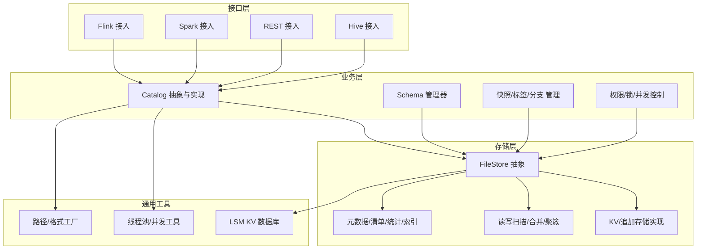

## 核心组件
- FileStore：统一抽象文件存储，提供扫描、读取、写入、提交、快照、标签、分区过期、服务管理等能力。不同表模式（KV/追加）由具体实现承载。
- AbstractCatalog：目录抽象，定义数据库/表生命周期、版本管理（可选）、函数与系统表加载等通用逻辑。
- SchemaManager：表结构多版本管理，支持Schema变更（增删改列、类型变更、选项变更等），并保证与快照状态一致。
- FileStoreTable：面向行数据的表抽象，封装FileStore访问、写入、提交、查询、分支/标签切换等。
- LSM-KV：在Common模块中提供基于内存排序缓冲与磁盘有序文件的LSM实现，用于查找/缓存场景。

章节来源
- [FileStore.java:61-127](file://paimon-core/src/main/java/org/apache/paimon/FileStore.java#L61-L127)
- [AbstractCatalog.java:77-768](file://paimon-core/src/main/java/org/apache/paimon/catalog/AbstractCatalog.java#L77-L768)
- [SchemaManager.java:108-1325](file://paimon-core/src/main/java/org/apache/paimon/schema/SchemaManager.java#L108-L1325)
- [FileStoreTable.java:56-181](file://paimon-core/src/main/java/org/apache/paimon/table/FileStoreTable.java#L56-L181)
- [SimpleLsmKvDb.java:72-560](file://paimon-common/src/main/java/org/apache/paimon/lookup/sort/db/SimpleLsmKvDb.java#L72-L560)

## 架构总览
Paimon的分层架构以“存储层-业务层-接口层”为主线，围绕以下关键点：
- 存储层：FileStore抽象统一了读写、物化结构（清单、统计、索引、快照）与维护操作（过期、清理、合并）。
- 业务层：Catalog负责目录与版本管理；SchemaManager负责模式演进；Snapshot/Tag/Branch提供时间旅行与版本回滚能力。
- 接口层：Table API、Flink/Spark/REST/Hive等接入，统一调用Catalog与FileStore。

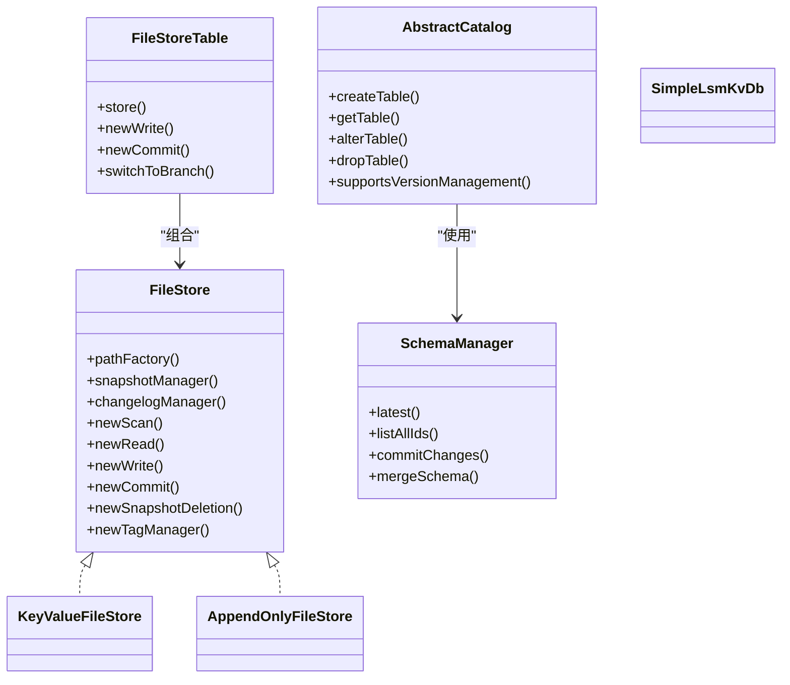

图表来源
- [FileStore.java:61-127](file://paimon-core/src/main/java/org/apache/paimon/FileStore.java#L61-L127)
- [AbstractCatalog.java:77-768](file://paimon-core/src/main/java/org/apache/paimon/catalog/AbstractCatalog.java#L77-L768)
- [SchemaManager.java:108-1325](file://paimon-core/src/main/java/org/apache/paimon/schema/SchemaManager.java#L108-L1325)
- [FileStoreTable.java:56-181](file://paimon-core/src/main/java/org/apache/paimon/table/FileStoreTable.java#L56-L181)
- [KeyValueFileStore.java:63-88](file://paimon-core/src/main/java/org/apache/paimon/KeyValueFileStore.java#L63-L88)
- [AppendOnlyFileStore.java:50-63](file://paimon-core/src/main/java/org/apache/paimon/AppendOnlyFileStore.java#L50-L63)
- [SimpleLsmKvDb.java:72-560](file://paimon-common/src/main/java/org/apache/paimon/lookup/sort/db/SimpleLsmKvDb.java#L72-L560)

## 组件深度解析

### 存储层：FileStore 抽象与实现
- 抽象接口定义了路径工厂、快照/变更日志/标签/分区过期、扫描/读取/写入/提交等能力，确保不同表模式（KV/追加）共享统一的物化与维护机制。
- 具体实现：
  - KeyValueFileStore：面向主键表，支持合并树、聚簇、增量合并等复杂读写路径。
  - AppendOnlyFileStore：面向追加表，简化写入与扫描，适合流式写入场景。

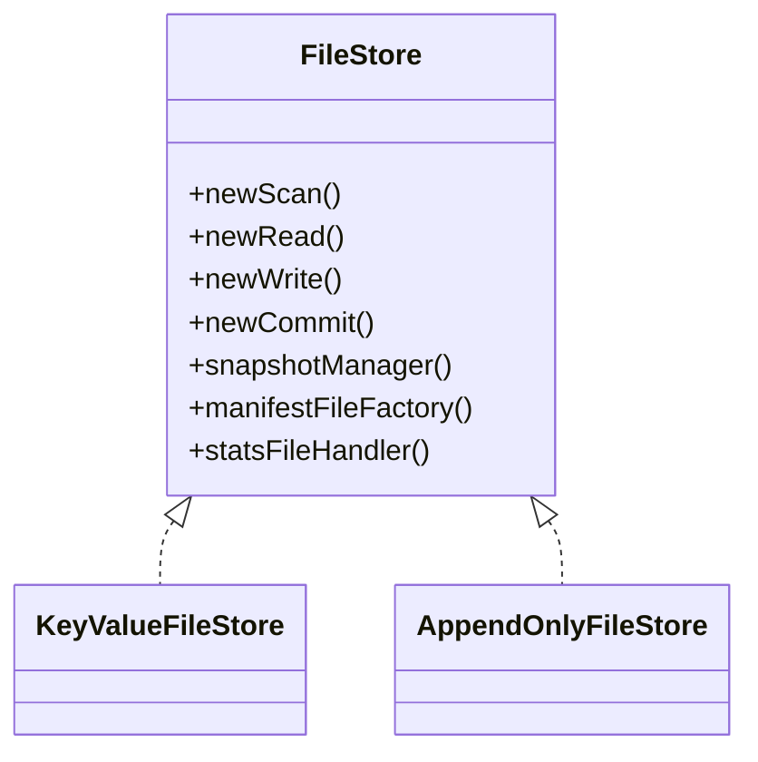

图表来源
- [FileStore.java:61-127](file://paimon-core/src/main/java/org/apache/paimon/FileStore.java#L61-L127)
- [KeyValueFileStore.java:63-88](file://paimon-core/src/main/java/org/apache/paimon/KeyValueFileStore.java#L63-L88)
- [AppendOnlyFileStore.java:50-63](file://paimon-core/src/main/java/org/apache/paimon/AppendOnlyFileStore.java#L50-L63)

章节来源
- [FileStore.java:61-127](file://paimon-core/src/main/java/org/apache/paimon/FileStore.java#L61-L127)
- [AbstractFileStore.java:95-525](file://paimon-core/src/main/java/org/apache/paimon/AbstractFileStore.java#L95-L525)
- [KeyValueFileStore.java:63-88](file://paimon-core/src/main/java/org/apache/paimon/KeyValueFileStore.java#L63-L88)
- [AppendOnlyFileStore.java:50-63](file://paimon-core/src/main/java/org/apache/paimon/AppendOnlyFileStore.java#L50-L63)

### 业务层：Catalog 与 SchemaManager
- AbstractCatalog：提供目录通用能力（数据库/表 CRUD、分区列举、函数管理、版本管理占位），具体实现按需覆盖。
- SchemaManager：多版本模式管理，支持Schema变更（增删改列、类型变更、选项变更、注释变更等），并与快照状态保持一致性。

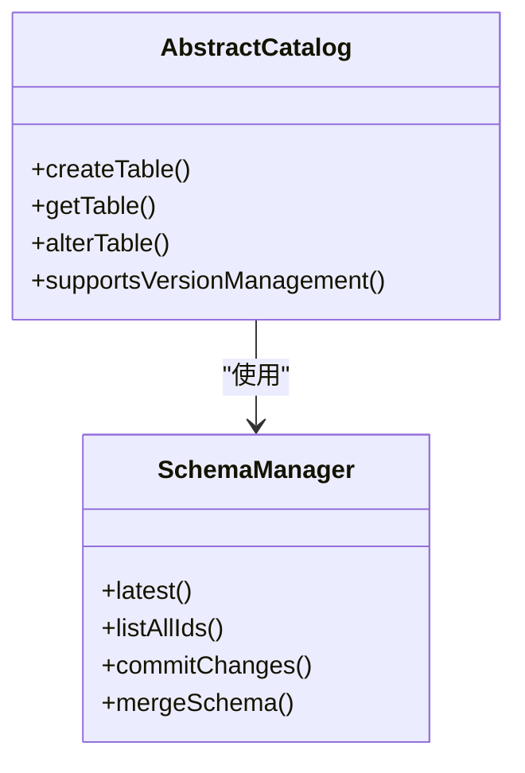

图表来源
- [AbstractCatalog.java:77-768](file://paimon-core/src/main/java/org/apache/paimon/catalog/AbstractCatalog.java#L77-L768)
- [SchemaManager.java:108-1325](file://paimon-core/src/main/java/org/apache/paimon/schema/SchemaManager.java#L108-L1325)

章节来源
- [AbstractCatalog.java:77-768](file://paimon-core/src/main/java/org/apache/paimon/catalog/AbstractCatalog.java#L77-L768)
- [SchemaManager.java:108-1325](file://paimon-core/src/main/java/org/apache/paimon/schema/SchemaManager.java#L108-L1325)
- [SchemaChange.java:37-72](file://paimon-api/src/main/java/org/apache/paimon/schema/SchemaChange.java#L37-L72)

### 表层：FileStoreTable 与工厂
- FileStoreTable：面向行数据的表抽象，封装FileStore访问、写入、提交、查询、分支/标签切换等。
- FileStoreTableFactory：根据配置与Schema创建具体表实例，支持链式表等扩展。

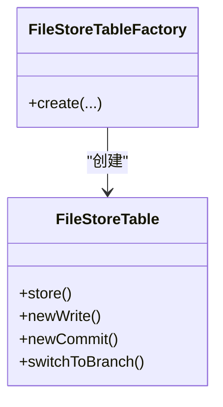

图表来源
- [FileStoreTable.java:56-181](file://paimon-core/src/main/java/org/apache/paimon/table/FileStoreTable.java#L56-L181)
- [FileStoreTableFactory.java:62-76](file://paimon-core/src/main/java/org/apache/paimon/table/FileStoreTableFactory.java#L62-L76)
- [FileStoreTableFactory.java:90-134](file://paimon-core/src/main/java/org/apache/paimon/table/FileStoreTableFactory.java#L90-L134)
- [FileStoreTableFactory.java:136-193](file://paimon-core/src/main/java/org/apache/paimon/table/FileStoreTableFactory.java#L136-L193)

章节来源
- [FileStoreTable.java:56-181](file://paimon-core/src/main/java/org/apache/paimon/table/FileStoreTable.java#L56-L181)
- [FileStoreTableFactory.java:62-76](file://paimon-core/src/main/java/org/apache/paimon/table/FileStoreTableFactory.java#L62-L76)
- [FileStoreTableFactory.java:90-134](file://paimon-core/src/main/java/org/apache/paimon/table/FileStoreTableFactory.java#L90-L134)
- [FileStoreTableFactory.java:136-193](file://paimon-core/src/main/java/org/apache/paimon/table/FileStoreTableFactory.java#L136-L193)

### LSM树与湖格式的结合
- LSM-KV：在Common模块中提供基于内存排序缓冲与磁盘有序文件的LSM实现，用于查找/缓存场景，体现“内存排序+磁盘有序”的LSM思想。
- 湖格式：FileStore通过清单（Manifest）、统计（Stats）、索引（Index）等元数据文件与数据文件分离，实现湖格式的可发现、可并行、可压缩特性。
- 结合方式：LSM用于加速查找与缓存，湖格式用于大规模数据存储与物化，二者在读写路径中协同工作。

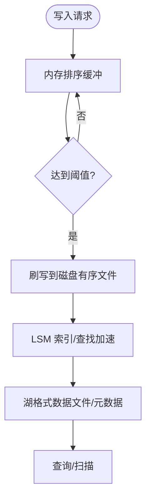

图表来源
- [SimpleLsmKvDb.java:72-560](file://paimon-common/src/main/java/org/apache/paimon/lookup/sort/db/SimpleLsmKvDb.java#L72-L560)
- [ManifestFile.java:62-87](file://paimon-core/src/main/java/org/apache/paimon/manifest/ManifestFile.java#L62-L87)
- [StatsFileHandler.java:31-31](file://paimon-core/src/main/java/org/apache/paimon/stats/StatsFileHandler.java#L31-L31)
- [IndexFileHandler.java:不适用](file://paimon-core/src/main/java/org/apache/paimon/index/IndexFileHandler.java#L不适用)

章节来源
- [SimpleLsmKvDb.java:72-560](file://paimon-common/src/main/java/org/apache/paimon/lookup/sort/db/SimpleLsmKvDb.java#L72-L560)
- [ManifestFile.java:62-87](file://paimon-core/src/main/java/org/apache/paimon/manifest/ManifestFile.java#L62-L87)
- [StatsFileHandler.java:31-31](file://paimon-core/src/main/java/org/apache/paimon/stats/StatsFileHandler.java#L31-L31)

### 设计模式应用
- 工厂模式：FileStoreTableFactory、KeyValueFileReaderFactory、ManifestFile.Factory等，用于创建与组装组件。
- 策略模式：MergeTreeCompactManagerFactory/KvCompactionManagerFactory、IncrementalClusterStrategy等，按表模式与配置选择不同策略。
- 装饰器/委托：PrivilegedFileStore/PrivilegedFileStoreTable对底层FileStore进行权限控制增强。

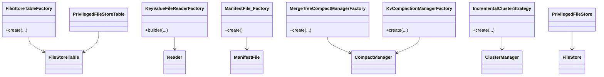

图表来源
- [FileStoreTableFactory.java:62-76](file://paimon-core/src/main/java/org/apache/paimon/table/FileStoreTableFactory.java#L62-L76)
- [FileStoreTableFactory.java:90-134](file://paimon-core/src/main/java/org/apache/paimon/table/FileStoreTableFactory.java#L90-L134)
- [FileStoreTableFactory.java:136-193](file://paimon-core/src/main/java/org/apache/paimon/table/FileStoreTableFactory.java#L136-L193)
- [KeyValueFileReaderFactory.java:75-99](file://paimon-core/src/main/java/org/apache/paimon/io/KeyValueFileReaderFactory.java#L75-L99)
- [ManifestFile.java:267-284](file://paimon-core/src/main/java/org/apache/paimon/manifest/ManifestFile.java#L267-L284)
- [MergeTreeCompactManagerFactory.java:92-92](file://paimon-core/src/main/java/org/apache/paimon/mergetree/compact/MergeTreeCompactManagerFactory.java#L92-L92)
- [KvCompactionManagerFactory.java:53-94](file://paimon-core/src/main/java/org/apache/paimon/mergetree/compact/KvCompactionManagerFactory.java#L53-L94)
- [IncrementalClusterStrategy.java:39-39](file://paimon-core/src/main/java/org/apache/paimon/append/cluster/IncrementalClusterStrategy.java#L39-L39)
- [PrivilegedFileStore.java:61-241](file://paimon-core/src/main/java/org/apache/paimon/privilege/PrivilegedFileStore.java#L61-L241)
- [PrivilegedFileStoreTable.java:106-109](file://paimon-core/src/main/java/org/apache/paimon/privilege/PrivilegedFileStoreTable.java#L106-L109)

## 依赖关系分析
- Catalog与SchemaManager：Catalog持有SchemaManager用于表结构与版本管理；部分Catalog实现（如FileSystemCatalog、RESTCatalog、HiveCatalog、JdbcCatalog）覆盖具体行为。
- FileStoreTable与FileStore：FileStoreTable组合FileStore，通过其接口完成读写与物化。
- 并发与线程池：ManifestReadThreadPool与ThreadPoolUtils提供批量执行与并发控制，避免资源争用。
- 权限与安全：PrivilegedFileStore/PrivilegedFileStoreTable对底层组件进行装饰，注入权限校验。

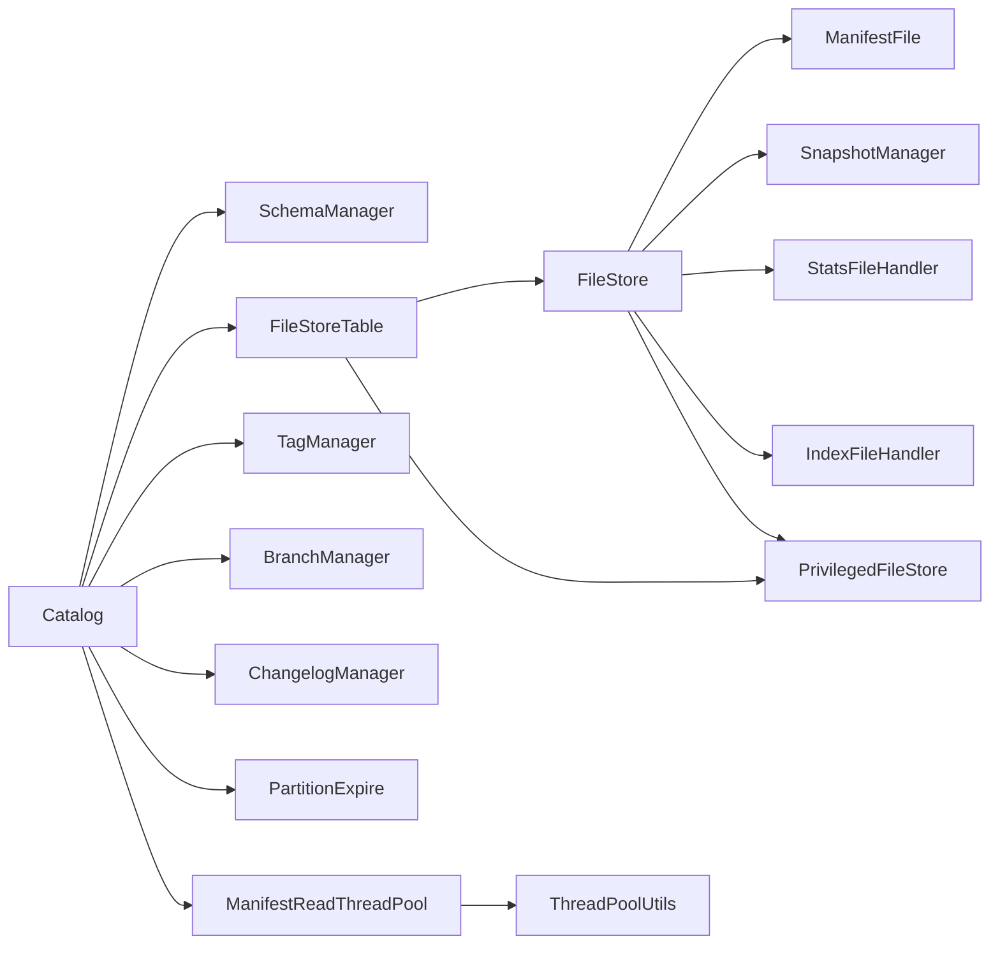

图表来源
- [AbstractCatalog.java:77-768](file://paimon-core/src/main/java/org/apache/paimon/catalog/AbstractCatalog.java#L77-L768)
- [SchemaManager.java:108-1325](file://paimon-core/src/main/java/org/apache/paimon/schema/SchemaManager.java#L108-L1325)
- [FileStoreTable.java:56-181](file://paimon-core/src/main/java/org/apache/paimon/table/FileStoreTable.java#L56-L181)
- [FileStore.java:61-127](file://paimon-core/src/main/java/org/apache/paimon/FileStore.java#L61-L127)
- [ManifestFile.java:62-87](file://paimon-core/src/main/java/org/apache/paimon/manifest/ManifestFile.java#L62-L87)
- [SnapshotManager.java:不适用](file://paimon-core/src/main/java/org/apache/paimon/utils/SnapshotManager.java#L不适用)
- [StatsFileHandler.java:31-31](file://paimon-core/src/main/java/org/apache/paimon/stats/StatsFileHandler.java#L31-L31)
- [IndexFileHandler.java:不适用](file://paimon-core/src/main/java/org/apache/paimon/index/IndexFileHandler.java#L不适用)
- [TagManager.java:不适用](file://paimon-core/src/main/java/org/apache/paimon/utils/TagManager.java#L不适用)
- [BranchManager.java:不适用](file://paimon-core/src/main/java/org/apache/paimon/utils/BranchManager.java#L不适用)
- [ChangelogManager.java:不适用](file://paimon-core/src/main/java/org/apache/paimon/utils/ChangelogManager.java#L不适用)
- [PartitionExpire.java:不适用](file://paimon-core/src/main/java/org/apache/paimon/table/partition/PartitionExpire.java#L不适用)
- [ManifestReadThreadPool.java:36-65](file://paimon-core/src/main/java/org/apache/paimon/utils/ManifestReadThreadPool.java#L36-L65)
- [ThreadPoolUtils.java:59-91](file://paimon-api/src/main/java/org/apache/paimon/utils/ThreadPoolUtils.java#L59-L91)
- [PrivilegedFileStore.java:61-241](file://paimon-core/src/main/java/org/apache/paimon/privilege/PrivilegedFileStore.java#L61-L241)
- [PrivilegedFileStoreTable.java:106-109](file://paimon-core/src/main/java/org/apache/paimon/privilege/PrivilegedFileStoreTable.java#L106-L109)

章节来源
- [AbstractCatalog.java:77-768](file://paimon-core/src/main/java/org/apache/paimon/catalog/AbstractCatalog.java#L77-L768)
- [SchemaManager.java:108-1325](file://paimon-core/src/main/java/org/apache/paimon/schema/SchemaManager.java#L108-L1325)
- [FileStoreTable.java:56-181](file://paimon-core/src/main/java/org/apache/paimon/table/FileStoreTable.java#L56-L181)
- [FileStore.java:61-127](file://paimon-core/src/main/java/org/apache/paimon/FileStore.java#L61-L127)
- [ManifestReadThreadPool.java:36-65](file://paimon-core/src/main/java/org/apache/paimon/utils/ManifestReadThreadPool.java#L36-L65)
- [ThreadPoolUtils.java:59-91](file://paimon-api/src/main/java/org/apache/paimon/utils/ThreadPoolUtils.java#L59-L91)
- [PrivilegedFileStore.java:61-241](file://paimon-core/src/main/java/org/apache/paimon/privilege/PrivilegedFileStore.java#L61-L241)
- [PrivilegedFileStoreTable.java:106-109](file://paimon-core/src/main/java/org/apache/paimon/privilege/PrivilegedFileStoreTable.java#L106-L109)

## 性能考量
- 并发与批处理：通过ManifestReadThreadPool与ThreadPoolUtils实现任务的顺序批处理与并发控制，避免过度线程导致上下文切换开销。
- LSM刷写与合并：内存缓冲达到阈值后刷写磁盘有序文件，减少随机写；合并策略按表模式与配置选择，平衡吞吐与延迟。
- 元数据缓存：FileStoreTable支持设置清单/快照/统计缓存，降低频繁IO带来的延迟。
- 过期与清理：Snapshot/Changelog/Orphan Files清理策略可配置保留窗口与限制，避免空间膨胀。

章节来源
- [ManifestReadThreadPool.java:36-65](file://paimon-core/src/main/java/org/apache/paimon/utils/ManifestReadThreadPool.java#L36-L65)
- [ThreadPoolUtils.java:59-91](file://paimon-api/src/main/java/org/apache/paimon/utils/ThreadPoolUtils.java#L59-L91)
- [FileStoreTable.java:56-181](file://paimon-core/src/main/java/org/apache/paimon/table/FileStoreTable.java#L56-L181)
- [SimpleLsmKvDb.java:72-560](file://paimon-common/src/main/java/org/apache/paimon/lookup/sort/db/SimpleLsmKvDb.java#L72-L560)

## 故障排查指南
- 版本管理相关
  - 回滚失败：检查是否存在快照引用或标签/分支未释放；参考回滚过程与异常信息定位。
  - 分支/标签创建/删除：确认Catalog是否支持版本管理，以及对应方法是否可用。
- 复制与迁移
  - 复制文件清单：使用CopyFilesUtil/CopyManifestFileOperator等工具核对清单与数据文件路径一致性。
  - 外部路径：当存在外部数据路径时，复制流程需要重写清单条目。
- 查询与扫描
  - 时间旅行与分桶：检查Schema变化对分桶数的影响，必要时进行重缩放或增量差异扫描。
  - 统计与索引：确认统计文件与索引文件存在且有效，避免扫描性能下降。

章节来源
- [RollbackToProcedure.java:51-78](file://paimon-flink/paimon-flink-common/src/main/java/org/apache/paimon/flink/procedure/RollbackToProcedure.java#L51-L78)
- [RollbackProcedure.java:76-121](file://paimon-spark/paimon-spark-common/src/main/java/org/apache/paimon/spark/procedure/RollbackProcedure.java#L76-L121)
- [CopyFilesUtil.java:69-111](file://paimon-flink/paimon-flink-common/src/main/java/org/apache/paimon/flink/copy/CopyFilesUtil.java#L69-L111)
- [CopyManifestFileOperator.java:129-174](file://paimon-flink/paimon-flink-common/src/main/java/org/apache/paimon/flink/copy/CopyManifestFileOperator.java#L129-L174)
- [TimeTravelUtil.java:270-284](file://paimon-core/src/main/java/org/apache/paimon/table/source/snapshot/TimeTravelUtil.java#L270-L284)
- [ExpirePartitionsProcedure.java:75-120](file://paimon-spark/paimon-spark-common/src/main/java/org/apache/paimon/spark/procedure/ExpirePartitionsProcedure.java#L75-L120)
- [ExpirePartitionsAction.java:63-81](file://paimon-flink/paimon-flink-common/src/main/java/org/apache/paimon/flink/action/ExpirePartitionsAction.java#L63-L81)

## 关键数据路径

### 写入流程
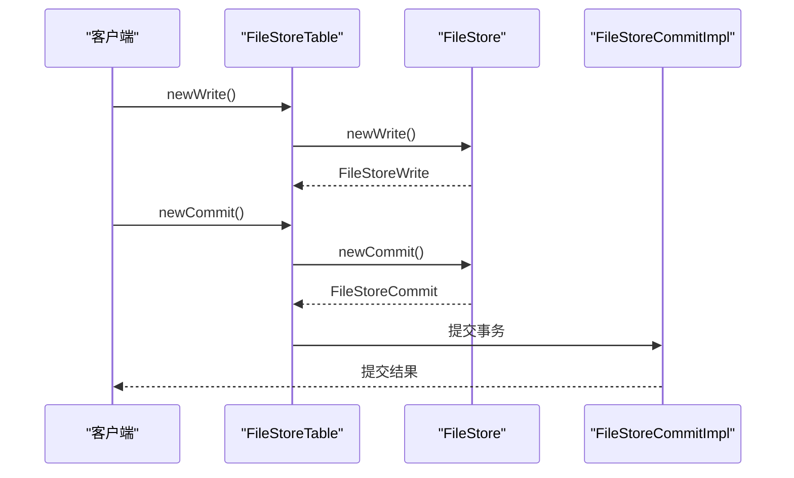

图表来源
- [FileStoreTable.java:120-127](file://paimon-core/src/main/java/org/apache/paimon/table/FileStoreTable.java#L120-L127)
- [FileStore.java:95-96](file://paimon-core/src/main/java/org/apache/paimon/FileStore.java#L95-L96)
- [FileStoreCommitImpl.java:133-133](file://paimon-core/src/main/java/org/apache/paimon/operation/FileStoreCommitImpl.java#L133-L133)

章节来源
- [FileStoreTable.java:120-127](file://paimon-core/src/main/java/org/apache/paimon/table/FileStoreTable.java#L120-L127)
- [FileStore.java:95-96](file://paimon-core/src/main/java/org/apache/paimon/FileStore.java#L95-L96)
- [FileStoreCommitImpl.java:133-133](file://paimon-core/src/main/java/org/apache/paimon/operation/FileStoreCommitImpl.java#L133-L133)

### 查询流程
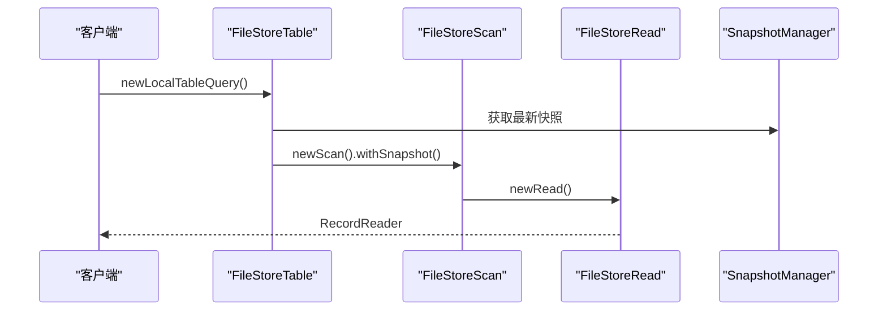

图表来源
- [LocalTableQuery.java:87-110](file://paimon-core/src/main/java/org/apache/paimon/table/query/LocalTableQuery.java#L87-L110)
- [DataTableBatchScan.java:57-77](file://paimon-core/src/main/java/org/apache/paimon/table/source/DataTableBatchScan.java#L57-L77)
- [SnapshotReader.java:不适用](file://paimon-core/src/main/java/org/apache/paimon/table/source/snapshot/SnapshotReader.java#L不适用)

章节来源
- [LocalTableQuery.java:87-110](file://paimon-core/src/main/java/org/apache/paimon/table/query/LocalTableQuery.java#L87-L110)
- [DataTableBatchScan.java:57-77](file://paimon-core/src/main/java/org/apache/paimon/table/source/DataTableBatchScan.java#L57-L77)

### 版本管理流程（快照/标签/分支）
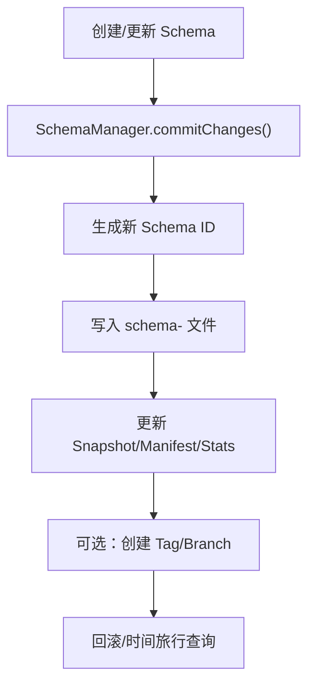

图表来源
- [SchemaManager.java:244-278](file://paimon-core/src/main/java/org/apache/paimon/schema/SchemaManager.java#L244-L278)
- [SnapshotManager.java:不适用](file://paimon-core/src/main/java/org/apache/paimon/utils/SnapshotManager.java#L不适用)
- [TagManager.java:不适用](file://paimon-core/src/main/java/org/apache/paimon/utils/TagManager.java#L不适用)
- [BranchManager.java:不适用](file://paimon-core/src/main/java/org/apache/paimon/utils/BranchManager.java#L不适用)

章节来源
- [SchemaManager.java:244-278](file://paimon-core/src/main/java/org/apache/paimon/schema/SchemaManager.java#L244-L278)

### 复制与迁移流程
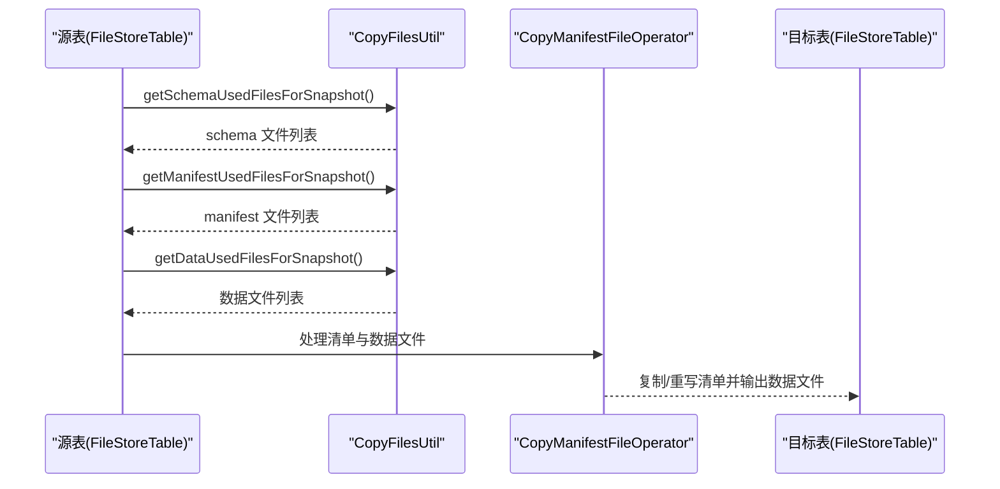

图表来源
- [CopyFilesUtil.java:69-111](file://paimon-flink/paimon-flink-common/src/main/java/org/apache/paimon/flink/copy/CopyFilesUtil.java#L69-L111)
- [CopyFilesUtil.java:123-158](file://paimon-flink/paimon-flink-common/src/main/java/org/apache/paimon/flink/copy/CopyFilesUtil.java#L123-L158)
- [CopyFilesUtil.java:169-191](file://paimon-flink/paimon-flink-common/src/main/java/org/apache/paimon/flink/copy/CopyFilesUtil.java#L169-L191)
- [CopyManifestFileOperator.java:129-174](file://paimon-flink/paimon-flink-common/src/main/java/org/apache/paimon/flink/copy/CopyManifestFileOperator.java#L129-L174)
- [CopyManifestFileOperator.java:176-199](file://paimon-flink/paimon-flink-common/src/main/java/org/apache/paimon/flink/copy/CopyManifestFileOperator.java#L176-L199)

章节来源
- [CopyFilesUtil.java:69-111](file://paimon-flink/paimon-flink-common/src/main/java/org/apache/paimon/flink/copy/CopyFilesUtil.java#L69-L111)
- [CopyFilesUtil.java:123-158](file://paimon-flink/paimon-flink-common/src/main/java/org/apache/paimon/flink/copy/CopyFilesUtil.java#L123-L158)
- [CopyFilesUtil.java:169-191](file://paimon-flink/paimon-flink-common/src/main/java/org/apache/paimon/flink/copy/CopyFilesUtil.java#L169-L191)
- [CopyManifestFileOperator.java:129-174](file://paimon-flink/paimon-flink-common/src/main/java/org/apache/paimon/flink/copy/CopyManifestFileOperator.java#L129-L174)
- [CopyManifestFileOperator.java:176-199](file://paimon-flink/paimon-flink-common/src/main/java/org/apache/paimon/flink/copy/CopyManifestFileOperator.java#L176-L199)

## 结论
Paimon通过“存储层-业务层-接口层”的清晰分层，实现了LSM与湖格式的有机融合，既满足流式写入的低延迟，又满足批式查询的高吞吐与强一致的时间旅行能力。SchemaManager与Catalog共同支撑Schema演进与版本管理，FileStore提供统一的物化与维护能力，配合工厂与策略模式，使系统具备良好的扩展性与可维护性。通过复制/迁移工具链与完善的过期/清理机制，Paimon在工程落地层面也提供了稳健的保障。

## 附录
- 相关实现与测试参考：
  - 写入/提交：FileStoreCommitImpl、FileStoreWrite
  - 查询：FileStoreScan、FileStoreRead、DataTableBatchScan
  - 版本管理：SchemaManager、SnapshotManager、TagManager、BranchManager
  - 复制迁移：CopyFilesUtil、CopyManifestFileOperator、CopySchemaOperator、CopyMetaFilesFunction
  - 权限与安全：PrivilegedFileStore、PrivilegedFileStoreTable
  - 目录实现：RESTCatalog、FileSystemCatalog、HiveCatalog、JdbcCatalog
  - 流批一体化：LSM-KV、合并树、聚簇策略、增量扫描

章节来源
- [FileStoreCommitImpl.java:159-219](file://paimon-core/src/main/java/org/apache/paimon/operation/FileStoreCommitImpl.java#L159-L219)
- [FileStoreWrite.java:不适用](file://paimon-core/src/main/java/org/apache/paimon/table/sink/FileStoreWrite.java#L不适用)
- [FileStoreRead.java:不适用](file://paimon-core/src/main/java/org/apache/paimon/table/reader/FileStoreRead.java#L不适用)
- [FileStoreScan.java:不适用](file://paimon-core/src/main/java/org/apache/paimon/table/scan/FileStoreScan.java#L不适用)
- [DataTableBatchScan.java:57-77](file://paimon-core/src/main/java/org/apache/paimon/table/source/DataTableBatchScan.java#L57-L77)
- [SchemaManager.java:108-1325](file://paimon-core/src/main/java/org/apache/paimon/schema/SchemaManager.java#L108-L1325)
- [SnapshotManager.java:不适用](file://paimon-core/src/main/java/org/apache/paimon/utils/SnapshotManager.java#L不适用)
- [TagManager.java:不适用](file://paimon-core/src/main/java/org/apache/paimon/utils/TagManager.java#L不适用)
- [BranchManager.java:不适用](file://paimon-core/src/main/java/org/apache/paimon/utils/BranchManager.java#L不适用)
- [CopyFilesUtil.java:69-111](file://paimon-flink/paimon-flink-common/src/main/java/org/apache/paimon/flink/copy/CopyFilesUtil.java#L69-L111)
- [CopyManifestFileOperator.java:129-174](file://paimon-flink/paimon-flink-common/src/main/java/org/apache/paimon/flink/copy/CopyManifestFileOperator.java#L129-L174)
- [CopySchemaOperator.java:57-92](file://paimon-spark/paimon-spark-common/src/main/java/org/apache/paimon/spark/copy/CopySchemaOperator.java#L57-L92)
- [CopyMetaFilesFunction.java:91-239](file://paimon-flink/paimon-flink-common/src/main/java/org/apache/paimon/flink/copy/CopyMetaFilesFunction.java#L91-L239)
- [PrivilegedFileStore.java:61-241](file://paimon-core/src/main/java/org/apache/paimon/privilege/PrivilegedFileStore.java#L61-L241)
- [PrivilegedFileStoreTable.java:106-109](file://paimon-core/src/main/java/org/apache/paimon/privilege/PrivilegedFileStoreTable.java#L106-L109)
- [RESTCatalog.java:1205-1229](file://paimon-core/src/main/java/org/apache/paimon/rest/RESTCatalog.java#L1205-L1229)
- [FileSystemCatalog.java:128-138](file://paimon-core/src/main/java/org/apache/paimon/catalog/FileSystemCatalog.java#L128-L138)
- [HiveCatalog.java:1190-1229](file://paimon-hive/paimon-hive-catalog/src/main/java/org/apache/paimon/hive/HiveCatalog.java#L1190-L1229)
- [JdbcCatalog.java:334-371](file://paimon-core/src/main/java/org/apache/paimon/jdbc/JdbcCatalog.java#L334-L371)
- [Catalog.java:654-674](file://paimon-core/src/main/java/org/apache/paimon/catalog/Catalog.java#L654-L674)
- [CatalogEnvironment.java:77-209](file://paimon-core/src/main/java/org/apache/paimon/catalog/CatalogEnvironment.java#L77-L209)
- [SchemaChange.java:37-72](file://paimon-api/src/main/java/org/apache/paimon/schema/SchemaChange.java#L37-L72)
- [FileStoreTableFactory.java:62-76](file://paimon-core/src/main/java/org/apache/paimon/table/FileStoreTableFactory.java#L62-L76)
- [FileStoreTableFactory.java:90-134](file://paimon-core/src/main/java/org/apache/paimon/table/FileStoreTableFactory.java#L90-L134)
- [FileStoreTableFactory.java:136-193](file://paimon-core/src/main/java/org/apache/paimon/table/FileStoreTableFactory.java#L136-L193)
- [LocalTableQuery.java:87-110](file://paimon-core/src/main/java/org/apache/paimon/table/query/LocalTableQuery.java#L87-L110)
- [KeyValueFileReaderFactory.java:75-99](file://paimon-core/src/main/java/org/apache/paimon/io/KeyValueFileReaderFactory.java#L75-L99)
- [RawFileSplitRead.java:94-113](file://paimon-core/src/main/java/org/apache/paimon/operation/RawFileSplitRead.java#L94-L113)
- [DataEvolutionFileStoreScan.java:72-94](file://paimon-core/src/main/java/org/apache/paimon/operation/DataEvolutionFileStoreScan.java#L72-L94)
- [MergeTreeCompactManagerFactory.java:101-132](file://paimon-core/src/main/java/org/apache/paimon/mergetree/compact/MergeTreeCompactManagerFactory.java#L101-L132)
- [KvCompactionManagerFactory.java:53-94](file://paimon-core/src/main/java/org/apache/paimon/mergetree/compact/KvCompactionManagerFactory.java#L53-L94)
- [IncrementalClusterStrategy.java:43-53](file://paimon-core/src/main/java/org/apache/paimon/append/cluster/IncrementalClusterStrategy.java#L43-L53)
- [BucketedAppendFileStoreWrite.java:49-80](file://paimon-core/src/main/java/org/apache/paimon/operation/BucketedAppendFileStoreWrite.java#L49-L80)
- [BucketedAppendClusterManager.java:52-68](file://paimon-core/src/main/java/org/apache/paimon/append/cluster/BucketedAppendClusterManager.java#L52-L68)
- [RecordLevelExpire.java:64-96](file://paimon-core/src/main/java/org/paimon/io/RecordLevelExpire.java#L64-L96)
- [OrphanFilesClean.java:109-128](file://paimon-core/src/main/java/org/apache/paimon/operation/OrphanFilesClean.java#L109-L128)
- [LocalOrphanFilesClean.java:不适用](file://paimon-core/src/main/java/org/apache/paimon/operation/LocalOrphanFilesClean.java#L不适用)
- [FileStoreLookupFunctionTest.java:122-157](file://paimon-flink/paimon-flink-common/src/test/java/org/apache/paimon/flink/lookup/FileStoreLookupFunctionTest.java#L122-L157)
- [CopyFilesActionITCase.java:645-731](file://paimon-flink/paimon-flink-common/src/test/java/org/apache/paimon/flink/action/CopyFilesActionITCase.java#L645-L731)
- [ExpirePartitionsActionITCaseBase.java:267-328](file://paimon-flink/paimon-flink-common/src/test/java/org/apache/paimon/flink/action/RemoveOrphanFilesActionITCaseBase.java#L267-L328)
- [RESTCatalogTest.java:1936-1985](file://paimon-core/src/test/java/org/apache/paimon/rest/RESTCatalogTest.java#L1936-L1985)
- [SchemaManagerTest.java:304-324](file://paimon-core/src/test/java/org/apache/paimon/schema/SchemaManagerTest.java#L304-L324)
- [SimpleTableTestBase.java:1228-1355](file://paimon-core/src/test/java/org/apache/paimon/table/SimpleTableTestBase.java#L1228-L1355)
- [TestFileStore.java:539-567](file://paimon-core/src/test/java/org/apache/paimon/TestFileStore.java#L539-L567)
- [AppendOnlyTableTest.java:1619-1656](file://paimon-core/src/test/java/org/apache/paimon/table/AppendOnlySimpleTableTest.java#L1619-L1656)
- [PrimaryKeyTableTest.java:2630-2647](file://paimon-core/src/test/java/org/apache/paimon/table/PrimaryKeySimpleTableTest.java#L2630-L2647)
- [StatsTableTest.java:46-101](file://paimon-core/src/test/java/org/apache/paimon/stats/StatsTableTest.java#L46-L101)
- [AppendOnlyTableCompactionTest.java:74-81](file://paimon-core/src/test/java/org/apache/paimon/append/AppendOnlyTableCompactionTest.java#L74-L81)
- [AppendOnlyTableColumnTypeFileDataTest.java:35-44](file://paimon-core/src/test/java/org/apache/paimon/table/AppendOnlyTableColumnTypeFileDataTest.java#L35-L44)
- [PrimaryKeyTableColumnTypeFileMetaTest.java:94-103](file://paimon-core/src/test/java/org/apache/paimon/table/PrimaryKeyTableColumnTypeFileMetaTest.java#L94-L103)
- [AppendOnlyTableFileMetaFilterTest.java:38-47](file://paimon-core/src/test/java/org/apache/paimon/table/AppendOnlyTableFileMetaFilterTest.java#L38-L47)
- [PrimaryKeyFileMetaFilterTest.java:244-254](file://paimon-core/src/test/java/org/apache/paimon/table/PrimaryKeyFileDataTableTest.java#L244-L254)
- [AppendOnlyTableTestBase.java:1658-1674](file://paimon-core/src/test/java/org/apache/paimon/table/AppendOnlySimpleTableTest.java#L1658-L1674)
- [PrimaryKeyFileDataTableTest.java:244-254](file://paimon-core/src/test/java/org/apache/paimon/table/PrimaryKeyFileDataTableTest.java#L244-L254)
- [AppendOnlyTableCompactionTest.java:184-211](file://paimon-core/src/test/java/org/apache/paimon/append/AppendOnlyTableCompactionTest.java#L184-L211)
- [AppendOnlyTableColumnTypeFileDataTest.java:1658-1674](file://paimon-core/src/test/java/org/apache/paimon/table/AppendOnlySimpleTableTest.java#L1658-L1674)
- [PrimaryKeyTableColumnTypeFileMetaTest.java:1640-1656](file://paimon-core/src/test/java/org/apache/paimon/table/AppendOnlySimpleTableTest.java#L1640-L1656)
- [AppendOnlyTableFileMetaFilterTest.java:1619-1638](file://paimon-core/src/test/java/org/apache/paimon/table/AppendOnlySimpleTableTest.java#L1619-L1638)
- [PrimaryKeyFileMetaFilterTest.java:2630-2647](file://paimon-core/src/test/java/org/apache/paimon/table/PrimaryKeySimpleTableTest.java#L2630-L2647)
- [AppendOnlyTableTestBase.java:1848-1865](file://paimon-core/src/test/java/org/apache/paimon/table/SimpleTableTestBase.java#L1848-L1865)
- [PrimaryKeyFileDataTableTest.java:1867-1897](file://paimon-core/src/test/java/org/apache/paimon/table/SimpleTableTestBase.java#L1867-L1897)
- [AppendOnlyTableCompactionTest.java:1867-1897](file://paimon-core/src/test/java/org/apache/paimon/table/SimpleTableTestBase.java#L1867-L1897)
- [AppendOnlyTableColumnTypeFileDataTest.java:1848-1865](file://paimon-core/src/test/java/org/apache/paimon/table/SimpleTableTestBase.java#L1848-L1865)
- [PrimaryKeyTableColumnTypeFileMetaTest.java:1867-1897](file://paimon-core/src/test/java/org/apache/paimon/table/SimpleTableTestBase.java#L1867-L1897)
- [AppendOnlyTableFileMetaFilterTest.java:1848-1865](file://paimon-core/src/test/java/org/apache/paimon/table/SimpleTableTestBase.java#L1848-L1865)
- [PrimaryKeyFileMetaFilterTest.java:1867-1897](file://paimon-core/src/test/java/org/apache/paimon/table/SimpleTableTestBase.java#L1867-L1897)
- [AppendOnlyTableTestBase.java:1897-1897](file://paimon-core/src/test/java/org/apache/paimon/table/SimpleTableTestBase.java#L1897-L1897)
- [PrimaryKeyFileDataTableTest.java:1897-1897](file://paimon-core/src/test/java/org/apache/paimon/table/SimpleTableTestBase.java#L1897-L1897)
- [AppendOnlyTableCompactionTest.java:1897-1897](file://paimon-core/src/test/java/org/apache/paimon/table/SimpleTableTestBase.java#L1897-L1897)
- [AppendOnlyTableColumnTypeFileDataTest.java:1897-1897](file://paimon-core/src/test/java/org/apache/paimon/table/SimpleTableTestBase.java#L1897-L1897)
- [PrimaryKeyTableColumnTypeFileMetaTest.java:1897-1897](file://paimon-core/src/test/java/org/apache/paimon/table/SimpleTableTestBase.java#L1897-L1897)
- [AppendOnlyTableFileMetaFilterTest.java:1897-1897](file://paimon-core/src/test/java/org/apache/paimon/table/SimpleTableTestBase.java#L1897-L1897)
- [PrimaryKeyFileMetaFilterTest.java:1897-1897](file://paimon-core/src/test/java/org/apache/paimon/table/SimpleTableTestBase.java#L1897-L1897)