# 生态系统集成

<cite>
**本文引用的文件**
- [生态系统总览](file://docs/content/ecosystem/overview.md)
- [Amoro 集成](file://docs/content/ecosystem/amoro.md)
- [Doris 集成](file://docs/content/ecosystem/doris.md)
- [Hive 集成](file://docs/content/ecosystem/hive.md)
- [StarRocks 集成](file://docs/content/ecosystem/starrocks.md)
- [Trino 集成](file://docs/content/ecosystem/trino.md)
- [REST API（Java）](file://docs/content/program-api/rest-api.md)
- [Java API](file://docs/content/program-api/java-api.md)
- [Flink API](file://docs/content/program-api/flink-api.md)
- [C++ API](file://docs/content/program-api/cpp-api.md)
- [规范概览（文件格式与快照）](file://docs/content/concepts/spec/overview.md)
- [Flink 快速开始](file://docs/content/flink/quick-start.md)
- [Spark 快速开始](file://docs/content/spark/quick-start.md)
- [REST 概述](file://docs/content/concepts/rest/overview.md)
- [Catalog 接口（工厂与加载器）](file://paimon-core/src/main/java/org/apache/paimon/catalog/CatalogFactory.java)
- [CatalogLoader 接口](file://paimon-core/src/main/java/org/apache/paimon/catalog/CatalogLoader.java)
- [FileSystemCatalog 工厂](file://paimon-core/src/main/java/org/apache/paimon/catalog/FileSystemCatalogFactory.java)
- [FileSystemCatalogLoader 加载器](file://paimon-core/src/main/java/org/apache/paimon/catalog/FileSystemCatalogLoader.java)
- [Spark Catalog 接口](file://paimon-spark/paimon-spark-common/src/main/java/org/apache/paimon/spark/catalog/WithPaimonCatalog.java)
- [REST API 客户端](file://paimon-api/src/main/java/org/apache/paimon/rest/RESTApi.java)
- [REST 工具类](file://paimon-api/src/test/java/org/apache/paimon/utils/RESTUtilTest.java)
</cite>

## 目录
1. [简介](#简介)
2. [项目结构](#项目结构)
3. [核心组件](#核心组件)
4. [架构总览](#架构总览)
5. [详细组件分析](#详细组件分析)
6. [依赖关系分析](#依赖关系分析)
7. [性能考量](#性能考量)
8. [故障排查指南](#故障排查指南)
9. [结论](#结论)
10. [附录](#附录)

## 简介
本文件面向希望在多引擎环境下使用 Apache Paimon 的工程师与数据平台团队，系统性梳理 Paimon 在 Flink、Spark、Hive、Trino、Doris、StarRocks 等生态中的集成方式与能力边界，并解释 Paimon 如何通过统一的 Catalog/表格式与 REST API 实现跨引擎的一致性访问。同时给出标准化接口设计思路、最佳实践与常见问题排查建议，帮助用户在不同环境中正确部署与使用。

## 项目结构
围绕“生态系统集成”，文档与代码主要分布在以下区域：
- 文档侧：docs/content/ecosystem 下的各引擎集成文档；docs/content/program-api 提供 Java/Flink/Spark/C++/REST 等编程接口说明；docs/content/concepts/spec 与 concepts/rest 提供底层文件格式与 REST 能力说明。
- 代码侧：paimon-core 提供 Catalog 抽象与工厂/加载器；paimon-api 提供 REST 客户端；paimon-flink 与 paimon-spark 提供各自引擎桥接；各引擎快速开始文档提供部署与示例。

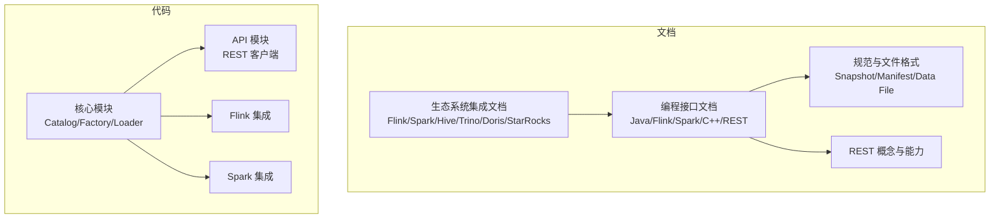

章节来源
- [生态系统总览:29-82](file://docs/content/ecosystem/overview.md#L29-L82)
- [规范概览（文件格式与快照）:29-85](file://docs/content/concepts/spec/overview.md#L29-L85)

## 核心组件
- 统一 Catalog 抽象：通过 CatalogFactory/CatalogLoader 抽象出“目录”能力，屏蔽底层存储与元数据后端差异，使上层引擎以一致方式读写表。
- 文件格式与快照：规范定义了快照、清单列表、清单、数据文件、变更日志文件等核心对象，确保跨引擎读写一致性。
- REST Catalog：通过 REST API 将客户端与 Catalog 服务解耦，支持多语言、多后端，便于在多引擎间共享同一 Catalog 服务。
- 编程接口：Java API 提供批/流读写、谓词下推、投影下推；Flink/Spark/C++ API 提供各自生态下的桥接与优化。

章节来源
- [Catalog 接口（工厂与加载器）:33-68](file://paimon-core/src/main/java/org/apache/paimon/catalog/CatalogFactory.java#L33-L68)
- [CatalogLoader 接口:25-35](file://paimon-core/src/main/java/org/apache/paimon/catalog/CatalogLoader.java#L25-L35)
- [FileSystemCatalog 工厂:27-35](file://paimon-core/src/main/java/org/apache/paimon/catalog/FileSystemCatalogFactory.java#L27-L35)
- [FileSystemCatalogLoader 加载器:25-43](file://paimon-core/src/main/java/org/apache/paimon/catalog/FileSystemCatalogLoader.java#L25-L43)
- [规范概览（文件格式与快照）:29-85](file://docs/content/concepts/spec/overview.md#L29-L85)
- [REST 概述:36-69](file://docs/content/concepts/rest/overview.md#L36-L69)

## 架构总览
Paimon 的跨引擎一致性由三层协同实现：
- 表格式与快照：统一的文件布局与版本控制，保证不同引擎读取到一致的数据视图。
- Catalog 抽象：屏蔽存储与元数据后端差异，统一创建/读写/DDL 等操作。
- REST Catalog：将 Catalog 服务化，客户端通过 REST 访问，实现多引擎共享同一元数据与数据后端。

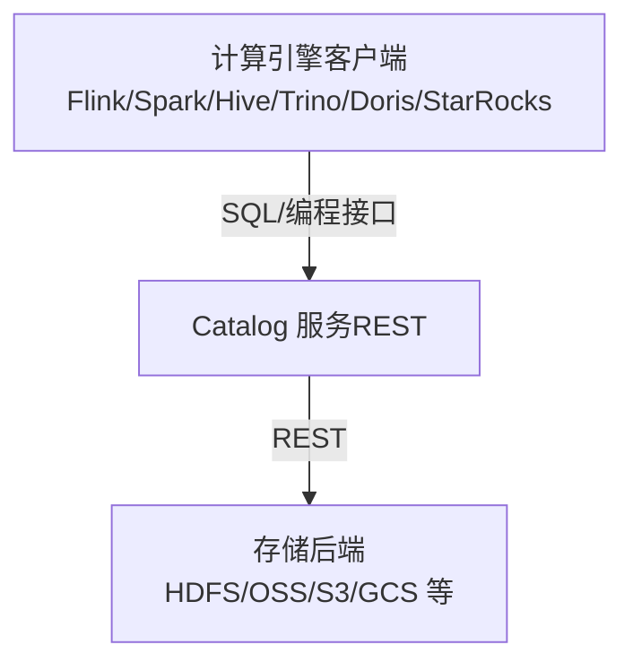

图表来源
- [REST 概述:36-69](file://docs/content/concepts/rest/overview.md#L36-L69)
- [REST API（Java）:47-89](file://docs/content/program-api/rest-api.md#L47-L89)

章节来源
- [生态系统总览:29-82](file://docs/content/ecosystem/overview.md#L29-L82)
- [REST 概述:36-69](file://docs/content/concepts/rest/overview.md#L36-L69)

## 详细组件分析

### Flink 集成
- 版本与能力矩阵：Flink 1.16–1.20 支持批量读写、创建表、变更表、流式写入/读取、覆盖写、DELETE/UPDATE（部分版本）、MERGE INTO、时间旅行等。
- 部署与运行：下载对应版本的 Paimon Flink Jar，放入 Flink lib 并启动本地集群；通过 Flink SQL Client 创建 Catalog 与表，设置检查点间隔后进行流式写入与 OLAP 查询。
- 编程接口：Flink API 提供 DataStream/Table API 与 Paimon 表互转，支持 CDC 增量写入与 RichCdcSinkBuilder。
- 最佳实践：生产环境建议使用共享文件系统（如 HDFS/OSS）作为仓库；启用受管内存提升 Sink 性能与稳定性。

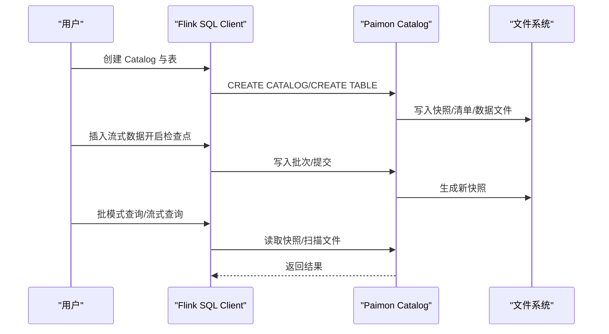

图表来源
- [Flink 快速开始:130-244](file://docs/content/flink/quick-start.md#L130-L244)
- [Flink API:63-122](file://docs/content/program-api/flink-api.md#L63-L122)

章节来源
- [生态系统总览:29-82](file://docs/content/ecosystem/overview.md#L29-L82)
- [Flink 快速开始:31-298](file://docs/content/flink/quick-start.md#L31-L298)
- [Flink API:27-233](file://docs/content/program-api/flink-api.md#L27-L233)

### Spark 集成
- 版本与能力矩阵：Spark 3.2–4.0 支持批量读写、创建表、变更表、流式写入（3.3+）、流式读取（3.3+）、覆盖写、DELETE/UPDATE、MERGE INTO、时间旅行（3.3+）。
- 部署与运行：通过 --packages 或 --jars 引入 Paimon Spark Jar，注册 Paimon Catalog 或 Generic Catalog，随后使用 SQL/DataFrame 进行建表、插入与查询。
- 类型映射：提供 Spark → Paimon 的类型映射表，注意 Spark3.3 及以下对 LocalZonedTimestamp 的解析差异。
- 最佳实践：推荐使用最新 Spark 版本；在 Hive 元数据场景下使用 Generic Catalog。

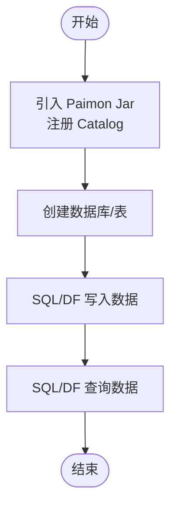

图表来源
- [Spark 快速开始:80-255](file://docs/content/spark/quick-start.md#L80-L255)

章节来源
- [生态系统总览:29-82](file://docs/content/ecosystem/overview.md#L29-L82)
- [Spark 快速开始:29-375](file://docs/content/spark/quick-start.md#L29-L375)

### Hive 集成
- 版本与执行引擎：支持 Hive 3.1、2.3、2.2、2.1 与 CDH 2.1-cdh-6.3；读取支持 MR/Tez，写入使用 MR；建议重启 Hive 集群以确保 beeline 生效。
- 安装与配置：从仓库下载对应版本的 paimon-hive-connector Jar，放置于 Hive 的 auxlib 或使用 add jar；HDFS 环境需设置 HADOOP_HOME/HADOOP_CONF_DIR 或禁用默认配置以减小 split。
- SQL 使用：支持列出表、读取、插入（INSERT INTO，不支持覆盖写）、时间旅行；可直接创建 Paimon 表或通过外部表接入既有 Paimon 表。
- 类型映射：提供 Hive → Paimon 的类型映射表。

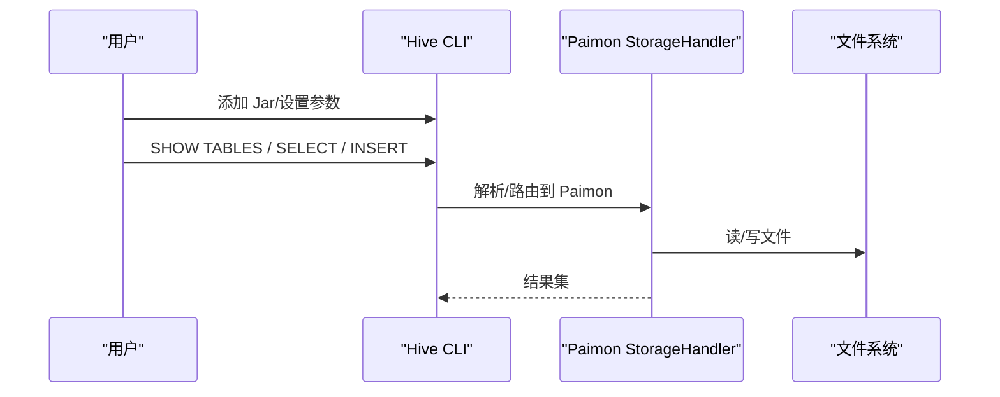

图表来源
- [Hive 集成:40-210](file://docs/content/ecosystem/hive.md#L40-L210)

章节来源
- [生态系统总览:29-82](file://docs/content/ecosystem/overview.md#L29-L82)
- [Hive 集成:31-313](file://docs/content/ecosystem/hive.md#L31-L313)

### Trino 集成
- 版本与能力：支持 Trino 440；从 0.8 起共享 Trino 文件系统，需先配置 Trino 文件系统。
- 部署与配置：下载/构建插件包，解压至 TRINO_HOME/plugin；在 etc/catalog 下创建 paimon.properties；按需配置 HDFS/OSS 等；JDK21 需添加 JVM 开放参数。
- SQL 使用：支持创建 Schema/表、新增列、插入、查询与时间旅行（FOR TIMESTAMP AS OF / FOR VERSION AS OF）。
- 类型映射：提供 Trino → Paimon 的类型映射表。

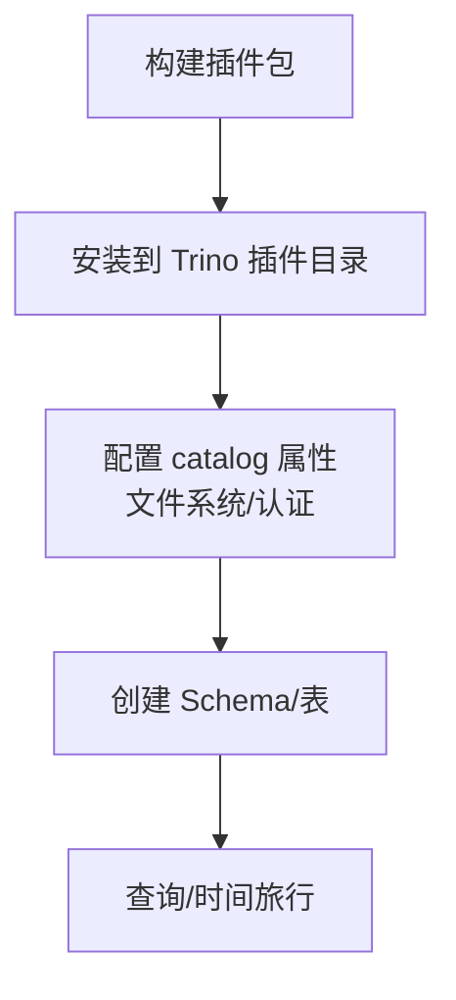

图表来源
- [Trino 集成:41-188](file://docs/content/ecosystem/trino.md#L41-L188)

章节来源
- [生态系统总览:29-82](file://docs/content/ecosystem/overview.md#L29-L82)
- [Trino 集成:31-311](file://docs/content/ecosystem/trino.md#L31-L311)

### StarRocks 集成
- 版本与能力：支持 StarRocks 3.1+（推荐 3.2.6+），提供 Paimon Catalog 注册、查询、系统表访问（如 read-optimized 表）。
- 配置：通过 CREATE EXTERNAL CATALOG 注册 Paimon Catalog，支持多种存储后端；可查询系统表加速主键表读取。
- 类型映射：提供 StarRocks → Paimon 的类型映射表。

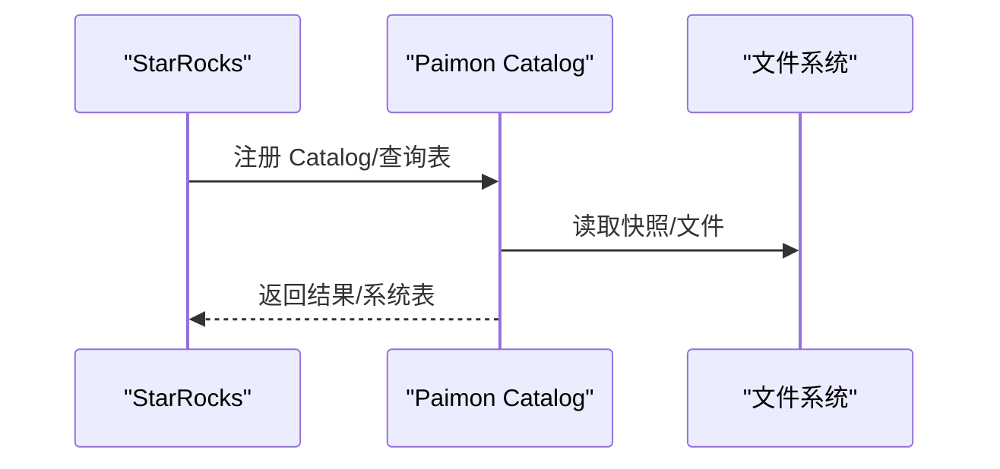

图表来源
- [StarRocks 集成:35-77](file://docs/content/ecosystem/starrocks.md#L35-L77)

章节来源
- [生态系统总览:29-82](file://docs/content/ecosystem/overview.md#L29-L82)
- [StarRocks 集成:27-185](file://docs/content/ecosystem/starrocks.md#L27-L185)

### Doris 集成
- 版本与能力：支持 Apache Doris 2.0.6+；提供多种 Paimon Catalog 类型（HDFS/OSS/Hive Metastore/DLF）与多云集成示例。
- 配置与使用：通过 CREATE CATALOG 创建 Paimon Catalog；支持全限定名查询与切换 Catalog 后查询；提供主键表读优化与删除向量（Deletion Vectors）。
- 类型映射：提供 Doris → Paimon 的类型映射表。

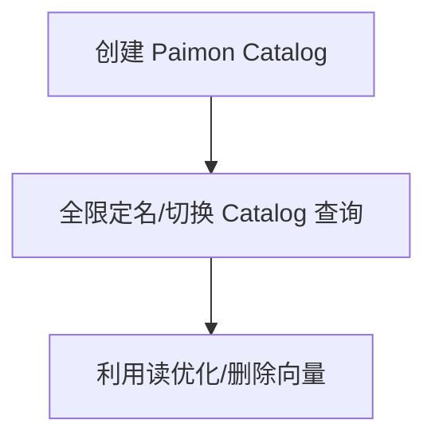

图表来源
- [Doris 集成:37-110](file://docs/content/ecosystem/doris.md#L37-L110)

章节来源
- [生态系统总览:29-82](file://docs/content/ecosystem/overview.md#L29-L82)
- [Doris 集成:27-215](file://docs/content/ecosystem/doris.md#L27-L215)

### Amoro 集成
- 能力概述：Amoro 是基于开放数据湖格式的湖仓一体管理平台，与 Flink/Spark/Trino 等计算引擎协作，提供统一 Catalog 服务与表维护能力；支持多种存储与 Catalog 类型。
- 协同策略：未来将支持 Paimon 自动优化策略，与 Amoro 自优化配合，获得更佳体验。

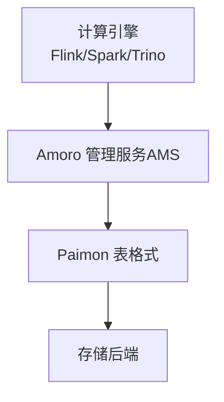

图表来源
- [Amoro 集成:27-45](file://docs/content/ecosystem/amoro.md#L27-L45)

章节来源
- [Amoro 集成:27-45](file://docs/content/ecosystem/amoro.md#L27-L45)

### 编程接口与标准化设计
- Java API：提供 Catalog/表创建、批/流读写、谓词/投影下推、两阶段提交等能力，适合离线/在线任务与自定义工具。
- Flink API：提供 DataStream/Table 与 Paimon 表互转，支持 CDC 写入与 RichCdcSinkBuilder。
- Spark/C++ API：Spark 提供 DataFrame/SQL 接口；C++ 提供 Arrow 交互与两阶段提交。
- REST API：通过 REST 客户端访问 Catalog 服务，支持 Bear/DLF 等 Token Provider，实现跨语言、跨后端的统一访问。

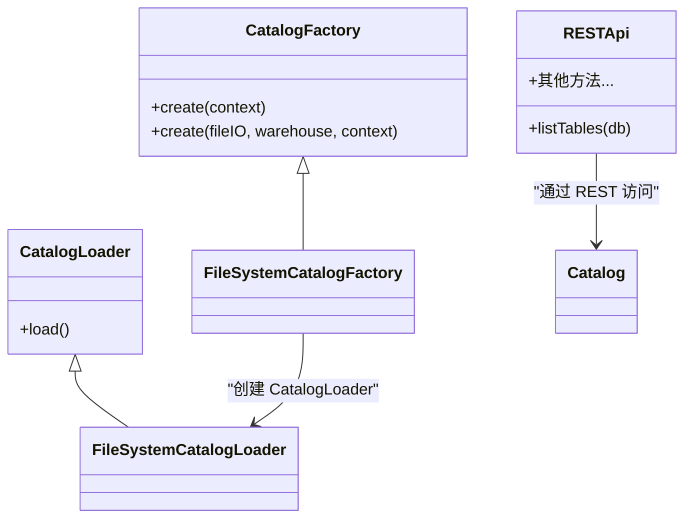

图表来源
- [Catalog 接口（工厂与加载器）:33-68](file://paimon-core/src/main/java/org/apache/paimon/catalog/CatalogFactory.java#L33-L68)
- [CatalogLoader 接口:25-35](file://paimon-core/src/main/java/org/apache/paimon/catalog/CatalogLoader.java#L25-L35)
- [FileSystemCatalog 工厂:27-35](file://paimon-core/src/main/java/org/apache/paimon/catalog/FileSystemCatalogFactory.java#L27-L35)
- [FileSystemCatalogLoader 加载器:25-43](file://paimon-core/src/main/java/org/apache/paimon/catalog/FileSystemCatalogLoader.java#L25-L43)
- [REST API（Java）:47-89](file://docs/content/program-api/rest-api.md#L47-L89)
- [REST API 客户端:180-205](file://paimon-api/src/main/java/org/apache/paimon/rest/RESTApi.java#L180-L205)

章节来源
- [Java API:51-429](file://docs/content/program-api/java-api.md#L51-L429)
- [Flink API:33-233](file://docs/content/program-api/flink-api.md#L33-L233)
- [C++ API:30-260](file://docs/content/program-api/cpp-api.md#L30-L260)
- [REST API（Java）:29-89](file://docs/content/program-api/rest-api.md#L29-L89)
- [REST API 客户端:180-205](file://paimon-api/src/main/java/org/apache/paimon/rest/RESTApi.java#L180-L205)

## 依赖关系分析
- Catalog 抽象：通过 CatalogFactory/CatalogLoader 解耦具体实现（文件系统/REST/Hive 等），上层引擎仅依赖抽象接口。
- 文件格式：规范定义的快照/清单/数据文件/变更日志构成一致性基础，所有引擎均遵循该规范。
- REST 服务：REST API 客户端与服务端通过标准协议通信，支持多后端与多语言。

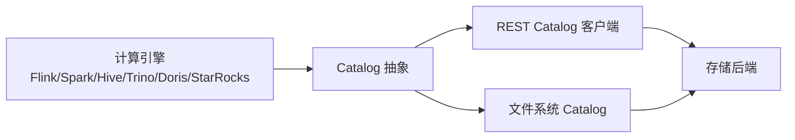

图表来源
- [Catalog 接口（工厂与加载器）:33-68](file://paimon-core/src/main/java/org/apache/paimon/catalog/CatalogFactory.java#L33-L68)
- [CatalogLoader 接口:25-35](file://paimon-core/src/main/java/org/apache/paimon/catalog/CatalogLoader.java#L25-L35)
- [REST API 客户端:180-205](file://paimon-api/src/main/java/org/apache/paimon/rest/RESTApi.java#L180-L205)

章节来源
- [规范概览（文件格式与快照）:29-85](file://docs/content/concepts/spec/overview.md#L29-L85)
- [REST 概述:36-69](file://docs/content/concepts/rest/overview.md#L36-L69)

## 性能考量
- 受管内存（Flink）：启用受管内存分配器与 Writer Buffer 内存权重，可提升 Sink 稳定性与吞吐。
- 主键表读优化（Doris/StarRocks）：利用读优化与删除向量（Deletion Vectors）降低扫描成本。
- 文件系统与网络：在对象存储场景下，合理配置临时目录与文件系统参数，避免频繁清理导致的抖动。
- 类型映射与谓词/投影下推：在各引擎中充分利用类型映射与下推能力，减少不必要的序列化与传输。

## 故障排查指南
- Hive beeline 重启：使用 beeline 时请重启 Hive 集群以确保连接生效。
- Hive CBO 限制：启用 CBO 可能导致某些查询（如带非空谓词的 struct）出现不一致结果，必要时关闭 CBO。
- HDFS 环境变量：在 HDFS 场景下确保设置 HADOOP_HOME 或 HADOOP_CONF_DIR，或禁用默认配置以避免 split 过大。
- Trino JDK21：部署时需添加 JVM 开放参数；临时目录建议使用安全路径，避免被系统清理。
- REST 认证：确认 Token Provider（Bear/DLF）配置正确，必要时检查服务端鉴权与仓库参数。

章节来源
- [Hive 集成:82-87](file://docs/content/ecosystem/hive.md#L82-L87)
- [Trino 集成:74-110](file://docs/content/ecosystem/trino.md#L74-L110)
- [REST API（Java）:75-85](file://docs/content/program-api/rest-api.md#L75-L85)

## 结论
Paimon 通过统一的 Catalog 抽象、规范化的表格式与快照机制，以及 REST Catalog 的服务化能力，在 Flink、Spark、Hive、Trino、Doris、StarRocks 等多引擎中实现了跨引擎的一致性与可移植性。结合各引擎的类型映射、读优化与受管内存等特性，用户可在不同场景下获得稳定、高效且易维护的数据湖/湖仓解决方案。

## 附录
- 版本与能力矩阵参考：见“生态系统总览”中的兼容性矩阵。
- 各引擎快速开始与示例：参阅 Flink/Spark 快速开始文档。
- 编程接口与示例：参阅 Java/Flink/Spark/C++/REST API 文档。