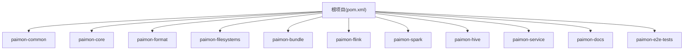
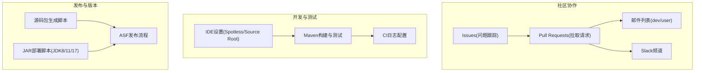
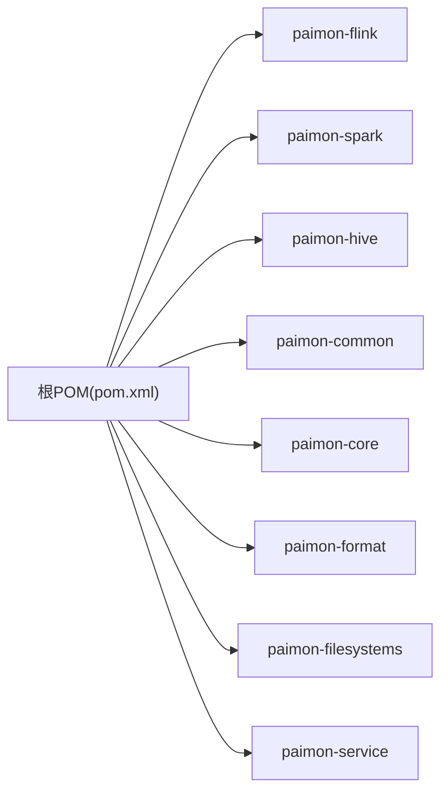

# 社区与开发

<cite>
**本文引用的文件**   
- [README.md](file://README.md)
- [CODE_OF_CONDUCT.md](file://CODE_OF_CONDUCT.md)
- [.asf.yaml](file://.asf.yaml)
- [docs/content/project/contributing.md](file://docs/content/project/contributing.md)
- [docs/content/project/download.md](file://docs/content/project/download.md)
- [docs/content/project/committer.md](file://docs/content/project/committer.md)
- [LICENSE](file://LICENSE)
- [.github/PULL_REQUEST_TEMPLATE.md](file://.github/PULL_REQUEST_TEMPLATE.md)
- [pom.xml](file://pom.xml)
- [tools/ci/log4j.properties](file://tools/ci/log4j.properties)
- [tools/releasing/create_source_release.sh](file://tools/releasing/create_source_release.sh)
- [tools/releasing/deploy_staging_jars.sh](file://tools/releasing/deploy_staging_jars.sh)
- [tools/maven/checkstyle.xml](file://tools/maven/checkstyle.xml)
</cite>

## 目录
1. [简介](#简介)
2. [项目结构](#项目结构)
3. [核心组件](#核心组件)
4. [架构总览](#架构总览)
5. [详细组件分析](#详细组件分析)
6. [依赖分析](#依赖分析)
7. [性能考虑](#性能考虑)
8. [故障排查指南](#故障排查指南)
9. [结论](#结论)
10. [附录](#附录)

## 简介
本文件面向Apache Paimon的社区与开发者，系统化介绍社区文化、治理模式、贡献流程、开发环境搭建、许可证与合规、沟通渠道、发布与版本管理、Backport机制以及新手入门建议。内容基于仓库内官方文档与配置文件整理而成，帮助新老贡献者快速上手并高效协作。

## 项目结构
Paimon采用多模块Maven聚合工程组织，根POM定义了统一的构建属性、依赖与插件配置，并通过模块划分实现功能解耦（如核心存储、格式层、引擎适配、文件系统扩展、服务组件等）。根目录包含社区与发布相关的关键文件：README、.asf.yaml、LICENSE、贡献指南、下载页文档、发布脚本与CI配置等。

图表来源
- [pom.xml:54-78](file://pom.xml#L54-L78)

章节来源
- [pom.xml:54-78](file://pom.xml#L54-L78)

## 核心组件
- 治理与社区：遵循Apache软件基金会治理，使用GitHub Issues与PR进行协作，邮件列表与Slack作为主要沟通渠道。
- 贡献流程：从Issue讨论到PR实现、评审与合并，强调共识与质量标准。
- 开发环境：JDK 8/11、Maven ≥3.6.3；支持Spotless格式化；IDE需将特定目录标记为Sources Root。
- 许可证与合规：采用Apache License 2.0，并在LICENSE中列示第三方组件及其许可证摘要。
- 发布与版本：提供源码发布脚本与多JDK部署脚本，配合ASF发布流程。
- 文档与下载：官方文档站点与下载页提供引擎、文件系统与API构件的稳定与快照版本下载入口。

章节来源
- [README.md:15-84](file://README.md#L15-L84)
- [docs/content/project/contributing.md:27-226](file://docs/content/project/contributing.md#L27-L226)
- [LICENSE:1-312](file://LICENSE#L1-L312)
- [tools/releasing/create_source_release.sh:1-89](file://tools/releasing/create_source_release.sh#L1-L89)
- [tools/releasing/deploy_staging_jars.sh:1-48](file://tools/releasing/deploy_staging_jars.sh#L1-L48)
- [docs/content/project/download.md:27-148](file://docs/content/project/download.md#L27-L148)

## 架构总览
下图展示社区协作与发布流程的关键节点：贡献者通过GitHub Issues与PR参与，邮件列表与Slack用于讨论与支持；发布阶段由PMC成员与Committer主导，结合ASF脚本完成源码包生成与JAR部署。

图表来源
- [.asf.yaml:20-48](file://.asf.yaml#L20-L48)
- [README.md:15-84](file://README.md#L15-L84)
- [tools/releasing/create_source_release.sh:66-88](file://tools/releasing/create_source_release.sh#L66-L88)
- [tools/releasing/deploy_staging_jars.sh:44-45](file://tools/releasing/deploy_staging_jars.sh#L44-L45)
- [tools/ci/log4j.properties:19-44](file://tools/ci/log4j.properties#L19-L44)

## 详细组件分析

### 社区治理与沟通渠道
- 治理模式：项目在Apache软件基金会下运作，使用GitHub Issues与PR进行协作，启用Squash合并、Rebase合并按钮，开启通知转发至PMC邮箱。
- 邮件列表：提供用户与开发列表订阅、退订、归档与投稿入口，强调必须先订阅再发信。
- Slack：ASF Slack工作区内的Paimon频道，支持邀请流程与加入方式。

章节来源
- [.asf.yaml:20-48](file://.asf.yaml#L20-L48)
- [README.md:19-68](file://README.md#L19-L68)

### 贡献流程与代码规范
- 贡献路径：提问、报Bug、编码贡献、代码评审、发布候选验证、社区推广等。
- 编码贡献四步法：讨论共识 → 实施 → 评审 → 合并。
- 代码评审六要点：描述充分性、特定Committer关注、代码质量与性能、测试覆盖、文档更新、第三方依赖变更后的NOTICE更新。
- 提交规范：PR模板包含“目的”和“测试”字段；鼓励避免无关格式化改动，确保测试通过，保留对话以便持续改进。

章节来源
- [docs/content/project/contributing.md:27-226](file://docs/content/project/contributing.md#L27-L226)
- [.github/PULL_REQUEST_TEMPLATE.md:1-4](file://.github/PULL_REQUEST_TEMPLATE.md#L1-L4)

### 开发环境与IDE设置
- JDK与Maven：JDK 8/11，Maven ≥3.6.3。
- 构建命令：clean install（可跳过测试），Spotless格式化（Java与Scala）。
- IDE设置：将生成的ANTLR源目录标记为Sources Root以提升索引与补全体验。

章节来源
- [README.md:69-76](file://README.md#L69-L76)

### 许可证与法律合规
- 主许可证：Apache License 2.0。
- 第三方组件：LICENSE中列出多处第三方组件及其许可证摘要（含Apache、MIT、BSD等），并指引查看licenses/目录获取完整文本。
- 贡献声明：贡献默认按License条款提交，明确贡献提交方式与排除情形。

章节来源
- [LICENSE:1-LICENSE:312](file://LICENSE#L1-L312)

### 发布流程与版本管理
- 源码发布：脚本克隆仓库生成纯净源码包，打包、签名与生成SHA-512校验。
- 多JDK部署：提供针对JDK8/11/17的部署脚本，统一部署到repository.apache.org。
- 版本策略：根POM定义版本号与模块版本策略，发布脚本与ASF流程协同推进。

章节来源
- [tools/releasing/create_source_release.sh:66-88](file://tools/releasing/create_source_release.sh#L66-L88)
- [tools/releasing/deploy_staging_jars.sh:44-45](file://tools/releasing/deploy_staging_jars.sh#L44-L45)
- [pom.xml:34](file://pom.xml#L34)

### Backport机制
- 当前仓库未发现专门的Backport脚本或自动化流程文件。建议在需要向历史分支回滚修复时，遵循ASF发布流程与PMC决策，结合分支策略手动执行或通过PR目标分支选择进行回滚。

章节来源
- [docs/content/project/contributing.md:182-187](file://docs/content/project/contributing.md#L182-L187)

### 新手友好任务与参与指南
- 参与机会：提问、报Bug、特性建议、邮件列表讨论、代码/文档贡献、改善网站、RC验证、博客撰写等。
- 成为Committer：通过活跃贡献与社区认可，经PMC投票产生；强调社区精神、信任与尊重。
- JetBrains免费授权：为Committer提供IDE全家桶授权，使用Apache邮箱申请。

章节来源
- [docs/content/project/contributing.md:29-81](file://docs/content/project/contributing.md#L29-L81)
- [docs/content/project/committer.md:29-68](file://docs/content/project/committer.md#L29-L68)

### 代码风格与质量检查
- Checkstyle规则：基于Apache Beam风格定制，禁止部分不合规导入与用法，强调文件结尾换行、尾随空白、TODO格式等。
- Spotless格式化：统一Java与Scala代码风格，建议在本地执行格式化后再提交。

章节来源
- [tools/maven/checkstyle.xml:1-200](file://tools/maven/checkstyle.xml#L1-L200)
- [README.md:74](file://README.md#L74)

### CI与日志
- CI日志：提供Log4j配置示例，控制台与文件输出级别与格式，便于定位构建问题。

章节来源
- [tools/ci/log4j.properties:19-44](file://tools/ci/log4j.properties#L19-L44)

## 依赖分析
- 统一构建与版本：根POM集中定义Java版本、Scala版本、测试框架、日志与第三方库版本，确保模块间一致性。
- 模块耦合：核心模块（common、core、format）为上层引擎与文件系统提供基础能力；引擎模块（Flink/Spark/Hive）通过适配层集成；服务模块提供客户端与运行时组件。

图表来源
- [pom.xml:54-78](file://pom.xml#L54-L78)

章节来源
- [pom.xml:80-171](file://pom.xml#L80-L171)

## 性能考虑
- 构建性能：合理配置Fork数量与复用策略，减少测试启动开销；在CI中启用并行与缓存。
- 代码质量：通过Checkstyle与Spotless在本地尽早发现问题，降低评审成本与回归风险。
- 测试效率：优先单元测试，必要时使用端到端测试；注意测试隔离与资源清理。

## 故障排查指南
- 构建失败
  - JDK/Maven版本不符：确认JDK 8/11与Maven ≥3.6.3。
  - Spotless格式错误：执行格式化命令后重试。
  - 依赖冲突：检查根POM中的版本属性与模块继承关系。
- 评审被拒
  - 描述不充分、缺少设计说明或POC；未按约定关联Issue；包含无关格式化改动；测试未通过；文档未更新。
- 发布问题
  - 源码包缺失签名或校验：核对脚本执行顺序与签名工具可用性。
  - 多JDK部署失败：确认JDK版本与部署脚本匹配，网络可达性与凭证配置正确。

章节来源
- [README.md:69-76](file://README.md#L69-L76)
- [docs/content/project/contributing.md:189-222](file://docs/content/project/contributing.md#L189-L222)
- [tools/releasing/create_source_release.sh:66-88](file://tools/releasing/create_source_release.sh#L66-L88)
- [tools/releasing/deploy_staging_jars.sh:44-45](file://tools/releasing/deploy_staging_jars.sh#L44-L45)

## 结论
Paimon在Apache基金会治理下形成了开放、透明且高效的协作生态。贡献者可通过清晰的流程与工具链快速融入，同时依托完善的许可证与合规体系保障项目健康可持续发展。建议新贡献者从Issue讨论与小任务入手，逐步深入核心模块与发布流程。

## 附录
- 下载与构件：官方文档提供引擎、文件系统与API构件的稳定与快照版本下载入口，便于集成与验证。
- 行为准则：遵循ASF行为准则，营造尊重与包容的社区氛围。

章节来源
- [docs/content/project/download.md:27-148](file://docs/content/project/download.md#L27-L148)
- [CODE_OF_CONDUCT.md:1-4](file://CODE_OF_CONDUCT.md#L1-L4)