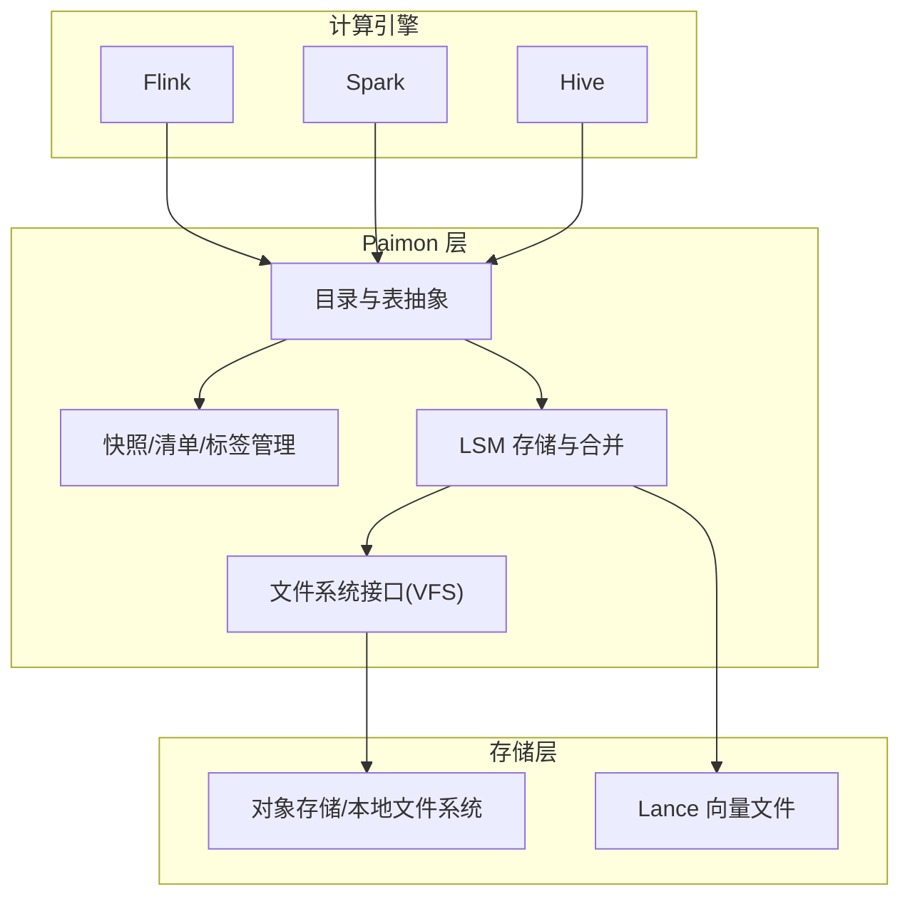
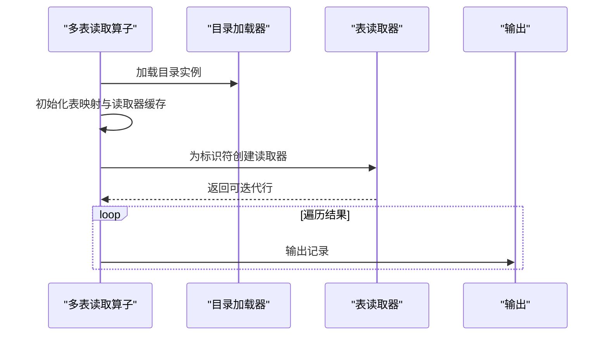
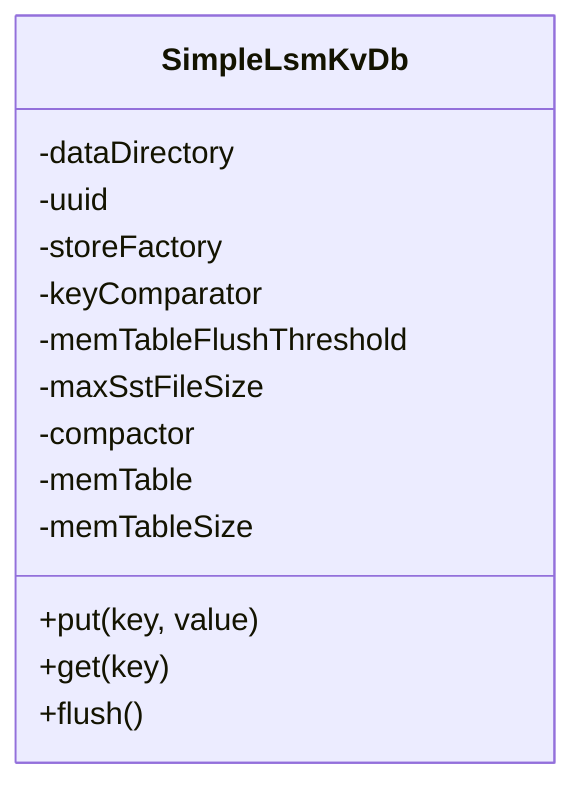
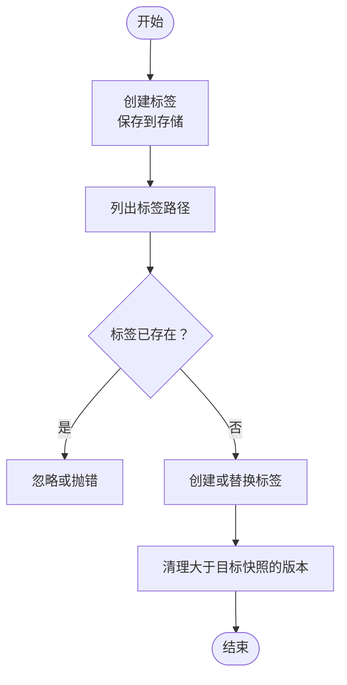
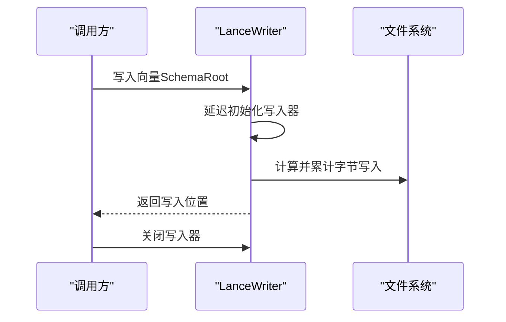
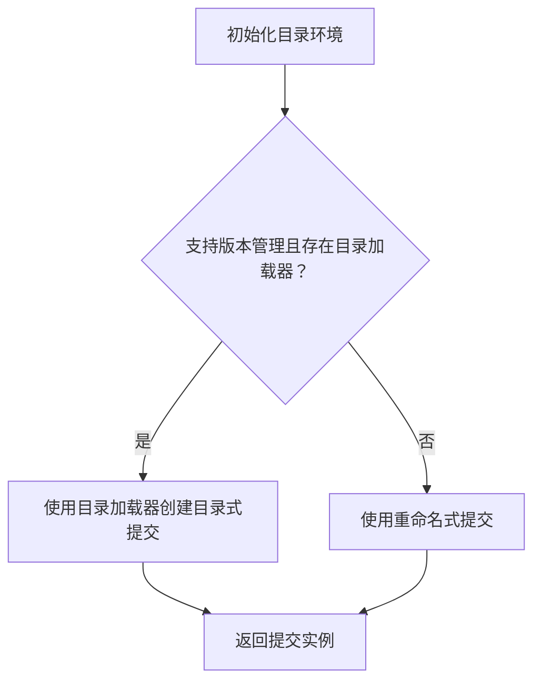
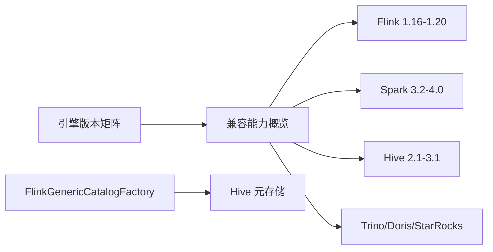

# 项目概述

<cite>
**本文引用的文件**
- [README.md](file://README.md)
- [pom.xml](file://pom.xml)
- [_index.md](file://docs/content/_index.md)
- [basic-concepts.md](file://docs/content/concepts/basic-concepts.md)
- [overview.md](file://docs/content/primary-key-table/overview.md)
- [ecosystem/overview.md](file://docs/content/ecosystem/overview.md)
- [FlinkGenericCatalogFactory.java](file://paimon-flink/paimon-flink-common/src/main/java/org/apache/paimon/flink/FlinkGenericCatalogFactory.java)
- [MultiTablesReadOperator.java](file://paimon-flink/paimon-flink-common/src/main/java/org/apache/paimon/flink/source/operator/MultiTablesReadOperator.java)
- [SimpleLsmKvDb.java](file://paimon-common/src/main/java/org/apache/paimon/lookup/sort/db/SimpleLsmKvDb.java)
- [LanceTableImpl.java](file://paimon-core/src/main/java/org/apache/paimon/table/lance/LanceTableImpl.java)
- [LanceWriter.java](file://paimon-lance/src/main/java/org/apache/paimon/format/lance/jni/LanceWriter.java)
- [BatchWriteGeneratorTagOperator.java](file://paimon-flink/paimon-flink-common/src/main/java/org/apache/paimon/flink/sink/BatchWriteGeneratorTagOperator.java)
- [TagManager.java](file://paimon-core/src/main/java/org/apache/paimon/utils/TagManager.java)
- [RollbackHelper.java](file://paimon-core/src/main/java/org/apache/paimon/table/RollbackHelper.java)
- [catalog_environment.py](file://paimon-python/pypaimon/catalog/catalog_environment.py)
</cite>

## 目录
1. [引言](#引言)
2. [项目结构](#项目结构)
3. [核心组件](#核心组件)
4. [架构总览](#架构总览)
5. [详细组件分析](#详细组件分析)
6. [依赖关系分析](#依赖关系分析)
7. [性能考量](#性能考量)
8. [故障排查指南](#故障排查指南)
9. [结论](#结论)
10. [附录](#附录)

## 引言
Apache Paimon 是一个面向实时湖仓架构的大规模数据湖格式，支持流式与批式一体化处理。其独特之处在于将 LSM（日志结构合并树）结构与现代湖格式相结合，使湖仓系统具备高性能的实时更新能力。项目前身为 Flink Table Store，由 Flink 社区孵化，并借鉴了 Apache Iceberg 的设计思想。当前在 Apache 软件基金会的治理下，围绕 Flink、Spark、Hive 等计算引擎构建了完整的生态体系。

本概述旨在帮助初学者快速理解 Paimon 的核心价值与设计理念，同时为有经验的开发者提供深入的技术细节与架构视图。

**章节来源**
- [README.md:1-84](file://README.md#L1-L84)
- [_index.md:25-58](file://docs/content/_index.md#L25-L58)

## 项目结构
Paimon 采用多模块聚合工程组织，核心模块覆盖湖格式实现、文件系统适配、引擎桥接（Flink/Spark）、Hive 集成、Python 客户端、服务化组件、向量索引扩展等。根 POM 中声明了主要模块，便于按需启用不同引擎与功能集。

```mermaid
graph TB
subgraph "核心模块"
CORE["paimon-core"]
COMMON["paimon-common"]
FORMAT["paimon-format"]
ARROW["paimon-arrow"]
LANCE["paimon-lance"]
VFS["paimon-vfs"]
SERVICE["paimon-service"]
LUMINA["paimon-lumina"]
end
subgraph "引擎桥接"
FLINK["paimon-flink"]
SPARK["paimon-spark"]
HIVE["paimon-hive"]
end
subgraph "生态与工具"
PYPAIMON["paimon-python"]
FS["paimon-filesystems"]
TEST["paimon-e2e-tests"]
BENCH["paimon-benchmark"]
DOCS["paimon-docs"]
end
ROOT["pom.xml 模块声明"] --> CORE
ROOT --> COMMON
ROOT --> FORMAT
ROOT --> ARROW
ROOT --> LANCE
ROOT --> VFS
ROOT --> SERVICE
ROOT --> LUMINA
ROOT --> FLINK
ROOT --> SPARK
ROOT --> HIVE
ROOT --> PYPAIMON
ROOT --> FS
ROOT --> TEST
ROOT --> BENCH
ROOT --> DOCS
```

**图表来源**
- [pom.xml:54-78](file://pom.xml#L54-L78)

**章节来源**
- [pom.xml:54-78](file://pom.xml#L54-L78)

## 核心组件
- 湖格式与文件布局：以快照（Snapshot）、清单（Manifest）与分层数据文件组织表数据，支持时间旅行与增量/紧凑快照组合提交。
- LSM 存储与主键表：基于 LSM 的有序运行（Sorted Runs）组织数据，结合桶（Bucket）与主键排序，提供高并发写入与高效查询路径。
- 多表读取与流式源：多表读算子统一调度不同表的扫描与分区过滤，支持历史分区识别与流式消费。
- 版本管理与回滚：标签（Tag）与快照（Snapshot）管理，支持清理大于指定快照的版本并进行回滚。
- Python 客户端与 REST：提供 Python API 与 REST 接口，支持目录加载与版本管理策略选择。
- 向量化与 Lance 集成：通过 Lance Writer 写入向量数据，配合 LanceTable 实现向量场景下的湖格式能力。

**章节来源**
- [basic-concepts.md:35-76](file://docs/content/concepts/basic-concepts.md#L35-L76)
- [overview.md:47-62](file://docs/content/primary-key-table/overview.md#L47-L62)
- [MultiTablesReadOperator.java:88-132](file://paimon-flink/paimon-flink-common/src/main/java/org/apache/paimon/flink/source/operator/MultiTablesReadOperator.java#L88-L132)
- [TagManager.java:110-140](file://paimon-core/src/main/java/org/apache/paimon/utils/TagManager.java#L110-L140)
- [RollbackHelper.java:36-64](file://paimon-core/src/main/java/org/apache/paimon/table/RollbackHelper.java#L36-L64)
- [catalog_environment.py:29-62](file://paimon-python/pypaimon/catalog/catalog_environment.py#L29-L62)
- [LanceTableImpl.java:37-95](file://paimon-core/src/main/java/org/apache/paimon/table/lance/LanceTableImpl.java#L37-L95)
- [LanceWriter.java:42-73](file://paimon-lance/src/main/java/org/apache/paimon/format/lance/jni/LanceWriter.java#L42-L73)

## 架构总览
Paimon 的整体架构围绕“湖格式 + LSM”的核心思想展开：上层通过 Flink/Spark/Hive 等引擎访问；中间层负责表模式、快照、清单与版本管理；底层以 LSM 组织数据文件，支持多种列存格式（Parquet/Orc/Avro）与对象存储/本地文件系统。

**图表来源**
- [pom.xml:54-78](file://pom.xml#L54-L78)
- [basic-concepts.md:35-76](file://docs/content/concepts/basic-concepts.md#L35-L76)
- [LanceTableImpl.java:37-95](file://paimon-core/src/main/java/org/apache/paimon/table/lance/LanceTableImpl.java#L37-L95)

## 详细组件分析

### 流式多表读取流程（Flink）
该流程展示了多表读取算子如何统一处理不同表的扫描请求，支持分区过滤与历史分区识别，适用于流式与批式混合场景。

**图表来源**
- [MultiTablesReadOperator.java:88-132](file://paimon-flink/paimon-flink-common/src/main/java/org/apache/paimon/flink/source/operator/MultiTablesReadOperator.java#L88-L132)

**章节来源**
- [MultiTablesReadOperator.java:88-132](file://paimon-flink/paimon-flink-common/src/main/java/org/apache/paimon/flink/source/operator/MultiTablesReadOperator.java#L88-L132)

### LSM 内存 KV 数据库（简单实现）
该组件以 LSM 思想在内存中维护有序键值对，支持阈值触发落盘与压缩器参与合并，体现 Paimon 在主键表中对 LSM 的基础能力。

**图表来源**
- [SimpleLsmKvDb.java:72-107](file://paimon-common/src/main/java/org/apache/paimon/lookup/sort/db/SimpleLsmKvDb.java#L72-L107)

**章节来源**
- [SimpleLsmKvDb.java:72-107](file://paimon-common/src/main/java/org/apache/paimon/lookup/sort/db/SimpleLsmKvDb.java#L72-L107)

### 快照与标签管理（版本控制）
快照用于捕获表在某时刻的状态，标签用于命名化标记特定快照；回滚辅助类负责清理大于给定快照的版本，确保一致性与空间回收。

**图表来源**
- [TagManager.java:110-140](file://paimon-core/src/main/java/org/apache/paimon/utils/TagManager.java#L110-L140)
- [RollbackHelper.java:55-64](file://paimon-core/src/main/java/org/apache/paimon/table/RollbackHelper.java#L55-L64)

**章节来源**
- [TagManager.java:110-140](file://paimon-core/src/main/java/org/apache/paimon/utils/TagManager.java#L110-L140)
- [RollbackHelper.java:36-64](file://paimon-core/src/main/java/org/apache/paimon/table/RollbackHelper.java#L36-L64)

### 向量湖格式（Lance）写入
Lance Writer 支持 Arrow 向量写入，按字段向量统计缓冲大小并延迟初始化写入器，适合向量检索与 AI 场景的数据湖化存储。

**图表来源**
- [LanceWriter.java:42-73](file://paimon-lance/src/main/java/org/apache/paimon/format/lance/jni/LanceWriter.java#L42-L73)

**章节来源**
- [LanceWriter.java:42-73](file://paimon-lance/src/main/java/org/apache/paimon/format/lance/jni/LanceWriter.java#L42-L73)

### 目录与版本管理策略（Python）
Python 目录环境根据是否支持版本管理与目录加载器，选择目录式快照提交或重命名式提交，保证在不同部署形态下的一致性。

**图表来源**
- [catalog_environment.py:29-62](file://paimon-python/pypaimon/catalog/catalog_environment.py#L29-L62)

**章节来源**
- [catalog_environment.py:29-62](file://paimon-python/pypaimon/catalog/catalog_environment.py#L29-L62)

## 依赖关系分析
- 引擎与版本矩阵：官方文档提供了 Flink/Spark/Hive/Trino/Doris/StarRocks 等引擎的兼容能力与推荐版本范围，便于用户按需选择。
- 目录工厂与 Hive 兼容：Flink 侧通过通用目录工厂创建 Paimon 目录并与 Hive 元存储对接，实现跨引擎的统一访问。

**图表来源**
- [ecosystem/overview.md:29-40](file://docs/content/ecosystem/overview.md#L29-L40)
- [FlinkGenericCatalogFactory.java:87-107](file://paimon-flink/paimon-flink-common/src/main/java/org/apache/paimon/flink/FlinkGenericCatalogFactory.java#L87-L107)

**章节来源**
- [ecosystem/overview.md:29-40](file://docs/content/ecosystem/overview.md#L29-L40)
- [FlinkGenericCatalogFactory.java:87-107](file://paimon-flink/paimon-flink-common/src/main/java/org/apache/paimon/flink/FlinkGenericCatalogFactory.java#L87-L107)

## 性能考量
- LSM 写入路径：新写入记录先在内存缓冲中排序，达到阈值后落盘形成新的有序运行，减少随机写放大，提升写吞吐。
- 分区与桶：分区用于粗粒度切分，桶用于细粒度并行与排序，建议每个桶数据规模在 200MB-1GB 之间以平衡小文件与读性能。
- 并发与隔离：同一表不同分区可并行提交；同分区写入仅保证快照隔离，避免丢失变更。
- 文件格式：默认 Parquet，亦支持 Orc/Avro，按查询与写入特征选择最优格式。

**章节来源**
- [overview.md:47-62](file://docs/content/primary-key-table/overview.md#L47-L62)
- [basic-concepts.md:67-76](file://docs/content/concepts/basic-concepts.md#L67-L76)

## 故障排查指南
- 提交与标签清理：若出现版本不一致或空间膨胀，可通过标签管理与回滚辅助类清理大于目标快照的版本，再执行回滚至期望状态。
- 批写入标签生成：批写入标签生成算子在完成阶段会创建标签并触发提交，若出现异常，检查屏障前准备与提交流程。
- 目录加载与版本策略：Python 目录环境在缺少目录加载器或不支持版本管理时，自动切换为重命名式提交，确认部署形态与配置。

**章节来源**
- [BatchWriteGeneratorTagOperator.java:88-137](file://paimon-flink/paimon-flink-common/src/main/java/org/apache/paimon/flink/sink/BatchWriteGeneratorTagOperator.java#L88-L137)
- [TagManager.java:110-140](file://paimon-core/src/main/java/org/apache/paimon/utils/TagManager.java#L110-L140)
- [RollbackHelper.java:55-64](file://paimon-core/src/main/java/org/apache/paimon/table/RollbackHelper.java#L55-L64)
- [catalog_environment.py:29-62](file://paimon-python/pypaimon/catalog/catalog_environment.py#L29-L62)

## 结论
Paimon 将 LSM 的高吞吐写入能力与湖格式的开放生态融合，形成了统一的实时湖仓解决方案。通过多引擎兼容、版本管理、向量化扩展与灵活的文件布局，Paimon 能够满足从流式 CDC 到大规模分析的多样化需求。对于初学者，建议从主键表与 LSM 概念入手；对于开发者，可关注目录工厂、版本管理与向量写入等核心模块的实现与扩展点。

## 附录
- 历史背景：项目前身为 Flink Table Store，由 Flink 社区孵化，借鉴 Iceberg 设计理念，现为 Apache 子项目。
- 社区与生态：提供邮件列表、Slack 等沟通渠道；官方文档包含下载与引擎适配矩阵，便于快速落地。

**章节来源**
- [README.md:12-13](file://README.md#L12-L13)
- [README.md:19-67](file://README.md#L19-L67)
- [ecosystem/overview.md:29-40](file://docs/content/ecosystem/overview.md#L29-L40)