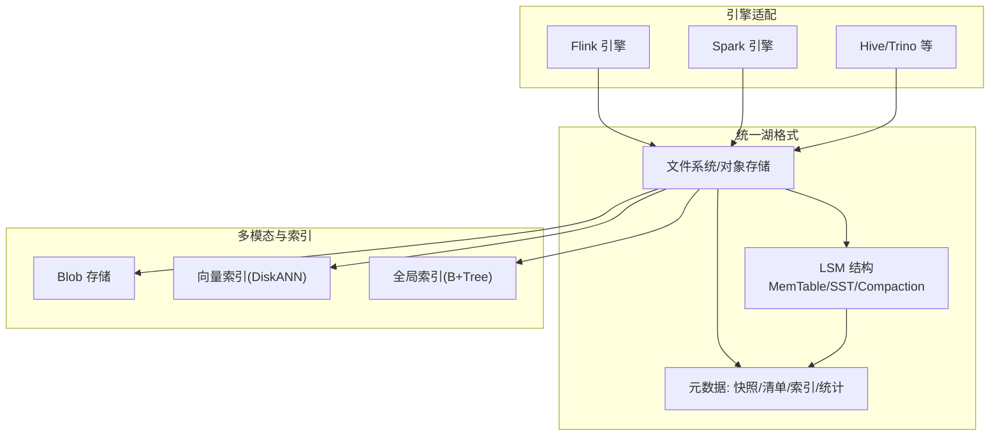
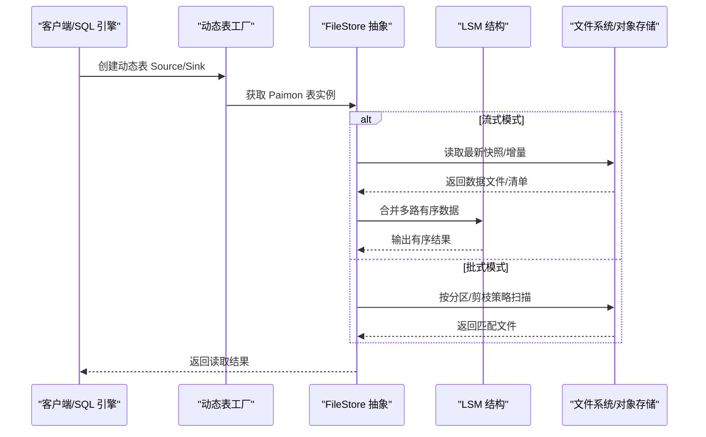
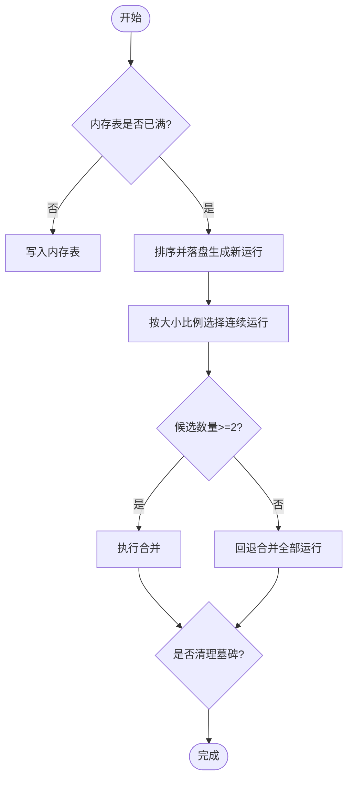
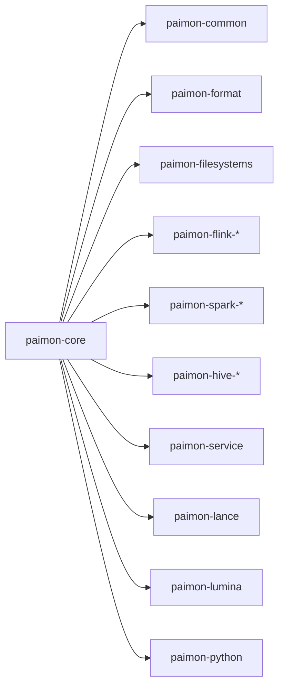

# 项目简介

<cite>
**本文引用的文件**   
- [README.md](file://README.md)
- [docs/content/_index.md](file://docs/content/_index.md)
- [docs/content/concepts/overview.md](file://docs/content/concepts/overview.md)
- [docs/content/concepts/basic-concepts.md](file://docs/content/concepts/basic-concepts.md)
- [docs/content/primary-key-table/overview.md](file://docs/content/primary-key-table/overview.md)
- [docs/content/learn-paimon/scenario-guide.md](file://docs/content/learn-paimon/scenario-guide.md)
- [docs/content/project/contributing.md](file://docs/content/project/contributing.md)
- [docs/content/project/download.md](file://docs/content/project/download.md)
- [pom.xml](file://pom.xml)
- [paimon-core/src/main/java/org/apache/paimon/FileStore.java](file://paimon-core/src/main/java/org/apache/paimon/FileStore.java)
- [paimon-common/src/main/java/org/apache/paimon/lookup/sort/db/LsmCompactor.java](file://paimon-common/src/main/java/org/apache/paimon/lookup/sort/db/LsmCompactor.java)
- [paimon-common/src/main/java/org/apache/paimon/lookup/sort/db/SimpleLsmKvDb.java](file://paimon-common/src/main/java/org/apache/paimon/lookup/sort/db/SimpleLsmKvDb.java)
- [paimon-core/src/main/java/org/apache/paimon/mergetree/compact/LoserTree.java](file://paimon-core/src/main/java/org/apache/paimon/mergetree/compact/LoserTree.java)
</cite>

## 目录
1. [引言](#引言)
2. [项目结构](#项目结构)
3. [核心组件](#核心组件)
4. [架构总览](#架构总览)
5. [详细组件分析](#详细组件分析)
6. [依赖分析](#依赖分析)
7. [性能考量](#性能考量)
8. [故障排查指南](#故障排查指南)
9. [结论](#结论)
10. [附录](#附录)

## 引言
Apache Paimon 是一个面向湖仓一体的湖格式（Lake Format），旨在通过统一的数据格式同时支撑流式与批处理场景，并将 LSM（日志结构化合并树）设计引入湖存储，从而在数据湖中实现高性能的实时更新与查询。它最初源自 Flink 社区的“Flink Table Store”，并在后续发展过程中吸收了 Iceberg 等设计思想，逐步成长为支持多计算引擎（如 Flink、Spark、Hive、Trino、StarRocks、Doris 等）的统一湖格式。

Paimon 的核心价值主张在于：
- 将湖格式的低成本、可扩展性与 LSM 的高吞吐写入能力结合，形成“实时湖存储”。
- 提供版本管理、时间旅行、快照隔离、模式演进、增量聚簇、全局索引（向量/标量）、多模态存储（Blob/向量）等能力，覆盖从 OLAP 到 AI/ML 的广泛场景。
- 支持流批一体化：既能像消息队列一样以流式方式消费历史与增量数据，也能像传统批表一样执行批量读写与复杂 SQL。

此外，Paimon 已成为 Apache 软件基金会顶级项目，社区活跃、文档完善、生态丰富，适合初学者快速上手，也具备足够的技术深度满足资深工程师的定制与优化需求。

章节来源
- [README.md:1-84](file://README.md#L1-L84)
- [docs/content/_index.md:25-73](file://docs/content/_index.md#L25-L73)

## 项目结构
Paimon 采用多模块聚合工程组织，根 POM 定义了核心模块与引擎适配模块，涵盖核心存储、格式层、文件系统适配、Flink/Spark 适配、服务化、Python SDK、多模态索引等子模块。典型模块划分如下：
- 核心与通用：paimon-common、paimon-core、paimon-format、paimon-codegen、paimon-arrow
- 文件系统与对象存储：paimon-filesystems（含 S3、OSS、GS、CosN、Obs、Azure 等）
- 计算引擎适配：paimon-flink（多版本 Flink 适配）、paimon-spark（多版本 Spark 适配）、paimon-hive、paimon-service
- 多模态与索引：paimon-lance、paimon-lumina（向量索引）、paimon-tantivy（全文索引）
- 文档与工具：paimon-docs、paimon-bundle、tools、paimon-python（PyPaimon）

该结构体现了“统一湖格式 + 多引擎适配 + 多模态扩展”的分层设计，便于按需构建与扩展。

章节来源
- [pom.xml:54-78](file://pom.xml#L54-L78)

## 核心组件
- 文件存储接口与能力
  - FileStore 接口定义了快照管理、清单管理、索引与统计文件处理、扫描/读取/写入、提交、标签与分区过期管理等能力，是湖格式存储的统一抽象。
- LSM 结构与合并策略
  - LsmCompactor 实现了类 RocksDB 的 Universal Compaction 思想，基于大小比例选择连续运行进行合并，触发条件与回退策略明确，兼顾写放大与空间放大平衡。
  - SimpleLsmKvDb 提供 LSM 内存表（MemTable）与 SST 文件组织，支持墓碑标记（删除键）与多级结构，内存占用估算与阈值控制有助于避免 OOM。
  - LoserTree 在多路有序数据源合并时用于维护键序一致性，确保重复键的正确合并顺序。
- 基本概念与元数据
  - 快照（Snapshot）记录某时刻的表状态；清单列表（Manifest List/Manifest File）记录该快照内数据文件与变更；数据文件按分区组织，支持 Parquet/ORC/Avro 等格式；一致性通过两阶段提交保障，写入并发与快照隔离规则清晰。

章节来源
- [paimon-core/src/main/java/org/apache/paimon/FileStore.java:61-127](file://paimon-core/src/main/java/org/apache/paimon/FileStore.java#L61-L127)
- [paimon-common/src/main/java/org/apache/paimon/lookup/sort/db/LsmCompactor.java:42-75](file://paimon-common/src/main/java/org/apache/paimon/lookup/sort/db/LsmCompactor.java#L42-L75)
- [paimon-common/src/main/java/org/apache/paimon/lookup/sort/db/SimpleLsmKvDb.java:72-107](file://paimon-common/src/main/java/org/apache/paimon/lookup/sort/db/SimpleLsmKvDb.java#L72-L107)
- [paimon-core/src/main/java/org/apache/paimon/mergetree/compact/LoserTree.java:31-59](file://paimon-core/src/main/java/org/apache/paimon/mergetree/compact/LoserTree.java#L31-L59)
- [docs/content/concepts/basic-concepts.md:35-76](file://docs/content/concepts/basic-concepts.md#L35-L76)

## 架构总览
下图展示了 Paimon 的整体架构与关键交互：统一湖格式在文件系统/对象存储上组织数据与元数据；读写路径通过 FileStore 抽象对接不同引擎；LSM 结构负责高吞吐写入与有序合并；多模态与索引能力（向量/全局索引/Blob）在统一格式之上扩展；生态适配覆盖 Flink/Spark/Hive/Trino 等。

图表来源
- [docs/content/concepts/overview.md:29-71](file://docs/content/concepts/overview.md#L29-L71)
- [docs/content/_index.md:32-73](file://docs/content/_index.md#L32-L73)
- [paimon-core/src/main/java/org/apache/paimon/FileStore.java:61-127](file://paimon-core/src/main/java/org/apache/paimon/FileStore.java#L61-L127)

## 详细组件分析

### 流批一体化与引擎集成
- 统一表抽象：在批模式下，Paimon 表如同传统批表（如 Hive），支持批量插入/覆盖与复杂 SQL；在流模式下，可像消息队列一样消费历史与增量数据，且历史数据不消亡。
- 引擎适配：Flink/Spark 通过动态表工厂创建 Source/Sink，自动识别运行模式（bounded/unbounded），并根据配置决定是否以流式或批式扫描。
- CDC 与变更日志：支持多种 Changelog Producer（输入/查找/全量合并），下游可直接消费正确的变更流，简化实时同步与物化任务。

图表来源
- [docs/content/concepts/overview.md:36-71](file://docs/content/concepts/overview.md#L36-L71)
- [paimon-flink/paimon-flink-common/src/main/java/org/apache/paimon/flink/AbstractFlinkTableFactory.java:84-101](file://paimon-flink/paimon-flink-common/src/main/java/org/apache/paimon/flink/AbstractFlinkTableFactory.java#L84-L101)

章节来源
- [docs/content/concepts/overview.md:29-71](file://docs/content/concepts/overview.md#L29-L71)
- [docs/content/learn-paimon/scenario-guide.md:52-200](file://docs/content/learn-paimon/scenario-guide.md#L52-L200)

### LSM 结构与合并流程
- 运行（Sorted Runs）组织：LSM 将数据组织为多个有序运行，新写入先落内存表，满后排序落盘形成新的运行；不同运行可能重叠主键范围，查询时需合并。
- 合并策略：采用 Universal Compaction 思想，按大小比例选择连续运行合并，达到平衡写放大与空间放大的目标；当仅剩一个运行时，触发更激进的合并以清理墓碑与碎片。
- 键序合并：使用类似败者树的机制对多路有序数据进行归并，保证重复键的合并顺序与一致性。

图表来源
- [docs/content/primary-key-table/overview.md:47-62](file://docs/content/primary-key-table/overview.md#L47-L62)
- [paimon-common/src/main/java/org/apache/paimon/lookup/sort/db/LsmCompactor.java:42-75](file://paimon-common/src/main/java/org/apache/paimon/lookup/sort/db/LsmCompactor.java#L42-L75)
- [paimon-common/src/main/java/org/apache/paimon/lookup/sort/db/SimpleLsmKvDb.java:72-107](file://paimon-common/src/main/java/org/apache/paimon/lookup/sort/db/SimpleLsmKvDb.java#L72-L107)
- [paimon-core/src/main/java/org/apache/paimon/mergetree/compact/LoserTree.java:31-59](file://paimon-core/src/main/java/org/apache/paimon/mergetree/compact/LoserTree.java#L31-L59)

章节来源
- [docs/content/primary-key-table/overview.md:47-62](file://docs/content/primary-key-table/overview.md#L47-L62)
- [paimon-common/src/main/java/org/apache/paimon/lookup/sort/db/LsmCompactor.java:42-75](file://paimon-common/src/main/java/org/apache/paimon/lookup/sort/db/LsmCompactor.java#L42-L75)
- [paimon-common/src/main/java/org/apache/paimon/lookup/sort/db/SimpleLsmKvDb.java:72-107](file://paimon-common/src/main/java/org/apache/paimon/lookup/sort/db/SimpleLsmKvDb.java#L72-L107)
- [paimon-core/src/main/java/org/apache/paimon/mergetree/compact/LoserTree.java:31-59](file://paimon-core/src/main/java/org/apache/paimon/mergetree/compact/LoserTree.java#L31-L59)

### 版本管理、时间旅行与一致性
- 快照与清单：快照记录某一时刻的表状态，包含当前使用的 Schema 与该快照内的清单列表；清单文件记录该快照内数据文件与变更，支持高效扫描与剪枝。
- 时间旅行：通过指定历史快照读取历史数据，支持回滚到健康状态，便于问题修复与审计。
- 一致性：写入采用两阶段提交，最多产生两个快照（增量/合并），并提供快照隔离；同一分区并发写入时，最终状态不会丢失，但可能出现混合状态。

章节来源
- [docs/content/concepts/basic-concepts.md:35-76](file://docs/content/concepts/basic-concepts.md#L35-L76)

### 多引擎兼容与下载
- 引擎与版本：官方提供 Flink 1.16~2.2、Spark 3.2~4.0、Hive Connector、Trino 插件等多版本适配包，便于在不同计算栈中部署与使用。
- 下载与发布：可通过 Maven 中央仓库或 Apache Snapshots 获取不稳定版本，或在稳定通道下载正式版本。

章节来源
- [docs/content/project/download.md:31-83](file://docs/content/project/download.md#L31-L83)

### 场景决策与最佳实践
- 主键表（Primary Key Table）：适用于需要 upsert/update/delete 的实时场景，支持多种合并引擎（去重/部分更新/聚合/首行）与多种表模式（MOR/COW/MOW），并可启用删除向量提升查询性能。
- 追加表（Append Table）：适用于无自然主键或批式 ETL 场景，具备更好的批读写性能与更低资源消耗；可配合增量聚簇与文件索引优化查询。
- 多模态数据湖：支持 Blob 存储与向量索引（DiskANN），结合全局索引实现标量与向量混合检索；配合 PyPaimon 可无缝接入 Python 生态（Ray/PyTorch/Pandas/PyArrow）。

章节来源
- [docs/content/learn-paimon/scenario-guide.md:29-601](file://docs/content/learn-paimon/scenario-guide.md#L29-L601)

## 依赖分析
- 模块耦合与分层
  - paimon-core 为核心存储抽象，向上提供 FileStore 接口，向下依赖 paimon-common 的 LSM/合并/索引等通用能力。
  - paimon-flink/spark 等引擎适配模块通过动态表工厂对接核心存储，实现统一的读写与扫描逻辑。
  - paimon-filesystems 提供多对象存储适配，屏蔽底层差异。
  - paimon-lance/paimon-lumina 等模块在统一湖格式之上扩展向量与全局索引能力。
- 外部依赖与集成点
  - 与 Flink/Spark 的表 API 集成，遵循各自 Planner/Connector 规范。
  - 与 Hive/Trino 等生态通过 Connector 或插件对接，实现 SQL 查询与元数据管理。
  - 与对象存储（S3/OSS/GS 等）通过 VFS/适配器访问，支持大规模数据集。

图表来源
- [pom.xml:54-78](file://pom.xml#L54-L78)

章节来源
- [pom.xml:54-78](file://pom.xml#L54-L78)

## 性能考量
- LSM 写入优化：通过内存表缓冲、有序落盘与 Universal Compaction，降低写放大与空间放大，适合高吞吐实时写入。
- 读取剪枝与索引：基于分区与列级统计、文件索引（布隆过滤器/位图/范围位图）与全局索引（DiskANN/B+Tree）加速查询。
- 批式与流式权衡：根据工作负载选择表模式（MOR/COW/MOW），并结合删除向量、增量聚簇与文件索引优化读写性能。
- 并发与隔离：两阶段提交与快照隔离在并发写入场景下保证一致性与数据完整性。

## 故障排查指南
- 建议步骤
  - 明确场景与表类型：主键表用于实时 upsert，追加表用于批式 ETL；根据查询特征选择合适的索引与聚簇策略。
  - 检查快照与清单：确认快照是否存在、清单是否完整，必要时进行时间旅行或回滚。
  - 校验引擎配置：核对运行模式（流/批）、分区键、桶数与桶键、合并引擎与表模式等参数。
  - 关注 LSM 合并：观察合并频率与大小比例，避免过多小文件与频繁合并导致的写放大。
- 社区与贡献
  - 通过用户邮件列表与 GitHub Issues 获取帮助与反馈，遵循贡献流程进行问题报告与 PR 提交。

章节来源
- [docs/content/project/contributing.md:27-81](file://docs/content/project/contributing.md#L27-L81)
- [docs/content/concepts/basic-concepts.md:67-76](file://docs/content/concepts/basic-concepts.md#L67-L76)

## 结论
Apache Paimon 以“湖格式 + LSM 结构”的独特设计，实现了数据湖的高性能实时更新与统一的流批一体化能力。通过版本管理、模式演进、多模态与索引扩展，Paimon 覆盖从 OLAP 到 AI/ML 的广泛场景，并在多引擎生态中保持一致的使用体验。对于初学者，建议从场景决策与快速入门开始；对于开发者，可深入 LSM 合并与文件组织细节，结合实际工作负载调优参数与索引策略，获得最佳性能与稳定性。

## 附录
- 历史背景：Paimon 前身为 Flink Table Store，由 Flink 社区孵化，后吸收 Iceberg 设计理念，发展为统一湖格式。
- Apache 背景：Paimon 是 Apache 软件基金会顶级项目，拥有完善的治理、社区与发布流程，文档与生态持续完善。

章节来源
- [README.md:12-13](file://README.md#L12-L13)
- [docs/content/_index.md:25-30](file://docs/content/_index.md#L25-L30)